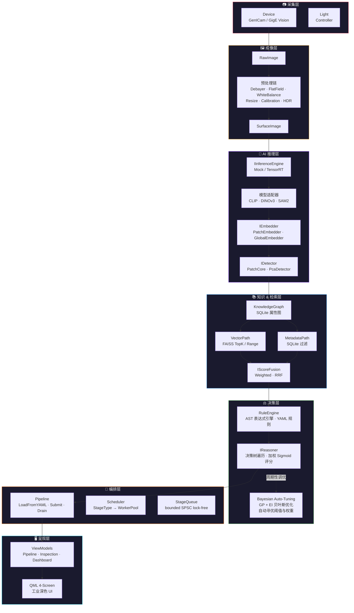

# 🏭 Surface AI Framework

> **工业级表面缺陷检测框架 —— "一切皆是 Surface"**

[](https://en.cppreference.com/w/cpp/20)
[](https://cmake.org/)
[](https://github.com)
[]()
[]()

**Surface AI** 是一套从零设计的**工业级 C++20 框架**，面向表面缺陷检测（AOI）场景——PCB、玻璃、织物、钢材、汽车座椅等。核心原则是 **"一切皆是 Surface"**：框架本身不与任何具体产品耦合，产品仅作为元数据注入。

**设计哲学：** 每层做一次明确的技术决策，用冻结的接口契约连接各层，拒绝"支持 A/B/C/D"的清单式大而全。

---

## 系统架构



**数据流：** 采集 → 成像预处理 → AI 推理（特征提取 + 异常检测）→ 知识图谱存储 → 混合检索 → 规则引擎 → 推理决策 → Pipeline 编排 → 可视化呈现

### 端到端检测 Pipeline

```
┌──────────┐   ┌──────────┐   ┌──────────┐   ┌──────────┐   ┌──────────┐   ┌──────────┐   ┌──────────┐
│ Capture  │──→│Preprocess│──→│Inference │──→│ Detect   │──→│RuleEval  │──→│ Reason   │──→│ Export   │
│RawImage  │   │Debayer   │   │TensorRT  │   │PatchCore │   │RuleEngine│   │Decision  │   │JsonExport│
│passthru  │   │WB+Resize │   │→Embedding│   │IDetector │   │FactBase  │   │Tree+Sigm │   │JSON+PPM  │
└──────────┘   └──────────┘   └──────────┘   └──────────┘   └──────────┘   └──────────┘   └──────────┘
                                                                   │
                                                   ┌───────────────┴───────────────┐
                                                   │ KnowledgeGraph    VectorPath   │
                                                   │ (SQLite 属性图)   (FAISS 检索)  │
                                                   └───────────────────────────────┘
```

---

## 快速开始（Docker）

### 前置条件

| 依赖 | 说明 |
|------|------|
| **Docker** | ≥ 20.10 |
| **nvidia-container-toolkit** | GPU 容器运行时 |
| **NVIDIA GPU** | 驱动 ≥ 525，CUDA 12.4 |

### 三步运行

```bash
# 1. 构建镜像
docker compose build

# 2. 训练 Coreset（使用正常样本构建特征库）
docker compose run seat_aoi_train

# 3. 运行检测
docker compose up seat_aoi_detect
```

### 运行模式

Seat AOI 支持三种运行模式：

```bash
# 训练模式：从正常样本图像目录构建 Coreset
./seat_aoi train \
    --image-dir /data/normal/ \
    --coreset-algo greedy \
    --coreset-max-samples 10000 \
    --coreset-output /app/resources/coresets/default.bin

# 检测模式：批量处理待检图像目录，输出 JSON 报告
./seat_aoi detect \
    --image-dir /data/samples/ \
    --coreset /app/resources/coresets/default.bin \
    --output-dir /data/results/

# 守护模式：连接工业相机 + OPC UA，连续在线检测
./seat_aoi daemon \
    --coreset /app/resources/coresets/default.bin \
    --output-dir /data/results/ \
    --opcua-server opc.tcp://192.168.1.100:4840
```

### Docker 服务说明

`docker-compose.yml` 定义了三个服务，均使用 `nvidia` runtime：

| 服务 | Profile | 用途 |
|------|---------|------|
| `seat_aoi_train` | `--profile train` | 一次性训练，生成 coreset 文件 |
| `seat_aoi_detect` | `--profile detect` | 批量检测，处理完退出 |
| `seat_aoi_daemon` | `--profile daemon` | 连续在线检测，连接相机 + PLC，`restart: unless-stopped` |

```bash
# 训练
docker compose --profile train run seat_aoi_train

# 批量检测
docker compose --profile detect up seat_aoi_detect

# 生产环境守护进程（自动重启）
docker compose --profile daemon up -d seat_aoi_daemon
```

---

## 原生构建（Ubuntu 22.04 x64）

### 系统依赖

```bash
# 基础工具链
sudo apt-get update && sudo apt-get install -y \
    build-essential cmake ninja-build pkg-config \
    gcc-12 g++-12 curl zip unzip tar git

# 运行时库
sudo apt-get install -y \
    libspdlog-dev libyaml-cpp-dev libsqlite3-dev \
    libopen62541-dev libaravis-dev libfaiss-dev \
    qt6-base-dev libgl1-mesa-dev libomp-dev
```

### 安装 vcpkg

```bash
git clone https://github.com/Microsoft/vcpkg.git ~/vcpkg
~/vcpkg/bootstrap-vcpkg.sh
export VCPKG_ROOT=~/vcpkg
```

### 构建 & 测试

```bash
# 配置（使用 vcpkg 清单模式）
cmake --preset default

# 构建
cmake --build --preset default

# 运行全部 621 个测试
ctest --preset default

# 按名称过滤测试
ctest --preset default -R "tuning"

# 运行单个测试用例
cd build/default && ctest -R "BayesianOptimizer.FindsMinimumOfQuadratic" --output-on-failure
```

---

## 技术栈

每一项选择都经过明确的权衡，详见 `docs/superpowers/specs/` 下的阶段设计文档。

### 运行时基础设施

| 关注点 | 选型 | 说明 |
|--------|------|------|
| 语言标准 | **C++20** | 协程（`co_await`）、Concepts、`constexpr` |
| 并发模型 | **C++20 Coroutines** + 固定 WorkerPool | GPU 工作通过 CUDA Stream + callback 恢复协程 |
| 错误处理 | **`tl::expected`**（别名 `Result<T>`） | 默认返回 `Result<T>`；异常仅用于构造/初始化失败 |
| 依赖管理 | **vcpkg**（清单模式） | CUDA/TensorRT 手动安装 |
| 构建系统 | **CMake 3.21+** | preset 驱动，单命令配置/构建/测试 |

### AI & 推理

| 关注点 | 选型 | 说明 |
|--------|------|------|
| 推理后端 | **TensorRT** | FP16/INT8、动态 shape、多 GPU |
| 向量检索 | **FAISS** | 进程内检索，可选 faiss-gpu |
| 模型适配 | CLIP · DINOv3 · SAM2 | 通过 IInferenceEngine 统一接口接入 |

### 存储 & 知识

| 关注点 | 选型 | 说明 |
|--------|------|------|
| 知识图谱 | **SQLite**（进程内属性图） | 节点表 + 边表 + 属性 JSON 列；SAVEPOINT 快照 |
| 配置格式 | **YAML**（yaml-cpp） | Pipeline / 规则 / 推理树 / 调优参数 统一用 YAML 描述 |

### 决策 & 调优

| 关注点 | 选型 | 说明 |
|--------|------|------|
| 规则引擎 | **自研 AST 表达式引擎** + YAML | 不用 Lua — 避免任意代码执行风险 |
| 推理决策 | **决策树** + 加权 Sigmoid 评分 | VerdictMapping 阈值热重载，无需重编译 |
| 参数寻优 | **贝叶斯优化**（GP + EI） | 离线后台线程，周期性读取 KG 反馈，自动调优阈值与融合权重，熔断自动回滚 |

### GUI & 可视化

| 关注点 | 选型 | 说明 |
|--------|------|------|
| GUI 框架 | **Qt 6** | QML + C++ ViewModel 层 |
| 图像提供 | **QQuickImageProvider** | FrameProvider 零拷贝帧传递 |

### 工业协议 & 部署

| 关注点 | 选型 | 说明 |
|--------|------|------|
| PLC 通信 | **OPC UA**（open62541） | 工业标准协议 |
| 相机采集 | **GenICam / GigE Vision** | 标准工业相机接口 |
| 日志 | **spdlog** | 异步 sink、双级队列（Warning+ 阻塞 / Trace-Debug 丢弃） |
| 部署 | **Docker + systemd** | nvidia-container-toolkit，`restart: unless-stopped` |

---

## 模块总览

19 个模块，每个模块对应一个命名空间 `sai::<module>`，编译为独立静态库 `sai_<module>`。

| # | 模块 | 命名空间 | 核心职责 |
|---|------|----------|----------|
| 1 | `core` | `sai::core` | Object/Resource 基类、TypeRegistry、Factory、Context（DI 容器）、生命周期状态机、ErrorCode |
| 2 | `memory` | `sai::memory` | ArenaAllocator、GpuPool（CUDA）、PinnedPool（CUDA）、PooledPtr 智能池化指针 |
| 3 | `plugin` | `sai::plugin` | PluginManager、Manifest 解析、ModuleManager、Capability/License/Version 管理器 |
| 4 | `runtime` | `sai::runtime` | `Task<T>` C++20 协程、WorkerPool 固定线程池、TaskGraph DAG、PipelineExecutor、GpuStreamQueue（CUDA） |
| 5 | `infra` | `sai::infra` | Logger（spdlog 封装，双级队列溢出策略）、ConfigSchema/ConfigStore（yaml-cpp）、inotify 热重载 |
| 6 | `device` | `sai::device` | IDevice/ICamera/ILightController 硬件抽象接口、RingBuffer、FakeCamera（开发测试用合成帧生成器） |
| 7 | `image` | `sai::image` | Image/RawImage/SurfaceImage/GpuImage 类型体系、ROI、预处理链（Debayer/FlatField/WhiteBalance/Resize/Calibration/HDR/Compose） |
| 8 | `io` | `sai::io` | IImporter/BasicImporter（YAML + PPM）、IExporter/JsonExporter（JSON 报告） |
| 9 | `inference` | `sai::inference` | IInferenceEngine（Mock / TensorRT）、CLIP/DINOv3/SAM2 模型适配器、多层特征聚合 |
| 10 | `embedding` | `sai::embedding` | Embedding（double 存储）、PatchEmbedder/GlobalEmbedder、DimensionReducer/PCA、FeatureCache |
| 11 | `detection` | `sai::detection` | DetectionResult、PatchCore、FeatureBank（FAISS）、PcaDetector、SpecularFilter、CoresetEvolution/CoresetUpdater（在线自进化）、MultiSignalConsensus、NoveltyFilter/NormalityScorer |
| 12 | `knowledge` | `sai::knowledge` | KnowledgeRecord/FieldValue、KnowledgeGraph（SQLite 属性图）、KnowledgeEvolution 变更日志、KnowledgeSnapshot（SAVEPOINT）、KnowledgeStore 统一门面 |
| 13 | `retrieval` | `sai::retrieval` | VectorPath（FAISS TopK/Range/Hybrid）、MetadataPath（SQLite 过滤）、IScoreFusion/WeightedFusion/RRFFusion、HybridRetriever 双路径编排 |
| 14 | `rule` | `sai::rule` | RuleEngine（AST 表达式引擎 + YAML 规则存储）、FactBase/ConflictResolver、Lexer/Parser |
| 15 | `reasoner` | `sai::reasoner` | IReasoner/DefaultReasoner（决策树遍历 + 加权 Sigmoid 评分 + 全链路溯源）、VerdictMapping（YAML 热重载）、ScoreCalculator、TraceRecorder、EvidenceCollector |
| 16 | `tuning` | `sai::tuning` | TuningSpace（参数搜索空间）、KnowledgeGraphObjective（反馈代价评估）、BayesianOptimizer（GP+EI 贝叶斯优化）、TuningScheduler（后台调优调度 + 熔断自动回滚） |
| 17 | `pipeline` | `sai::pipeline` | Pipeline（LoadFromYAML/Start/Submit/Drain/Stop）、PipelineBuilder（YAML + 拓扑校验）、7 个 Stage、`StageQueue<T>`（bounded SPSC lock-free） |
| 18 | `scheduler` | `sai::scheduler` | StageType → WorkerPool 映射、阶段间队列分配（**仅内部头文件**） |
| 19 | `visualization` | `sai::visualization` | PipelineViewModel、InspectionViewModel、FrameProvider（QQuickImageProvider）、ConfigViewModel、DashboardViewModel、QML 4 屏工业深色 UI |

---

## 项目结构

```
surface-ai/
├── CMakePresets.json                       # CMake preset（Linux x64, vcpkg）
├── vcpkg.json                              # vcpkg 清单（依赖声明）
├── Dockerfile                              # 生产镜像（nvidia/cuda:12.4-runtime-ubuntu22.04）
├── docker-compose.yml                      # 多服务编排（train / detect / daemon）
│
├── docs/
│   ├── superpowers/specs/                  # 阶段设计 spec（Approved）
│   ├── superpowers/plans/                  # 执行计划（task-by-task checkbox）
│   └── surface-ai/
│       ├── design/                         # 14 节冻结设计文档（中文）
│       └── glossary-and-contracts.md       # 跨批次接口契约表（活文档）
│
├── .superpowers/sdd/                       # SDD 工作流：per-task brief / report / review diff
│
├── resources/
│   ├── models/                             # 模型文件（ONNX / TensorRT engine）
│   └── web/                                # Web 仪表盘
│
├── apps/seat-aoi/
│   ├── main.cpp                            # 参考应用入口
│   └── resources/
│       ├── pipeline.yaml                   # Pipeline 配置
│       ├── rules/                          # 规则 YAML
│       ├── trees/                          # 决策树 YAML
│       └── tuning/                         # 贝叶斯调优 YAML
│
├── include/sai/                            # 公开头文件（19 个模块）
│   ├── core/    ├── memory/   ├── plugin/
│   ├── runtime/ ├── infra/    ├── device/
│   ├── image/   ├── io/       ├── inference/
│   ├── embedding/ ├── detection/ ├── knowledge/
│   ├── retrieval/ ├── rule/   ├── reasoner/
│   ├── tuning/  ├── pipeline/ └── visualization/
│
├── src/                                    # 实现文件 + per-module CMakeLists.txt（19 个模块）
│   └── <module>/CMakeLists.txt             # 编译门控（CUDA/平台特定代码在 target 级别门控）
│
└── tests/                                  # GoogleTest 测试套件
    ├── <module>/                           # 每模块独立测试
    └── integration/                        # 端到端集成测试
```

---

## 部署

### Docker Compose（推荐）

```bash
# 准备目录结构
mkdir -p samples/normal samples/test results resources/coresets resources/models

# 放入模型文件
cp /path/to/model.onnx resources/models/

# 训练 Coreset
docker compose --profile train run seat_aoi_train

# 批量检测
docker compose --profile detect up seat_aoi_detect

# 生产守护进程
docker compose --profile daemon up -d seat_aoi_daemon

# 查看日志
docker compose logs -f seat_aoi_daemon
```

### 手动 Docker

```bash
# 构建镜像
docker build -t surface-ai:latest .

# 训练
docker run --runtime=nvidia \
    -v ./samples/normal:/data/normal:ro \
    -v ./resources/coresets:/app/resources/coresets \
    -v ./resources/models:/app/resources/models:ro \
    surface-ai:latest train \
    --image-dir /data/normal/ \
    --coreset-output /app/resources/coresets/default.bin

# 批量检测
docker run --runtime=nvidia \
    -v ./samples/test:/data/samples:ro \
    -v ./results:/data/results \
    -v ./resources/coresets:/app/resources/coresets:ro \
    -v ./resources/models:/app/resources/models:ro \
    surface-ai:latest detect \
    --image-dir /data/samples/ \
    --coreset /app/resources/coresets/default.bin \
    --output-dir /data/results/
```

### systemd 守护（无容器部署）

```ini
# /etc/systemd/system/seat-aoi.service
[Unit]
Description=Surface AI Seat AOI Inspection Daemon
After=network.target docker.service

[Service]
ExecStart=/usr/local/bin/seat_aoi daemon \
    --coreset /etc/surface-ai/coresets/default.bin \
    --output-dir /var/lib/surface-ai/results/ \
    --opcua-server opc.tcp://192.168.1.100:4840
Restart=unless-stopped
User=surface-ai
Group=surface-ai

[Install]
WantedBy=multi-user.target
```

```bash
sudo systemctl enable --now seat-aoi
sudo systemctl status seat-aoi
```

---

## 贡献指南

### 工作流

本项目使用 **Superpowers Spec-Driven Development (SDD)**：

```
Spec（审批）→ Plan（checkbox 任务）→ Brief → Report
→ Review Diff → Commit
```

`.superpowers/sdd/progress.md` 是任务账本——恢复工作前先读它。

### 设计文档规范

- 所有设计文档遵循固定的 **14 节结构**：Purpose, Responsibilities, Design, Interfaces, Workflow, Data Structure, Class Diagram, Sequence Diagram, Thread Model, Performance, Memory, Future Extension, Best Practice, Anti Pattern
- 验证命令：`grep -c "^## [0-9]" <file>` —— 预期 `14`
- **Design 章节严禁清单式罗列**（"支持 A/B/C/D"），必须做明确决策：*"使用 X，因为……；拒绝 Y，因为……"*
- 跨批次接口以 `docs/surface-ai/glossary-and-contracts.md` 为唯一事实来源——每个概念/接口归属一个批次，其他批次引用、不重定义

### 代码风格

- **不过度防御** —— 不守卫不可能发生的状态
- **避免深层嵌套** —— 偏好 early return；树/图结构优先用递归
- **错误处理用 monadic 链** —— `Result<T>` 的 `and_then`/`or_else`，而非层层 `if`
- **模板方法留在头文件** —— 非模板方法移入 `.cpp`
- 模块 CMakeLists.txt 在 target 级别做编译门控，不使用 `#ifdef`

### 语言约定

| 内容 | 语言 |
|------|------|
| 设计文档 / Spec | **中文** |
| 代码标识符 / 注释 | **English** |
| Git 提交描述 | **中文** |
| Commit message 结构 | 英文 type/scope + 中文描述 |

### Git 提交规范

**约定式提交 + Gitmoji**，格式：

```
<type>(<scope>): <emoji> <中文描述>
```

| type | emoji | 用途 |
|------|:-----:|------|
| `feat` | ✨ | 新功能 |
| `fix` | 🐛 | 修复 Bug |
| `chore` | 🔧 | 构建/工具/依赖/日常 |
| `refactor` | ♻️ | 重构（无新功能无修复） |
| `docs` | 📝 | 仅文档/注释 |
| `style` | 💄 | 不影响含义的格式 |
| `perf` | ⚡ | 性能优化 |
| `test` | ✅ | 测试 |
| `ci` | 💚 | CI/CD 配置 |

**示例：** `fix(tuning): 🐛 修复 ParameterApplier 丢弃优化参数 + MetricsPoller 硬编码 NG 率`

---

## License

This project is proprietary. All rights reserved.

---

<p align="center">
  <sub>Built with C++20 · TensorRT · FAISS · Qt 6 · SQLite · OPC UA · Docker</sub>
</p>
