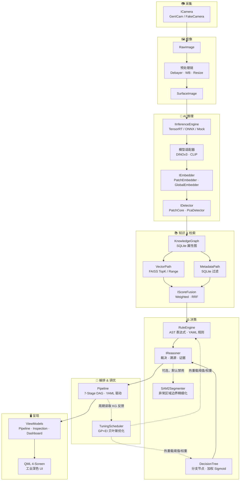

# 🏭 Surface AI Framework

> **工业级表面缺陷检测框架 —— "一切皆是 Surface"**

[](https://en.cppreference.com/w/cpp/20)
[](https://cmake.org/)
[](https://github.com)
[]()
[]()

**Surface AI** 是一套从零设计的 C++20 工业表面缺陷检测框架，覆盖 **采集 → 成像 → AI 推理 → 异常检测 → 知识检索 → 规则决策 → 贝叶斯自动调优 → 可视化** 的完整链路。框架不与任何具体产品耦合，产品仅作为元数据注入。

- 🧠 **PatchCore + PCA 双检测器**，FAISS 向量检索引擎，GPU 加速
- 📚 **SQLite 知识图谱** + FAISS 混合检索（向量 + 元数据双路径 + RRF/加权融合）
- ⚖️ **自研 AST 规则引擎** + 决策树推理器，YAML 热重载，全链路可溯源
- 🎯 **贝叶斯自动调优**（GP + EI），在线监控 + 熔断自动回滚
- ⚡ **C++20 协程** + 无锁 SPSC 队列 + CUDA Stream 异步推理，工业级吞吐
- 🖥️ **Qt6/QML 工业深色 UI**，4 屏仪表板（Pipeline / 检测 / 仪表板 / 配置）
- 🐳 **Docker 一键部署**，systemd 守护，OPC UA 工业协议

---

## 系统架构



---

## 主链路

一帧图像从采集到最终裁决的完整数据流，以及后台自动调优闭环：

```
┌──────────┐   ┌──────────┐   ┌──────────┐   ┌──────────┐   ┌──────────┐   ┌──────────┐   ┌──────────┐
│ Capture  │──→│Preprocess│──→│Inference │──→│  Detect  │──→│RuleEval  │──→│  Reason  │──→│  Export  │
│          │   │          │   │          │   │          │   │          │   │          │   │          │
│ RawImage │   │SurfaceImg│   │Embedding │   │Detection │   │ FactBase │   │Reasoning │   │  JSON    │
│          │   │          │   │          │   │ Result   │   │+Resolved │   │ Result   │   │ +PPM    │
└──────────┘   └──────────┘   └──────────┘   └────┬─────┘   │  Rules   │   │(verdict  │   └──────────┘
                                                  │         └──────────┘   │ severity │
                                                  │              │        │ evidence)│
                                                  ▼              ▼        └──────────┘
                                         ┌────────────────────────────┐
                                         │     KnowledgeGraph          │
                                         │  InspectionRecorder 写入    │
                                         │  FactBuilder 读取+检索      │
                                         └────────────┬───────────────┘
                                                      │
                                         ┌────────────▼───────────────┐
                                         │   TuningScheduler (后台)    │
                                         │   GP+EI 贝叶斯优化         │
                                         │   读取 KG 反馈 → 热重载    │
                                         │   阈值 / 权重 / 裁决边界   │
                                         └────────────────────────────┘
```

| # | 阶段 | 输入 → 输出 | 核心职责 |
|---|------|------------|---------|
| 1 | Capture | — → `RawImage` | 相机帧抓取（GenICam / FakeCamera），唯一允许丢帧的阶段 |
| 2 | Preprocess | `RawImage` → `SurfaceImage` | 去拜耳、白平衡、缩放、ROI 提取、HDR 合成 |
| 3 | Inference | `SurfaceImage` → `Embedding` | DINOv3 补丁特征 / CLIP 全局特征提取（TensorRT/ONNX） |
| 4 | Detect | `Embedding` → `DetectionResult` | PatchCore k-NN 异常评分 / PCA 子空间建模，后处理（平滑+连通分量） |
| 5 | RuleEval | `DetectionResult` → `FactBase` + `ResolvedRules` | 构建事实库（检测结果 + KG 路径解析 + FAISS 向量检索），AST 规则评估，冲突消解 |
| 6 | Reason | `FactBase` + `ResolvedRules` → `ReasoningResult` | 决策树遍历，加权 Sigmoid 评分，生成裁决（OK/NG/WARN）+ 证据链 + 全链路溯源。可选启用 SAM2 对异常区域做边界精细化掩膜 |
| 7 | Export | `ReasoningResult` → JSON + PPM | 检测报告输出，缺陷区域标注图，回调 UI 更新 |

**后台闭环：** `InspectionRecorder` 将每帧检测分数写入 `KnowledgeGraph` → `TuningScheduler` 周期性读取反馈，用高斯过程 + 预期改进（GP+EI）自动寻优 Detection 阈值、规则权重、裁决边界 → 热重载生效，无需重启 Pipeline。熔断机制：若调优后 NG 率异常，自动回滚至上一次参数。

---

## 功能特性

### AI 检测
- **PatchCore**：coreset k-NN 异常检测，PCA 白化，自适应阈值（目标 FPR），混合 k-NN×PCA 评分
- **PcaDetector**：PCA 子空间建模，4 种评分（重建误差 / 马氏 / 余弦 / 欧几里得）
- **后处理**：高斯平滑、双线性上采样、4-连通分量标记、区域提案排序
- **镜面反射过滤**：四线索融合（亮度/去饱和度/LoG曲率/过曝剪切），抑制光泽表面伪影
- **多信号共识**：正态性评估 + 检测分数 + 规则匹配 + 推理裁决，联合判否

### 特征提取
- **DINOv3**（ViT 补丁特征）、**CLIP**（全局 [CLS] 特征）
- 多层特征聚合（Concat / Mean / Group），显著性掩码（Percentile / Otsu）
- PCA 降维 + 球化白化 + 空间池化（Avg / Max），流式 PCA 支持大数据集
- 双存储 Embedding（GPU/CPU），零拷贝共享指针，LRU 特征缓存

### 知识 & 检索
- **知识图谱**：SQLite 属性图，节点 + 边 + JSON 属性，最大深度 3 遍历
- **向量检索**：FAISS TopK / Range / Hybrid 三种模式，GPU 加速
- **元数据检索**：SQLite 结构化过滤（=、≠、<、>、Like、In）
- **混合检索**：Weighted 线性加权 / RRF 倒数排名融合，双路径编排
- 知识演化变更日志，SAVEPOINT 快照，统一 KnowledgeStore 门面

### 规则 & 决策
- **AST 表达式引擎**：字面量 / 字段引用 / 二元 & 一元运算 / 内置函数 / 图路径表达式
- **YAML 规则存储**：优先级 + 条件 + 动作 + 覆盖层次，inotify 热重载
- **决策树**：分支节点（数值范围分派）+ 叶子节点（加权 Sigmoid 公式）
- **全链路溯源**：TraceRecorder 记录每一步（表达式→规则→树分支→评分），EvidenceCollector 汇总证据
- **FactBuilder**：自动从 DetectionResult + KnowledgeGraph + VectorPath 构建事实库
- **SAM2Segmenter**（可选）：对异常区域做边界精细化掩膜，默认禁用

### 在线自进化
- **CoresetEvolution**：后台线程周期性评估每帧正常性/新颖性，双缓冲热更新 FeatureBank
- **NoveltyFilter**：CandidateBuffer 累积候选帧，达到触发阈值后全量重建 coreset
- **NormalityScorer**：基于 FeatureBank 自查询的 P50/P95/P99/均值/标准差统计量

### 贝叶斯自动调优
- **TuningSpace**：连续/离散参数空间，线性约束，YAML 定义
- **BayesianOptimizer**：GP 代理 + EI 采集函数，RBF 核 + Cholesky 分解 + L-BFGS-B
- **KnowledgeGraphObjective**：从历史检测记录计算 FP/FN 代价，支持仿真模式
- **TuningScheduler**：后台周期调度，监控窗口 + NG 率异常检测 + 熔断自动回滚

### 流水线 & 调度
- **7-Stage Pipeline**：Capture → Preprocess → Inference → Detect → RuleEval → Reason → Export
- **YAML 驱动**：拓扑声明 + 依赖解析（Kahn 算法）+ 类型兼容性校验
- **StageQueue\<T\>**：有界 SPSC 无锁环形缓冲区，三种背压策略（阻塞/丢旧/降级）
- **Scheduler**：StageType → WorkerPool 固定映射，队列深度/P99延迟/丢帧指标采集

### 可视化
- **4 屏工业 UI**：Pipeline 状态 / 检测详情 / 产量仪表板 / YAML 配置编辑器
- **FrameProvider**：QQuickImageProvider 环形缓冲区缓存，零拷贝帧传递
- **实时热力图**：异常分数覆盖层，缺陷 bounding box 标注

### 工业接口
- **GenICam / GigE Vision** 相机采集，**OPC UA** PLC 通信
- **FakeCamera**：合成帧生成器（正弦纹理 + Perlin 噪声），无硬件可跑全链路
- **inotify** 配置热重载，YAML 启动时全量校验（fail-fast）
- **spdlog** 异步日志，双级溢出策略（Trace/Debug 丢弃，Warning+ 阻塞）

---

## 快速开始（Docker）

### 前置条件

| 依赖 | 说明 |
|------|------|
| **Docker** | ≥ 20.10 |
| **nvidia-container-toolkit** | GPU 容器运行时 |
| **NVIDIA GPU** | 驱动 ≥ 525，CUDA 12.4 |

### 三步运行

```bash
# 1. 构建镜像
docker compose build

# 2. 训练 Coreset（使用正常样本构建特征库）
docker compose --profile train run seat_aoi_train

# 3. 运行检测
docker compose --profile detect up seat_aoi_detect
```

### 运行模式

```bash
# 训练模式：从正常样本图像目录构建 Coreset
./seat_aoi train \
    --image-dir /data/normal/ \
    --coreset-algo greedy \
    --coreset-max-samples 10000 \
    --coreset-output /app/resources/coresets/default.bin

# 检测模式：批量处理待检图像目录，输出 JSON 报告
./seat_aoi detect \
    --image-dir /data/samples/ \
    --coreset /app/resources/coresets/default.bin \
    --output-dir /data/results/

# 守护模式：连接工业相机 + OPC UA，连续在线检测
./seat_aoi daemon \
    --coreset /app/resources/coresets/default.bin \
    --output-dir /data/results/ \
    --opcua-server opc.tcp://192.168.1.100:4840
```

### Docker 服务说明

`docker-compose.yml` 定义了三个服务，均使用 `nvidia` runtime：

| 服务 | Profile | 用途 |
|------|---------|------|
| `seat_aoi_train` | `--profile train` | 一次性训练，生成 coreset 文件 |
| `seat_aoi_detect` | `--profile detect` | 批量检测，处理完退出 |
| `seat_aoi_daemon` | `--profile daemon` | 连续在线检测，连接相机 + PLC，`restart: unless-stopped` |

```bash
# 训练
docker compose --profile train run seat_aoi_train

# 批量检测
docker compose --profile detect up seat_aoi_detect

# 生产环境守护进程（自动重启）
docker compose --profile daemon up -d seat_aoi_daemon
```

---

## 原生构建（Ubuntu 22.04 x64）

### 系统依赖

```bash
sudo apt-get update && sudo apt-get install -y \
    build-essential cmake gcc-12 g++-12 \
    libspdlog-dev libyaml-cpp-dev libsqlite3-dev \
    libopen62541-dev libaravis-dev libfaiss-dev \
    qt6-base-dev libgl1-mesa-dev libomp-dev
```

### 安装 vcpkg

```bash
git clone https://github.com/Microsoft/vcpkg.git ~/vcpkg
~/vcpkg/bootstrap-vcpkg.sh
export VCPKG_ROOT=~/vcpkg
```

### 构建 & 测试

```bash
cmake --preset linux           # 配置
cmake --build --preset linux   # 构建
ctest --preset linux           # 运行全部 621 个测试

# 按名称过滤
ctest --preset linux -R "tuning"

# 运行单个测试用例
cd build/linux && ctest -R "BayesianOptimizer.FindsMinimumOfQuadratic" --output-on-failure

# 直接运行测试二进制（支持 --gtest_filter）
cd build/linux && ./tests/detection/sai_detection_test --gtest_filter="PatchCore*"
```

---

## 技术栈

| 关注点 | 选型 | 说明 |
|--------|------|------|
| 语言标准 | **C++20** | 协程（`co_await`）、Concepts |
| 并发模型 | **C++20 Coroutines** + 固定 WorkerPool | GPU 通过 CUDA Stream + callback 恢复协程 |
| 错误处理 | **`tl::expected`**（别名 `Result<T>`） | 默认返回 `Result<T>`；异常仅用于构造/初始化失败 |
| 推理后端 | **TensorRT** | FP16/INT8、动态 shape、多 GPU |
| 向量检索 | **FAISS** | 进程内检索，可选 faiss-gpu |
| 规则引擎 | **自研 AST 表达式引擎** + YAML | 不用 Lua — 避免任意代码执行风险 |
| 知识图谱 | **SQLite**（进程内属性图） | SAVEPOINT 快照，演化变更日志 |
| 配置格式 | **YAML**（yaml-cpp） | Pipeline / 规则 / 决策树 / 调优参数统一 YAML |
| 参数寻优 | **贝叶斯优化**（GP + EI） | 离线后台线程，周期性读 KG 反馈，熔断自动回滚 |
| GUI | **Qt 6** | QML + C++ ViewModel 层 |
| PLC 通信 | **OPC UA**（open62541） | 工业标准协议 |
| 相机采集 | **GenICam / GigE Vision** | 标准工业相机接口 |
| 日志 | **spdlog** | 异步 sink，双级溢出策略 |
| 测试 | **GoogleTest + gmock** | |
| 部署 | **Docker + systemd** | nvidia-container-toolkit |

---

## 模块总览

19 个模块，每个模块对应一个命名空间 `sai::<module>`，编译为独立静态库 `sai_<module>`。

| # | 模块 | 核心职责 |
|---|------|---------|
| 1 | `core` | Object/Resource 基类、TypeRegistry、Factory、Context（DI 容器）、生命周期状态机 |
| 2 | `memory` | ArenaAllocator、GpuPool（CUDA）、PinnedPool（CUDA）、PooledPtr 智能池化指针 |
| 3 | `plugin` | PluginManager、Manifest 解析、Capability/License/Version 管理器 |
| 4 | `runtime` | `Task<T>` C++20 协程、WorkerPool、TaskGraph、PipelineExecutor、GpuStreamQueue（CUDA） |
| 5 | `infra` | Logger（spdlog 封装）、ConfigSchema/ConfigStore（yaml-cpp）、inotify 热重载 |
| 6 | `device` | IDevice/ICamera/ILightController 硬件抽象、RingBuffer、FakeCamera |
| 7 | `image` | Image/RawImage/SurfaceImage/GpuImage 类型体系、ROI、预处理链 |
| 8 | `io` | IImporter/BasicImporter、IExporter/JsonExporter |
| 9 | `inference` | IInferenceEngine（TensorRT/ONNX/Mock）、DINOv3/CLIP/SAM2 适配器、多层特征聚合 |
| 10 | `embedding` | Embedding（double 存储）、PatchEmbedder/GlobalEmbedder、DimensionReducer/PCA、FeatureCache |
| 11 | `detection` | PatchCore、PcaDetector、FeatureBank（FAISS）、CoresetEvolution、MultiSignalConsensus、SpecularFilter |
| 12 | `knowledge` | KnowledgeGraph（SQLite 属性图）、KnowledgeEvolution、KnowledgeSnapshot、KnowledgeStore |
| 13 | `retrieval` | VectorPath（FAISS TopK/Range/Hybrid）、MetadataPath、WeightedFusion/RRFFusion、HybridRetriever |
| 14 | `rule` | RuleEngine（AST 表达式 + YAML 规则）、FactBase/ConflictResolver、FactBuilder |
| 15 | `reasoner` | DecisionTree、IReasoner/DefaultReasoner（Sigmoid 评分 + 全链路溯源）、EvidenceCollector |
| 16 | `tuning` | TuningSpace、BayesianOptimizer（GP+EI）、KnowledgeGraphObjective、TuningScheduler |
| 17 | `pipeline` | Pipeline（YAML 驱动 7-Stage）、PipelineBuilder、StageQueue\<T\>（SPSC 无锁） |
| 18 | `scheduler` | StageType → WorkerPool 映射、队列分配（仅内部头文件） |
| 19 | `visualization` | PipelineViewModel、InspectionViewModel、DashboardViewModel、FrameProvider、QML 4 屏 UI |

---

## 项目结构

```
surface-ai/
├── CMakePresets.json                       # CMake preset（Linux x64, vcpkg）
├── vcpkg.json                              # vcpkg 清单
├── vcpkg-overlays/                         # 自定义 vcpkg ports（FAISS w/ GPU）
├── Dockerfile                              # 生产镜像
├── docker-compose.yml                      # 多服务编排（train / detect / daemon）
│
├── docs/
│   ├── superpowers/specs/                  # 阶段设计 spec（Approved）
│   ├── superpowers/plans/                  # 执行计划（task-by-task）
│   └── surface-ai/
│       ├── design/                         # 14 节冻结设计文档（中文）
│       └── glossary-and-contracts.md       # 跨批次接口契约（活文档）
│
├── .superpowers/sdd/                       # SDD 工作流：per-task brief / report / review diff
│
├── apps/seat-aoi/
│   ├── main.cpp                            # 参考应用入口
│   └── resources/
│       ├── pipeline.yaml                   # Pipeline 拓扑
│       ├── rules/                          # 规则 YAML
│       ├── trees/                          # 决策树 YAML
│       └── tuning/                         # 贝叶斯调优 YAML
│
├── include/sai/                            # 公开头文件（19 个模块）
├── src/                                    # 实现文件 + per-module CMakeLists.txt
└── tests/                                  # GoogleTest 套件（模块测试 + 集成测试）
```

---

## 贡献指南

### 工作流

本项目使用 **Superpowers Spec-Driven Development (SDD)**：

```
Spec（审批）→ Plan（checkbox 任务）→ Brief → Report → Review Diff → Commit
```

`.superpowers/sdd/` 是任务账本——恢复工作前先读它。

### 设计文档规范

- 所有设计文档遵循固定的 **14 节结构**，验证命令：`grep -c "^## [0-9]" <file>` —— 预期 `14`
- **Design 章节严禁清单式罗列**（"支持 A/B/C/D"），必须做明确决策
- 跨批次接口以 `docs/surface-ai/glossary-and-contracts.md` 为唯一事实来源——每个概念/接口归属一个批次，其他批次引用、不重定义

### 代码风格

- 不过度防御，避免深层嵌套，优先 early return；树/图结构优先用递归
- 错误处理用 `Result<T>` 的 monadic 链（`and_then`/`or_else`）
- 模板方法留在头文件，非模板方法移入 `.cpp`
- 模块 CMakeLists.txt 在 target 级别做编译门控，不使用 `#ifdef`

### 语言约定

| 内容 | 语言 |
|------|------|
| 设计文档 / Spec | **中文** |
| 代码标识符 / 注释 | **English** |
| Git 提交描述 | **中文** |
| Commit message 结构 | 英文 type/scope + 中文描述 |

### Git 提交规范

**约定式提交 + Gitmoji**，格式：`<type>(<scope>): <emoji> <中文描述>`

| type | emoji | 用途 |
|------|:-----:|------|
| `feat` | ✨ | 新功能 |
| `fix` | 🐛 | 修复 Bug |
| `chore` | 🔧 | 构建/工具/依赖/日常 |
| `refactor` | ♻️ | 重构（无新功能无修复） |
| `docs` | 📝 | 仅文档/注释 |
| `style` | 💄 | 不影响含义的格式 |
| `perf` | ⚡ | 性能优化 |
| `test` | ✅ | 测试 |
| `ci` | 💚 | CI/CD 配置 |

---

## License

This project is proprietary. All rights reserved.
