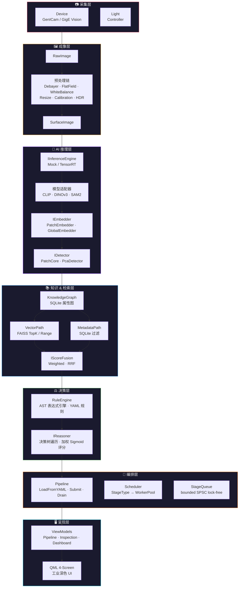

# 🏭 Surface AI Framework

> **Industrial-Grade Surface Defect Detection — "Everything is Surface"**

[](https://en.cppreference.com/w/cpp/20)
[](https://cmake.org/)
[](https://github.com)
[]()
[]()

**Surface AI** 是一套从零设计的**工业级 C++20 框架**，面向表面缺陷检测（AOI）场景——PCB、玻璃、织物、钢材、汽车座椅等。核心原则是 **"一切皆是 Surface"**：框架本身不与任何具体产品耦合，产品仅作为元数据注入。

**设计哲学：** 不追求"支持 A/B/C/D"的清单式大而全，而是每层做一次明确的技术决策，用冻结的接口契约连接各层。

---

## 📐 系统架构



**数据流：** 采集 → 成像预处理 → AI 推理（特征提取 + 异常检测）→ 知识图谱存储 → 混合检索 → 规则引擎 → 推理决策 → Pipeline 编排 → 可视化呈现

### 端到端检测 Pipeline

```
┌──────────┐   ┌──────────┐   ┌──────────┐   ┌──────────┐   ┌──────────┐   ┌──────────┐   ┌──────────┐
│ Capture  │──→│Preprocess│──→│Inference │──→│ Detect   │──→│RuleEval  │──→│ Reason   │──→│ Export   │
│RawImage  │   │Debayer   │   │TensorRT  │   │PatchCore │   │RuleEngine│   │Decision  │   │JsonExport│
│passthru  │   │WB+Resize │   │→Embedding│   │IDetector │   │FactBase  │   │Tree+Sigm │   │JSON+PPM  │
└──────────┘   └──────────┘   └──────────┘   └──────────┘   └──────────┘   └──────────┘   └──────────┘
                                                                    │
                                                    ┌───────────────┴───────────────┐
                                                    │ KnowledgeGraph    VectorPath   │
                                                    │ (SQLite 属性图)   (FAISS 检索)  │
                                                    └───────────────────────────────┘
```

**批处理模式：** `./seat_aoi --image-dir ./samples/ --output-dir ./results/`

---

## 🚀 快速开始

### 前置条件

| 依赖 | 说明 |
|------|------|
| **vcpkg** | 清单模式，需设置 `VCPKG_ROOT` 环境变量 |
| **OpenMP** | macOS: `brew install libomp` |
| **FAISS** | 使用本地 overlay port `vcpkg-overlays/faiss/`（官方 port 不支持 macOS arm64） |
| **CMake** | ≥ 3.21 |
| **编译器** | Clang（macOS）/ GCC 12+（Linux） |

### 构建三步

```bash
# 1. 配置（Debug on macOS arm64，使用 vcpkg toolchain）
cmake --preset default

# 2. 构建
cmake --build --preset default

# 3. 运行全部测试
ctest --preset default
```

### 运行特定测试

```bash
# 按名称模式过滤
ctest --preset default -R "logger"

# 运行单个测试用例（含失败输出）
cd build/default && ctest -R "LoggerTest.SetLevelRoundTripsFilterDecision" --output-on-failure
```

### 构建参考应用

```bash
# 构建 Seat AOI 参考应用
cmake --build --preset default --target seat_aoi

# GUI 模式 — FakeCamera 实时采集 + QML 监控面板
./build/default/apps/seat-aoi/seat_aoi

# 批处理模式 — 处理样本目录中的图像文件
./build/default/apps/seat-aoi/seat_aoi \
    --image-dir /path/to/leather/samples \
    --output-dir /path/to/results
```

> **注意：** CUDA-gated（`GpuPool`、`GpuStreamQueue`、`TensorRtEngine`）和 Linux-gated（`inotify` 热重载）代码在 macOS 上不编译。它们按冻结设计书写，仅在目标平台（Ubuntu 22.04 x64 + NVIDIA GPU）编译验证。各模块 CMakeLists.txt 在 target 级别做编译门控，不使用 `#ifdef` 补丁。
>
> Seat AOI 在 Linux+CUDA 上自动使用 **TensorRtEngine**，在 macOS 上回退到 **MockEngine**。

---

## 🧩 模块总览

18 个模块，每个模块对应一个命名空间 `sai::<module>`，编译为独立静态库 `sai_<module>`。

| # | 模块 | 命名空间 | 核心职责 |
|---|------|----------|----------|
| 1 | `core` | `sai::core` | Object/Resource 基类、TypeRegistry、Factory、Context（DI 容器）、生命周期状态机、ErrorCode |
| 2 | `memory` | `sai::memory` | ArenaAllocator、GpuPool（CUDA）、PinnedPool（CUDA）、PooledPtr 智能池化指针 |
| 3 | `plugin` | `sai::plugin` | PluginManager、Manifest 解析、ModuleManager、Capability/License/Version 管理器 |
| 4 | `runtime` | `sai::runtime` | `Task<T>` C++20 协程、WorkerPool 固定线程池、TaskGraph DAG、PipelineExecutor、GpuStreamQueue（CUDA） |
| 5 | `infra` | `sai::infra` | Logger（spdlog 封装，双级队列溢出策略）、ConfigSchema/ConfigStore（yaml-cpp）、inotify 热重载（Linux） |
| 6 | `device` | `sai::device` | IDevice/ICamera/ILightController 硬件抽象接口、RingBuffer、FakeCamera（开发测试用合成帧生成器） |
| 7 | `image` | `sai::image` | Image/RawImage/SurfaceImage/GpuImage 类型体系、ROI、预处理链（Debayer/FlatField/WhiteBalance/Resize/Calibration/HDR/Compose） |
| 8 | `io` | `sai::io` | IImporter/BasicImporter（YAML + PPM）、IExporter/JsonExporter（JSON 报告） |
| 9 | `inference` | `sai::inference` | IInferenceEngine（Mock / TensorRT CUDA）、CLIP/DINOv3/SAM2 模型适配器、多层特征聚合 |
| 10 | `embedding` | `sai::embedding` | Embedding（double 存储）、PatchEmbedder/GlobalEmbedder、DimensionReducer/PCA、FeatureCache |
| 11 | `detection` | `sai::detection` | DetectionResult、PatchCore 检测器、FeatureBank（FAISS）、SpecularFilter、后处理工具 |
| 12 | `knowledge` | `sai::knowledge` | KnowledgeRecord/FieldValue、KnowledgeGraph（SQLite 属性图）、KnowledgeEvolution 变更日志、KnowledgeSnapshot（SAVEPOINT）、KnowledgeStore 统一门面 |
| 13 | `retrieval` | `sai::retrieval` | VectorPath（FAISS TopK/Range/Hybrid）、MetadataPath（SQLite 过滤）、IScoreFusion/WeightedFusion/RRFFusion、HybridRetriever 双路径编排 |
| 14 | `rule` | `sai::rule` | RuleEngine（AST 表达式引擎 + YAML 规则存储）、FactBase/ConflictResolver、Lexer/Parser |
| 15 | `reasoner` | `sai::reasoner` | IReasoner/DefaultReasoner（决策树遍历 + 加权 Sigmoid 评分 + 溯源）、ScoreCalculator、TraceRecorder、EvidenceCollector |
| 16 | `pipeline` | `sai::pipeline` | Pipeline（LoadFromYAML/Start/Submit/Drain/Stop）、PipelineBuilder（YAML + 拓扑校验）、7 个 Stage（Capture/Preprocess/Inference/Detect/RuleEval/Reason/Export）、`StageQueue<T>`（bounded SPSC lock-free）、RuleEvalOutput 跨阶段上下文传递 |
| 17 | `scheduler` | `sai::scheduler` | StageType → WorkerPool 映射、阶段间队列分配（**仅内部头文件**） |
| 18 | `visualization` | `sai::visualization` | PipelineViewModel、InspectionViewModel、FrameProvider（QQuickImageProvider）、ConfigViewModel、DashboardViewModel、QML 4 屏工业深色 UI |

---

## 🔧 技术栈

每一项选择都经过明确的权衡，详见 `docs/superpowers/specs/` 下的阶段设计文档。

### 运行时基础设施

| 关注点 | 选型 | 说明 |
|--------|------|------|
| 语言标准 | **C++20** | 协程（`co_await`）、Concepts、`constexpr` 字符串哈希 |
| 并发模型 | **C++20 Coroutines** + 固定 WorkerPool | 无 Fiber、无硬实时调度器；GPU 工作通过 CUDA Stream + callback 恢复协程 |
| 错误处理 | **`tl::expected`**（别名 `Result<T>`） | 默认返回 `Result<T>`；异常仅用于构造/静态初始化失败 |
| 依赖管理 | **vcpkg**（清单模式） | CUDA/TensorRT 手动安装 |
| 构建系统 | **CMake 3.21+** | preset 驱动，单命令配置/构建/测试 |

### AI & 推理

| 关注点 | 选型 | 说明 |
|--------|------|------|
| 推理后端 | **TensorRT** | FP16/INT8、动态 shape、多 GPU |
| 向量检索 | **FAISS** | 进程内检索，可选 faiss-gpu |
| 模型适配 | CLIP · DINOv3 · SAM2 | 通过 IInferenceEngine 统一接口接入 |

### 存储 & 知识

| 关注点 | 选型 | 说明 |
|--------|------|------|
| 知识图谱 | **SQLite**（进程内属性图） | 节点表 + 边表 + 属性 JSON 列；SAVEPOINT 快照 |
| 配置格式 | **YAML**（yaml-cpp） | Pipeline / 规则 / 推理树 统一用 YAML 描述 |

### 规则 & 推理

| 关注点 | 选型 | 说明 |
|--------|------|------|
| 规则引擎 | **自研 AST 表达式引擎** + YAML | 不用 Lua — 避免任意代码执行风险 |
| 推理决策 | **决策树** + 加权 Sigmoid 评分 | YAML 配置的 BranchNode / LeafNode / ScoreFormula |

### GUI & 可视化

| 关注点 | 选型 | 说明 |
|--------|------|------|
| GUI 框架 | **Qt 6** | QML + C++ ViewModel 层 |
| 图像提供 | **QQuickImageProvider** | FrameProvider 零拷贝帧传递 |

### 工业协议 & 部署

| 关注点 | 选型 | 说明 |
|--------|------|------|
| PLC 通信 | **OPC UA**（open62541） | 工业标准协议 |
| 相机采集 | **GenICam / GigE Vision** | 标准工业相机接口 |
| 日志 | **spdlog** | 异步 sink、双级队列（Warning+ 阻塞 / Trace-Debug 丢弃） |
| 部署 | **Docker + systemd** | nvidia-container-toolkit |

---

## 🗺️ 里程碑进度

全部 7 个里程碑已完成，共 572 个测试通过。

| 里程碑 | 内容 | 状态 |
|--------|------|:----:|
| **M1** 基础层 | Core（Object/Context/DI）· Runtime（协程/WorkerPool/TaskGraph）· Memory（Arena/GpuPool/PinnedPool）· Plugin · Infra（Logger/ConfigStore） | ✅ |
| **M2** 采集 & 成像 | Device 接口 · Image 类型体系 · 预处理链（Debayer/FlatField/HDR 等）· I/O（导入/导出） | ✅ |
| **M3** AI 推理核心 | InferenceEngine（Mock/TensorRT）· CLIP/DINOv3/SAM2 适配器 · Embedding（Patch/Global/PCA）· Detection（PatchCore/PcaDetector/FAISS） | ✅ |
| **M4** 知识 & 检索 | KnowledgeGraph（SQLite 属性图）· KnowledgeEvolution · VectorPath（FAISS）· MetadataPath（SQLite）· HybridRetriever 双路径编排 | ✅ |
| **M5** 推理决策 | RuleEngine（AST + YAML）· FactBase/ConflictResolver · Reasoner（决策树 + Sigmoid 评分 + 全链路溯源） | ✅ |
| **M6** 编排 & 调度 | Pipeline（LoadFromYAML/Submit/Drain）· StageQueue（bounded SPSC lock-free）· Scheduler（StageType → WorkerPool） | ✅ |
| **M7** 呈现 & 应用 | ViewModel 层 · QML 4 屏工业深色 UI · **Seat AOI** 端到端 Pipeline（7 Stage DI 注入，批处理 CLI，KnowledgeGraph 种子数据） | ✅ |

---

## 📁 项目结构

```
surface-ai/
├── CMakePresets.json                     # CMake preset（default: Debug, macOS arm64, vcpkg）
├── vcpkg.json                            # vcpkg 清单（依赖声明）
├── vcpkg-overlays/faiss/                 # FAISS 本地 overlay port
│
├── docs/
│   ├── superpowers/specs/                # 阶段设计 spec（Approved）
│   ├── superpowers/plans/                # 执行计划（task-by-task checkbox）
│   └── surface-ai/
│       ├── design/                       # 14 节冻结设计文档（中文）
│       └── glossary-and-contracts.md     # 跨批次接口契约表（活文档）
│
├── .superpowers/sdd/                     # SDD 工作流：per-task brief / report / review diff
│
├── include/sai/                          # 公开头文件（17 个模块，scheduler 仅内部头文件）
│   ├── core/    ├── memory/   ├── plugin/
│   ├── runtime/ ├── infra/    ├── device/
│   ├── image/   ├── io/       ├── inference/
│   ├── embedding/ ├── detection/ ├── knowledge/
│   ├── retrieval/ ├── rule/   ├── reasoner/
│   ├── pipeline/ └── visualization/
│
├── src/                                  # 实现文件 + per-module CMakeLists.txt（18 个模块）
│   └── <module>/CMakeLists.txt           # 编译门控（CUDA 仅在 Linux 编译，无 #ifdef）
│
└── tests/                                # GoogleTest 测试套件
    ├── <module>/                         # 每模块独立测试
    └── integration/                      # 端到端集成测试
```

---

## 🤝 贡献指南

### 工作流

本项目使用 **Superpowers Spec-Driven Development (SDD)**：

```
Spec（审批）→ Plan（checkbox 任务）→ Brief → Report
→ Review Diff → Commit
```

`.superpowers/sdd/progress.md` 是任务账本——恢复工作前先读它。

### 设计文档规范

- 所有设计文档遵循固定的 **14 节结构**（见 `docs/surface-ai/design/` 下任意文档）
- **Design 章节严禁清单式罗列**（"支持 A/B/C/D"），必须做明确决策：*"使用 X，因为……；拒绝 Y，因为……"*
- 跨批次接口以 `docs/surface-ai/glossary-and-contracts.md` 为唯一事实来源——每个概念/接口归属一个批次，其他批次引用、不重定义

### Git 提交规范

**约定式提交 + Gitmoji**，格式：

```
<type>(<scope>): <emoji> <中文描述>
```

| type | emoji | 用途 |
|------|:-----:|------|
| `feat` | ✨ | 新功能 |
| `fix` | 🐛 | 修复 Bug |
| `chore` | 🔧 | 构建/工具/依赖/日常 |
| `refactor` | ♻️ | 重构（无新功能无修复） |
| `docs` | 📝 | 仅文档/注释 |
| `style` | 💄 | 不影响含义的格式 |
| `perf` | ⚡ | 性能优化 |
| `test` | ✅ | 测试 |
| `ci` | 💚 | CI/CD 配置 |

**示例：** `fix(cpp): 🐛 修复 frame_by_index 使用 std::map 字母序导致取错帧`

### 代码风格

- **不过度防御** —— 不守卫不可能发生的状态
- **避免深层嵌套** —— 偏好 early return
- **树/图结构优先用递归** —— 而非嵌套循环（如 `TaskGraph` 拓扑遍历、`Registry` 查找）
- **错误处理用 monadic 链** —— `Result<T>` 的 `and_then`/`or_else`，而非层层 `if (result.has_value())`
- **模板方法留在头文件** —— `TypeRegistry::Register<T>`、`Context::Resolve<T>` 等；非模板方法移入 `.cpp`
- **CUDA/Linux 代码不加 `#ifdef`** —— 通过模块 CMakeLists.txt 在 target 级别门控编译

### 语言约定

| 内容 | 语言 |
|------|------|
| 设计文档 / Spec | **中文** |
| 代码标识符 / 注释 | **English** |
| Git 提交描述 | **中文** |
| Commit message 结构 | 英文 type/scope + 中文描述 |

---

## 📄 License

This project is proprietary. All rights reserved.

---

<p align="center">
  <sub>Built with C++20 · TensorRT · FAISS · Qt 6 · SQLite · OPC UA</sub>
</p>
