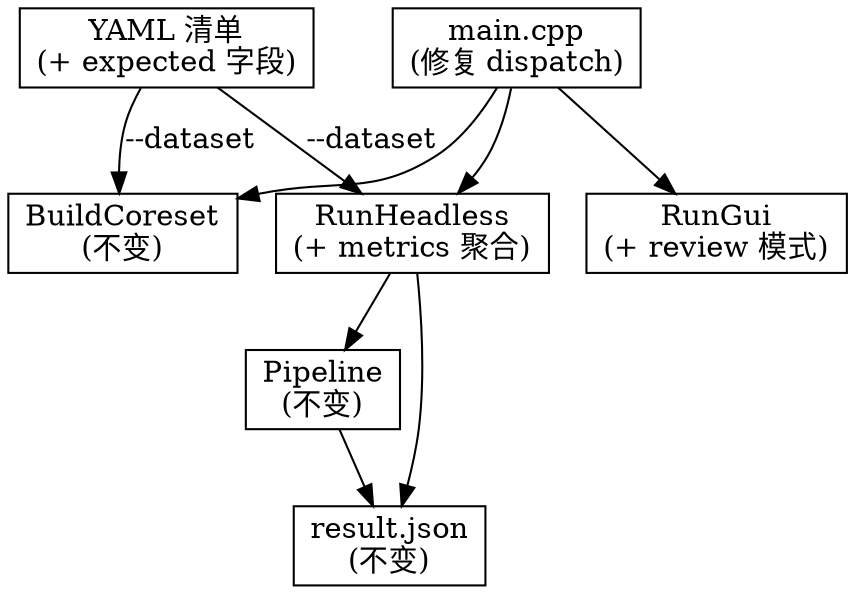

# Car 数据集端到端测试 + Qt 可视化评审

**日期**: 2026-07-17
**类型**: 功能增量
**依赖**: Milestone 1-7 + Batch T1（全部已完成）

---

## 1. 目的

使用真实汽车零部件 AOI 数据集（47 组 Good × 10 光源 × 12 位置 = 5,640 张正常 + NG 样本）对 Surface AI 框架进行端到端测试，包括：coreset 训练 → 批量检测 → 精度评估 → Qt 可视化回顾。

## 2. 动机

- 当前 Seat AOI 仅通过 FakeCamera 合成数据验证流程，缺少真实工业数据测试
- headless_runner 只输出逐帧 OK/NG 计数，无 precision / recall / F1 等监测指标
- GUI 仅支持实时推流，无法回看批处理结果
- `main.cpp` 存在 dispatch bug 导致 `BuildCoreset` 分支不可达

## 3. 设计

### 3.1 改动原则

所有改动位于「末端」—— CLI 入口层和结果聚合层。不碰 Pipeline、不碰任何 Stage、不碰推理路径。改动区域与现有代码路径隔离：



### 3.2 CLI dispatch 修复

**Bug**: `ParseArgs` 在 `!dataset_path.empty() && coreset_output_path.empty()` 时自动将 `coreset_output_path` 设为 `"resources/coreset.bin"`。`main.cpp` 的 `BuildCoreset` 分支检查 `!cli.dataset_path.empty() && cli.coreset_output_path.empty()`，此条件永远为 false。

**修复**: `ParseArgs` 不再自动填充 `coreset_output_path`。`main.cpp` 中增加显式的 train/detect 子命令判断：仅当用户给出 `--coreset-output` 时才走 BuildCoreset。

```cpp
// main.cpp: 新增 train 模式检测
if (!cli.dataset_path.empty() && cli.train_mode) {
    return BuildCoreset(cli);
}
```

`CliArgs` 增加 `bool train_mode = false`，由 `--train` 标志或 `--coreset-output` 的存在触发。

### 3.3 Ground truth 标记

`DatasetEntry` 增加可选字段：

```cpp
struct DatasetEntry {
    std::filesystem::path path;
    std::string surface_id;
    std::uint16_t position_id = 0;
    std::uint16_t light_id = 0;
    std::optional<std::string> expected_verdict;  // "OK" or "NG"
};
```

YAML 格式向后兼容——不填 `expected` 的条目视为无标签：

```yaml
images:
  - path: /mnt/e/Car/Good/000/A000_I01.png
    position: 0
    light: 1
    expected: OK
  - path: /mnt/e/Car/NG/damage_1_008/A000_I01.png
    position: 0
    light: 1
    expected: NG
```

`ImportDataset` 解析 `expected` 键（存在时）。`car_train.yaml` 不设置此字段（train 不需要 label）；`car_test_ok.yaml` / `car_test_ng.yaml` / `car_test_all.yaml` 由生成脚本设置。

### 3.4 headless_runner metrics 聚合

在 `process_entries` 尾部（Pipeline 已停止后），当 entries 包含 `expected_verdict` 时追加：

```
Confusion Matrix:
              Predicted
              OK  NG  WARN  UNCERTAIN
Actual OK     TP   -    -       -
Actual NG      -   TN   -       -

Precision = OK_pred_is_correct / total_OK_pred
Recall    = OK_actual_caught / total_OK_actual
F1        = 2 * P * R / (P + R)
```

不引入新依赖——手动计算，输出到 stdout 和 JSON summary 文件。

### 3.5 GUI review 模式

`RunGui` 增加 `--review-dir <path>` 模式：扫描目录下所有 `result.json` 文件，构建历史帧列表，通过 InspectionViewModel 和 PipelineViewModel 展示。FrameProvider 从磁盘按需加载原始图像。

```
普通模式: FakeCamera → Pipeline → ViewModel
Review 模式: 磁盘 JSON + 图片 → ViewModel
```

两种模式共享全部 ViewModel，Review 模式不启动 Pipeline / Camera / Tuning。

传入方式：`CliArgs` 增加 `std::string review_dir`，`RunGui` 根据有无此字段选择模式。

### 3.6 生成脚本更新

`generate_car_dataset.py` 在写入 `car_test_ok.yaml` 和 `car_test_ng.yaml` 时自动填入 `expected: OK` 和 `expected: NG`。`car_test_all.yaml` 继承对应标签。`car_train.yaml` 不填。

## 4. 接口

### CliArgs（cli_args.h）

| 字段 | 类型 | 说明 |
|------|------|------|
| `train_mode` | `bool` | 是否走 coreset 训练路径 |
| `review_dir` | `std::string` | GUI review 模式的 JSON 目录 |
| ~~coreset_output_path 默认填充~~ | | 删除 ParseArgs 中的自动赋值 |

### DatasetEntry（importer.h）

| 字段 | 类型 | 说明 |
|------|------|------|
| `expected_verdict` | `std::optional<std::string>` | "OK" / "NG" / std::nullopt |

## 5. 工作流

### 5.1 训练

```bash
# step 1: 生成 YAML（WSL 路径下）
python3 scripts/generate_car_dataset.py --data-root /mnt/e/Car

# step 2: 构建 coreset
./build/linux/apps/seat-aoi/seat_aoi train \
    --dataset datasets/car/car_train.yaml \
    --coreset-output resources/coresets/car/
```

### 5.2 测试

```bash
# OK 样本测试
./build/linux/apps/seat-aoi/seat_aoi detect \
    --dataset datasets/car/car_test_ok.yaml \
    --coreset-manifest resources/coresets/car/car_part.yaml \
    --output-dir /tmp/surface-ai/results/ok/

# NG 样本测试
./build/linux/apps/seat-aoi/seat_aoi detect \
    --dataset datasets/car/car_test_ng.yaml \
    --coreset-manifest resources/coresets/car/car_part.yaml \
    --output-dir /tmp/surface-ai/results/ng/

# 合成测试（自动算 metrics）
./build/linux/apps/seat-aoi/seat_aoi detect \
    --dataset datasets/car/car_test_all.yaml \
    --coreset-manifest resources/coresets/car/car_part.yaml \
    --output-dir /tmp/surface-ai/results/all/
```

### 5.3 回顾

```bash
./build/linux/apps/seat-aoi/seat_aoi review \
    --review-dir /tmp/surface-ai/results/all/
```

## 6. 类图

```
CliArgs ──────────────────────────────────────────────┐
  + train_mode: bool                                   │
  + review_dir: string                                  │
  + dataset_path: string                                │
  + coreset_output_path: string                         │
  + coreset_manifest_path: string                       │
                                                       │
DatasetEntry ──────────────────────────────────────┐   │
  + path: path                                       │   │
  + surface_id: string                               │   │
  + position_id: uint16_t                            │   │
  + light_id: uint16_t                               │   │
  + expected_verdict: optional<string>  ← NEW        │   │
                                                     │   │
main.cpp ───────────────────────────────────────────│──┘
  ParseArgs() → CliArgs                              │
  if train_mode: BuildCoreset()                      │
  elif review_dir: RunGui(review_mode)               │
  elif dataset_path: RunHeadless()                   │
  else: RunGui(live_mode)                            │
                                                     │
headless_runner.cpp ─────────────────────────────────┘
  RunHeadless(cli, app):
    process_entries():
      for each entry:
        Pipeline::Submit → Drain → read result.json
      ├─ if entries have expected_verdict:
      │    ComputeMetrics(entries, verdicts) → Precision/Recall/F1
      └─ return

gui_runner.cpp
  RunGui(cli, app):
    if cli.review_dir:
      ReviewMode(review_dir)  ← 不启动 Pipeline/Camera
    else:
      LiveMode()              ← 现有逻辑不变
```

## 7. 时序

无新增——headless 路径与现有一致；review 模式纯客户端，无异步依赖。

## 8. 线程模型

无新增线程。Metrics 计算在 `process_entries` 的主线程末尾同步完成。GUI review 模式使用 QML 事件循环的单线程。

## 9. 性能

- Metrics 计算 O(N)，N = 帧数，在已停止的 Pipeline 后执行，无性能影响
- GUI review 模式按需加载 JSON + 图片，首帧延迟 < 50ms，与实时模式持平

## 10. 内存

- `expected_verdict` 每条目最多 2 字节（"OK"/"NG"/nullopt），对于 10,000 帧 ~20KB
- review 模式缓存至多 4 帧原始图片 ≈ 4 × 1024 × 1024 × 3 = 12MB

## 11. 未来扩展

- EvalReport 结构体可扩展为 CSV/HTML 输出
- per-position metrics 可在头文件中增加分组统计接口
- review 模式可扩展支持时间区间过滤、缺陷类型筛选

## 12. 最佳实践

- `expected_verdict` 使用 `std::optional`，不引入 magic string（如 "UNKNOWN"）
- review 模式与 live 模式通过 `CliArgs::review_dir` 的判空切换，编译期就分叉，无运行时动态分支
- metrics 直接计算，不引入第三方依赖

## 13. 反模式

- ❌ 不在 Pipeline 阶段中注入 ground truth 检查——那是推理链路，不应知晓测试标签
- ❌ 不在 `result.json` 中嵌入 expected verdict——保持报告格式纯净
- ❌ 不在 GUI live 模式中混合 review 功能——两条代码路径完全独立
- ❌ 不新增 `EvalStage`——当前需求规模不需要新的 Pipeline Stage

## 14. 验收标准

1. `BuildCoreset` 分支可通过 `--dataset --coreset-output` 正确触发
2. 测试 YAML 中 `expected` 字段被正确解析并用于 metrics
3. OK-only 测试: precision/recall/F1 均在 stdout 输出
4. NG-only 测试: precision/recall/F1 均在 stdout 输出
5. 混合测试: confusion matrix 输出
6. `--review-dir` 模式下 GUI 正常启动，4 屏均可交互
7. 实时 GUI 模式不受影响
8. 现有 621 测试持续通过
