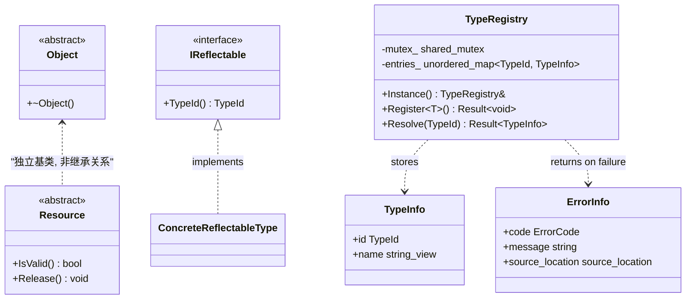
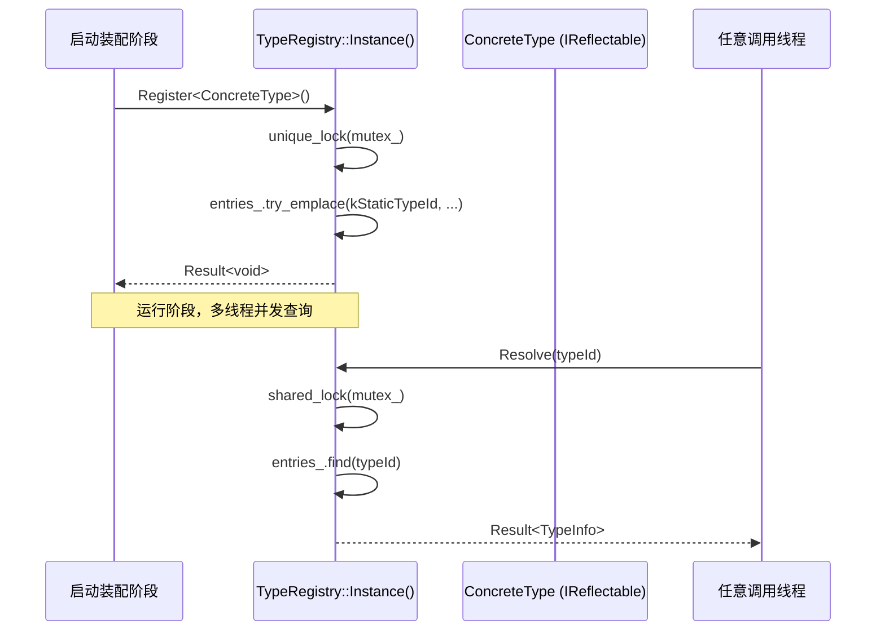

# 1.1 Core 基础（Object / Result / Resource / Type System）

> 里程碑：里程碑 1 —— 基座设施
> 批次依赖：无（首个内容批次）
> 本批次定稿的概念与接口是后续所有批次（1.2 - 7.2）错误处理与反射能力的唯一基线，一旦定稿不可在其他批次重新定义，只能引用。

## 1. Purpose

Core 基础批次为 Surface AI Framework 建立四个贯穿全框架生命周期的地基构件：

- **`Object`**：框架内所有一等对象（Module、Service、Plugin、Resource 的具体实现等）的公共基类语义，统一对象身份与不可拷贝默认策略。
- **`Result<T>`**：框架统一的错误返回通道，取代裸 `bool`/错误码/异常滥用，是 spec 第 2 节"错误处理：tl::expected 为主"决策在代码层面的唯一落地形式。
- **`Resource`**：RAII 资源句柄的公共语义基类，统一相机句柄、GPU 内存句柄、文件句柄等一切需要确定性释放的资源的生命周期契约。
- **Type System（`TypeId` / `IReflectable` / `TypeRegistry`）**：跨插件边界的运行时类型标识与查找机制，替代不可靠的 RTTI，支撑后续 1.3 插件体系的按类型注册与解析。

这四个构件不解决具体业务问题，而是让里程碑 2-7 的每一个模块在"如何报错""如何标识自己的类型""如何管理资源生命周期"这三个问题上有唯一、确定的答案，不需要每个模块各自发明一套。

## 2. Responsibilities

Core 基础批次负责：

- 定义 `Object` 基类，规定其拷贝/移动语义与析构契约，作为所有一等对象的公共祖先。
- 定义 `ErrorInfo` 结构体与 `Result<T>` 别名，规定框架内函数返回错误的唯一形式。
- 划定异常与 `Result<T>` 的适用边界，给出可执行的判断规则而非模糊建议。
- 定义 `Resource` 基类，规定 RAII 资源句柄的公共接口（`IsValid()` / `Release()`）与移动语义。
- 定义 `TypeId` 的生成机制（编译期字符串哈希），不依赖 RTTI。
- 定义 `IReflectable` 接口，规定"一个类型如何报告自己的 `TypeId`"。
- 定义 `TypeRegistry`，规定类型注册与按 `TypeId` 反查的线程安全模型。

Core 基础批次不负责：

- 具体业务对象（Module/Service/Plugin/Camera/Detector 等）的定义，这些属于 1.2/1.3 及里程碑 2 及以后。
- 依赖注入容器与生命周期状态机，属于 1.2。
- 内存池化策略，属于 1.5。
- 日志与配置的运行时基础设施，属于 1.6（本批次只提供 `ErrorInfo`/`Result<T>` 类型本身，不提供 Logger/ConfigStore）。

## 3. Design

**`Result<T>` 采用 `tl::expected<T, ErrorInfo>` 作为唯一错误返回通道，拒绝裸 `bool`/`errno` 风格返回值。** 原因：裸 `bool` 或整数错误码丢失错误上下文（发生在哪一行、什么原因），调用方必须依赖约定俗成的"检查返回值"习惯，容易被遗漏；`tl::expected` 把错误提升为类型系统的一部分，编译器强制调用方处理（否则 `.value()` 在无值时的行为是明确定义的，比裸返回值被静默忽略更安全），并且提供 `and_then`/`or_else`/`map` 链式组合能力，能把多步可能失败的操作写成线性管道而不是嵌套 `if` 判断。定义：

```cpp
template <typename T>
using Result = tl::expected<T, ErrorInfo>;
```

`ErrorInfo` 固定为三个字段，不多不少：

```cpp
struct ErrorInfo {
    ErrorCode code;                         // 枚举，模块前缀分区（Core_* 等，分类表由 1.6 补完）
    std::string message;                    // 面向排障的人类可读描述
    std::source_location source_location;   // C++20 标准库，编译期捕获，零手工维护成本
};
```

`source_location` 使用 C++20 标准库类型而不是手写 `__FILE__`/`__LINE__` 宏，因为标准库版本在调用点自动展开、类型安全，且与 `std::format`/日志库的集成是标准化路径,不需要框架自己维护一套宏。

**异常仅允许在两种场景抛出：构造函数失败、静态初始化失败；其余一切场景返回 `Result<T>`。** 这是与 spec 第 2 节"tl::expected 为主，异常仅用于真正例外场景"决策的直接对应，而不是留给实现者"看情况自行选择"的开放式选项。理由是可执行的判断规则而非原则性口号：

- 构造函数没有返回值通道，无法用 `Result<T>` 表达失败，只能抛异常或让对象进入无效状态被后续调用悄悄放大错误；框架选择前者，构造失败必须抛异常，禁止"构造出一个半初始化对象，指望调用方检查某个 `IsValid()`"的隐式契约。
- 静态初始化（全局/命名空间作用域对象的构造、`TypeRegistry` 等单例的首次初始化）发生在 `main()` 之前，没有调用栈上的 `Result<T>` 接收方，失败只能通过异常中止进程，这是可接受的，因为静态初始化失败意味着二进制本身有问题，无法通过运行期重试恢复。
- 所有其他场景（业务函数、成员函数、工厂方法、I/O 操作）一律返回 `Result<T>`，包括看起来"几乎不会失败"的路径（例如 `TypeRegistry::Resolve`），因为这些路径处于框架热路径或跨插件边界，异常在这些位置引入不可预测的性能开销与跨动态库边界的 ABI 风险（不同编译单元对异常类型的 RTTI 匹配可能不可靠）。

**`TypeId` 用编译期 `constexpr` 字符串哈希生成，拒绝使用 RTTI（`typeid`/`dynamic_cast`）。** 理由：Surface AI Framework 的插件以独立编译的动态库（`.so`）形式加载（1.3 批次定稿），`typeid` 的比较依赖同一份 `type_info` 在跨编译单元、跨动态库场景下的一致性，这一保证在不同编译器版本、不同 `-fvisibility` 设置、不同动态库加载顺序下并不总是成立，会导致"同一个类型在插件 A 和主程序里被判定为不同类型"这类难以复现的缺陷。编译期字符串哈希只依赖类型的完全限定名字符串本身，不依赖编译器 ABI 内部表示，跨插件边界结果确定且可复现：

```cpp
namespace detail {
constexpr TypeId Fnv1aHash(std::string_view name) noexcept {
    TypeId hash = 14695981039346656037ULL;  // FNV-1a 64-bit offset basis
    for (char ch : name) {
        hash ^= static_cast<TypeId>(static_cast<unsigned char>(ch));
        hash *= 1099511628211ULL;            // FNV-1a 64-bit prime
    }
    return hash;
}
}  // namespace detail
```

哈希算法选定 FNV-1a 64 位，不选 `std::hash<std::string_view>`，因为标准库 `std::hash` 的具体实现允许因编译器/标准库版本不同而不同（标准未规定算法），无法保证跨插件二进制在不同工具链下产出同一哈希值；FNV-1a 是公开算法，行为在所有编译器上一致，且是 `constexpr` 友好的纯位运算，可在编译期完全求值。

`TypeId` 的碰撞风险不通过"运行期检测碰撞并报错"来兜底，而是通过约定类型名必须是完全限定名（包含完整命名空间路径，如 `"sai::vision::CameraPlugin"` 而非 `"CameraPlugin"`）来降低概率；64 位哈希空间下同批次注册的类型数量（预计数百级别）碰撞概率可忽略,框架不为这一低概率事件引入运行期校验的复杂度。

**`Object` 默认禁止拷贝与移动，拒绝"默认可拷贝，特殊场景再手动禁用"的惯例。** 框架内一等对象（Module、Service、Plugin 实例）代表持有身份与生命周期的实体，拷贝一个 `Object` 会产生两个具有相同类型身份但独立生命周期的实例，这与"对象等价于其生命周期内唯一的一份状态"的设计前提冲突。需要值语义的数据载体（如传递给 Pipeline 的 Tensor/Image 帧数据）不派生自 `Object`，而是普通结构体或 1.5 批次定稿的池化句柄类型，两类语义在类型系统上明确分离，不共用同一个基类。

**`Resource` 与 `Object` 是两个独立的基类，不合并成一个"万能基类"。** `Object` 表达"身份"，`Resource` 表达"需要确定性释放的底层资源持有关系"（相机句柄、GPU 显存块、文件描述符）。二者职责正交：一个 `Object`（例如某个 `Service` 实现）可以内部持有若干 `Resource`，但 `Resource` 本身不需要 `Object` 的身份语义（它不会被 `TypeRegistry` 按类型查找，只会被其持有者管理）。`Resource` 允许移动（转移持有权）但禁止拷贝（拷贝会产生两个自认为都拥有同一份底层资源的句柄，双重释放风险），这与 `Object` 的"移动也禁止"策略不同，因此不能合并成同一基类语义。

## 4. Interfaces

以下为本批次定稿的头文件级声明（命名空间统一为 `sai`），非实现细节；后续批次引用这些名称时必须逐字一致。

```cpp
// -----------------------------------------------------------------------
// <sai/core/type_id.h>
// -----------------------------------------------------------------------
namespace sai {

using TypeId = std::uint64_t;

namespace detail {
constexpr TypeId Fnv1aHash(std::string_view name) noexcept;
}  // namespace detail

}  // namespace sai

// 每个可反射类型通过该宏一次性声明 kStaticTypeId / kStaticTypeName 并实现 TypeId() override。
// QualifiedName 必须是完全限定名（含命名空间），例如 SAI_DECLARE_TYPE_ID(sai::vision::CameraPlugin)。
#define SAI_DECLARE_TYPE_ID(QualifiedName)                                 \
    static constexpr std::string_view kStaticTypeName = #QualifiedName;    \
    static constexpr ::sai::TypeId kStaticTypeId =                         \
        ::sai::detail::Fnv1aHash(kStaticTypeName);                         \
    [[nodiscard]] auto TypeId() const noexcept -> ::sai::TypeId override { \
        return kStaticTypeId;                                             \
    }
```

```cpp
// -----------------------------------------------------------------------
// <sai/core/error.h>
// -----------------------------------------------------------------------
namespace sai {

enum class ErrorCode : std::uint32_t {
    Core_Unknown = 0,
    Core_ConstructionFailed,
    Core_TypeAlreadyRegistered,
    Core_TypeNotFound,
    // 完整分类表（Runtime_* / Memory_* 等前缀）由 1.6 批次补完，本批次只定义 Core_* 前缀下
    // TypeRegistry 相关的最小必需子集。
};

struct ErrorInfo {
    ErrorCode code;
    std::string message;
    std::source_location source_location;
};

template <typename T>
using Result = tl::expected<T, ErrorInfo>;

}  // namespace sai
```

```cpp
// -----------------------------------------------------------------------
// <sai/core/object.h>
// -----------------------------------------------------------------------
namespace sai {

class Object {
public:
    virtual ~Object() = default;

    Object(const Object&) = delete;
    Object& operator=(const Object&) = delete;
    Object(Object&&) = delete;
    Object& operator=(Object&&) = delete;

protected:
    Object() = default;
};

}  // namespace sai
```

```cpp
// -----------------------------------------------------------------------
// <sai/core/resource.h>
// -----------------------------------------------------------------------
namespace sai {

class Resource {
public:
    Resource() noexcept = default;
    virtual ~Resource() noexcept = default;

    Resource(const Resource&) = delete;
    Resource& operator=(const Resource&) = delete;
    Resource(Resource&&) noexcept = default;
    Resource& operator=(Resource&&) noexcept = default;

    [[nodiscard]] virtual bool IsValid() const noexcept = 0;
    virtual void Release() noexcept = 0;
};

}  // namespace sai
```

```cpp
// -----------------------------------------------------------------------
// <sai/core/reflectable.h>
// -----------------------------------------------------------------------
namespace sai {

class IReflectable {
public:
    virtual ~IReflectable() = default;

    // 返回该实例的运行时类型标识；具体类型通过 SAI_DECLARE_TYPE_ID 宏实现本方法。
    [[nodiscard]] virtual auto TypeId() const noexcept -> sai::TypeId = 0;
};

}  // namespace sai
```

```cpp
// -----------------------------------------------------------------------
// <sai/core/type_registry.h>
// -----------------------------------------------------------------------
namespace sai {

struct TypeInfo {
    TypeId id;
    std::string_view name;
};

// T 必须派生自 IReflectable 且通过 SAI_DECLARE_TYPE_ID 声明了 kStaticTypeId / kStaticTypeName。
template <typename T>
concept Reflectable = std::is_base_of_v<IReflectable, T> &&
    requires {
        { T::kStaticTypeId } -> std::convertible_to<TypeId>;
        { T::kStaticTypeName } -> std::convertible_to<std::string_view>;
    };

class TypeRegistry {
public:
    static auto Instance() noexcept -> TypeRegistry&;

    // 注册阶段调用，重复注册同一 TypeId 返回 Core_TypeAlreadyRegistered 错误而非覆盖。
    template <Reflectable T>
    auto Register() -> Result<void>;

    // 查询阶段调用，找不到返回 Core_TypeNotFound 错误。
    [[nodiscard]] auto Resolve(TypeId id) const -> Result<TypeInfo>;

private:
    mutable std::shared_mutex mutex_;
    std::unordered_map<TypeId, TypeInfo> entries_;
};

}  // namespace sai
```

## 5. Workflow

**类型注册流程（启动阶段，单线程）：**

1. 具体类型（例如某个 `IModule` 实现）通过 `SAI_DECLARE_TYPE_ID` 宏在编译期获得 `kStaticTypeId` 与 `kStaticTypeName`。
2. 启动装配阶段（1.2 批次定稿的 `Context` 装配流程中）调用 `TypeRegistry::Instance().Register<T>()`。
3. `Register<T>()` 内部通过 `try_emplace` 插入条目，若键已存在则不覆盖，直接返回 `Core_TypeAlreadyRegistered` 错误。

**类型查询流程（运行阶段，多线程只读）：**

```cpp
auto DescribeType(TypeId id) -> Result<std::string> {
    return TypeRegistry::Instance()
        .Resolve(id)
        .and_then([](const TypeInfo& info) -> Result<std::string> {
            return Result<std::string>(std::string(info.name));
        });
}
```

查询流程用 `and_then` 链式组合而非嵌套 `if (result.has_value())` 判断：`Resolve` 失败时 `and_then` 自动短路并把原始 `ErrorInfo` 向上传播，调用方不需要在每一层手动检查再转发错误。这一模式是本批次为后续所有批次的错误传播定下的标准写法。

**错误处理决策路径（构造函数 vs `Result<T>`）：**

判断一个失败场景该抛异常还是返回 `Result<T>`，遵循单一提前返回式判断，不需要多层 if 链：

```cpp
// 伪代码，描述决策规则本身，非真实函数
auto DecideFailureChannel(FailureContext ctx) -> FailureChannel {
    if (ctx.occurs_in_constructor || ctx.occurs_in_static_init) {
        return FailureChannel::Exception;
    }
    return FailureChannel::Result;
}
```

## 6. Data Structure

| 类型 | 归属场景 | 关键字段/成员 | 生命周期 |
|---|---|---|---|
| `ErrorInfo` | 所有 `Result<T>` 的错误分支 | `code` / `message` / `source_location` | 值语义，随 `Result<T>` 一起构造/销毁，不跨函数边界持久化 |
| `TypeInfo` | `TypeRegistry` 内部条目 | `id` / `name`（`string_view`，指向 `kStaticTypeName` 的静态存储，不拷贝字符串） | 与所属类型的静态存储期相同，进程运行期间不失效 |
| `TypeRegistry` 内部表 | 单例，进程生命周期 | `std::unordered_map<TypeId, TypeInfo>` + `std::shared_mutex` | 首次访问时构造（`Instance()` 内的 `static` 局部变量），进程退出时销毁 |

`TypeInfo::name` 使用 `std::string_view` 而非 `std::string`，因为其指向的字符串来自 `kStaticTypeName`（编译期常量，静态存储期），没有必要为已经在静态存储区存在的字符串再做一份堆拷贝。

## 7. Class Diagram



## 8. Sequence Diagram



## 9. Thread Model

`TypeRegistry` 的并发模型分两个明确阶段，不是"随时可能被任意方式访问"的通用并发结构：

- **注册阶段**：发生在进程启动、`Context` 装配尚未完成之前，此阶段框架保证单线程执行（1.2 批次定稿的 `Context` 装配流程在单线程中依次调用各模块的注册逻辑）。`Register<T>()` 内部仍然获取 `std::unique_lock`，不是因为注册阶段真的存在并发，而是为了让 `TypeRegistry` 的接口契约本身不依赖调用方遵守"启动阶段单线程"这一约定就能保证正确性——防御性成本极低（一次锁获取），换来的是接口契约不依赖外部纪律。
- **查询阶段**：应用进入 `Running` 状态后，`Resolve()` 可能被 Capture/Inference/Retrieval 等多个工作线程并发调用（这些线程角色由 1.4 批次定稿）。此阶段不再有新的 `Register()` 调用。`Resolve()` 使用 `std::shared_lock`，允许多个读者并发持有共享锁，不阻塞彼此。

选择 `std::shared_mutex` 而非 `std::mutex`，理由是查询阶段读多写零（注册阶段结束后不再写），`std::mutex` 会把并发读请求全部串行化，而 `std::shared_mutex` 让并发读之间零阻塞，只在理论上仍有写入者时才互斥。不采用无锁结构（如 1.5 批次内存池使用的 lock-free stack），因为 `TypeRegistry` 的访问频率远低于内存池的 slab 申请/归还（类型查询通常发生在插件加载、日志分类等低频路径，不是逐帧调用的热路径），`shared_mutex` 的开销在这个场景下不构成瓶颈，引入无锁结构的复杂度收益不成正比。

## 10. Performance

- `TypeId` 计算发生在编译期（`constexpr` 求值），运行期零开销；`kStaticTypeId` 在二进制中是编译期常量，`TypeId()` 虚函数调用只是一次虚表跳转 + 常量返回，不涉及运行期哈希计算。
- `TypeRegistry::Resolve()` 的时间复杂度为 `unordered_map` 平均 O(1) 查找 + 一次 `shared_lock` 获取（无写入者竞争时，`shared_lock` 是一次原子操作，无系统调用），单次查询预期耗时低于 100 纳秒（未包含容器桶分布不均的最坏情况）。
- `TypeRegistry::Register()` 只发生在启动阶段，对其性能不设硬性指标（预期注册的类型数量在数百量级，累计耗时不超过毫秒级，不影响启动时间预算）。

## 11. Memory

- `TypeRegistry` 本身是进程级单例，随进程启动分配、进程退出时随静态存储期对象一起销毁，不参与 1.5 批次的池化管理（它不是热路径分配对象，没有池化的必要）。
- `TypeInfo::name` 不持有堆内存（`string_view` 指向静态存储期字符串），`TypeRegistry` 内部 `unordered_map` 的节点分配走标准堆分配器，因为注册操作只发生在启动阶段一次性完成，不产生运行期的持续分配压力。
- `ErrorInfo::message` 为 `std::string`，在错误路径上会发生一次堆分配（短字符串优化可能规避,取决于消息长度）；框架接受这一开销，因为错误路径本身就是非热路径（错误不应该逐帧发生），不为错误消息引入池化或固定缓冲区的复杂度。

## 12. Future Extension

- 若未来需要支持"运行期动态加载后卸载插件时移除其注册的类型"，`TypeRegistry` 需要新增 `Unregister(TypeId)` 接口；本批次不预留该接口的占位签名，因为当前 1.3 批次的插件卸载策略尚未定稿，避免过早锁定一个可能与卸载流程不匹配的签名。
- 若未来需要跨进程（而非跨插件动态库）传递 `TypeId`（例如分布式部署场景下不同进程间同步类型信息），当前基于本进程编译产物的字符串哈希方案仍然适用，因为哈希算法本身不依赖进程内状态，只要类型的完全限定名字符串在所有进程的构建中保持一致即可；这属于验证而非新设计，留待相关里程碑评估。
- `ErrorCode` 的完整分类表由 1.6 批次补完，本批次只锁定 `Core_*` 前缀下与 `TypeRegistry` 直接相关的最小子集，避免本批次越界定义其他模块的错误码。

## 13. Best Practice

- 派生类型声明 `TypeId` 时始终使用 `SAI_DECLARE_TYPE_ID` 宏而不是手写重复的 `kStaticTypeId`/`TypeId()` 样板代码，保证所有类型的哈希输入格式（完全限定名字符串）一致。
- 传给 `SAI_DECLARE_TYPE_ID` 的名称必须是完全限定名（包含完整命名空间路径），不要传裸类名，以降低跨模块类名冲突导致的哈希碰撞概率。
- 消费 `Result<T>` 时优先使用 `and_then`/`or_else`/`map` 链式组合，只在链的末端（需要真正决定分支逻辑时）才用 `if (result.has_value())` 或 `result.error()`，保持错误传播路径线性、可读。
- 需要跨模块共享同一份资源生命周期语义时派生自 `Resource`，不要在业务类里手写裸指针 + 手动 `delete`；`Resource` 的移动语义已经处理好了持有权转移。

## 14. Anti Pattern

- 不要在框架代码中使用 `typeid`/`dynamic_cast` 来判断或比较类型；一旦涉及跨插件边界，其行为不可靠，必须统一通过 `IReflectable::TypeId()` + `TypeRegistry` 完成类型识别。
- 不要在非构造函数、非静态初始化路径中抛异常来表达"正常业务失败"（例如"文件不存在""网络超时""配置项缺失"）；这些场景必须返回 `Result<T>`，异常只保留给构造失败和静态初始化失败两种场景。
- 不要绕过 `Result<T>` 直接用裸 `bool` 返回值加一个 `out` 参数来表达"成功与否 + 失败原因"；这是本批次明确拒绝的 `errno` 风格，错误上下文（`source_location`/`message`）会在传递中丢失。
- 不要让 `Object` 派生类提供拷贝构造函数或拷贝赋值运算符（即便通过 `= default` 显式声明）；需要值语义的数据应设计为不派生自 `Object` 的独立类型。
- 不要在 `TypeRegistry::Resolve()` 的调用点用嵌套 `if (result.has_value()) { if (...) { ... } }` 的多层结构处理返回值；应使用 `and_then` 链式组合把多步查询/转换写成线性管道。

