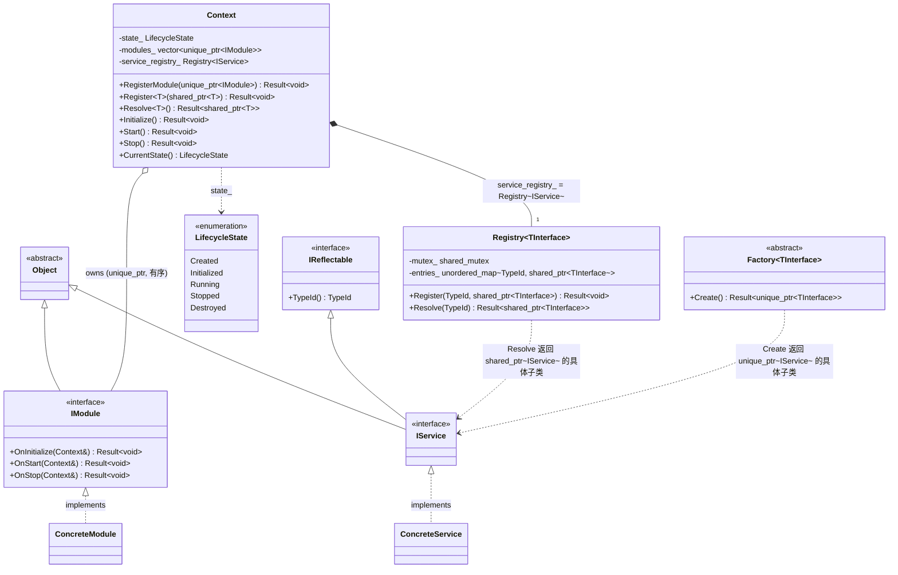
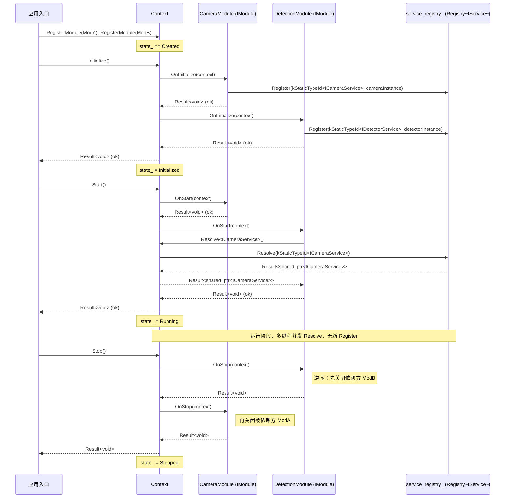

# 1.2 Core 生命周期与装配（Module / Service / Context / Factory / Registry）

> 里程碑：里程碑 1 —— 基座设施
> 批次依赖：1.1（`Object`、`Result<T>`、`IReflectable`、`TypeRegistry`、`TypeId`、`Reflectable` concept，均按 1.1 定稿签名直接引用，不重新定义）
> 本批次定稿的 `Registry<TInterface>` 是通用的按接口类型注册表，与 `Context` 无耦合；1.3 批次插件体系将直接实例化 `Registry<IPlugin>` 复用本模板，不得重新定义其签名。

## 1. Purpose

Core 生命周期与装配批次回答 1.1 批次故意留白的两个问题："业务对象之间如何组织成一个可运行的程序"与"程序自身如何从启动到停止有序推进"。为此建立五个构件：

- **`Module`**：编译期/部署期粒度的功能单元。一个 `Module` 对应源码里一组内聚的类型集合（例如"视觉能力模块"），是装配阶段的注册单位，不是运行期可替换的对象。
- **`Service`**：运行期可替换的能力提供者。同一个 `IService` 派生接口在不同部署下可以绑定不同的具体实现（例如相机服务在开发环境绑定模拟实现，在生产环境绑定真实驱动实现），是依赖注入解析的目标类型。
- **`Context`**：依赖注入容器 + 生命周期宿主。既是服务的解析入口，也是驱动整个进程从 `Created` 到 `Stopped` 的唯一状态机宿主。
- **`Factory<TInterface>`**：无状态工厂，每次 `Create()` 产出一个全新实例，不维护已创建实例的注册表。
- **`Registry<TInterface>`**：通用的按 `TypeId` 存储已注册单例实例的表，`Context` 内部持有一个 `Registry<IService>` 来存放服务，但 `Registry<TInterface>` 本身是与 `Context` 正交的独立构件。

这五个构件共同把"框架启动时该做什么、按什么顺序做、失败了怎么办"从每个模块各自发明的临时代码，收敛成一套贯穿里程碑 2-7 的统一装配契约。

## 2. Responsibilities

本批次负责：

- 定义 `LifecycleState` 枚举与其合法迁移规则，规定进程级生命周期状态机的唯一权威定义。
- 定义 `IModule`、`IService` 接口，规定模块与服务两类一等对象各自的公共契约与相互关系。
- 定义 `Context`，规定依赖注入的注册（`Register<T>`）、解析（`Resolve<T>`）与生命周期驱动（`Initialize`/`Start`/`Stop`）三组操作的签名与调用时序约束。
- 定义 `Factory<TInterface>` 与 `Registry<TInterface>` 两个模板，规定"无状态构造"与"已注册单例查找"两种对象获取语义的边界，且后者的签名对后续批次（1.3 插件体系）具有约束力。

本批次不负责：

- 插件的动态库加载、卸载、版本兼容检查——属于 1.3，1.3 只消费本批次定稿的 `Registry<TInterface>` 模板，实例化为 `Registry<IPlugin>`。
- 工作线程池、任务调度——属于 1.4；本批次的 `Context::Resolve<T>()` 并发模型只规定"多线程只读安全"，不规定具体由哪些线程调用。
- 具体 `ErrorCode` 分类表的完整定义——延续 1.1 的做法，本批次只新增 `Lifecycle_*` 前缀下与本批次直接相关的最小必需子集，完整表由 1.6 补完。
- 服务的热重启（`Stopped` 回到 `Initialized` 再次 `Start`）——本批次的状态机是单向线性迁移，重启语义留待未来批次评估（见 12. Future Extension）。

## 3. Design

**依赖注入采用构造函数注入 + `Context::Resolve<T>()`，拒绝属性注入（setter injection）。** 属性注入允许对象先被构造出来、之后再通过 setter 补齐依赖，这意味着对象在"已构造但依赖未就位"的中间状态下仍然可以被其他代码持有并调用；这与 `LifecycleState::Initialized` 的语义直接冲突——`Initialized` 表示"该对象的全部依赖已确定且不再变化"，如果依赖可以在对象生命周期中途通过 setter 改变，`Initialized` 就不再是一个稳定、可依赖的状态，任何在 `Initialized` 之后读取该对象的代码都需要额外确认"setter 是否已经被调用过"，重新引入了 1.1 批次已经用 `Result<T>` 消灭掉的那类"隐式契约"问题。构造函数注入把依赖的完整性检查交给编译器（缺参数编译不通过）和 `Context::Resolve<T>()` 的 `Result<T>` 返回值（解析失败在构造前暴露），对象一旦构造完成，其依赖集合终身不变。

**`Registry<TInterface>` 是与 `Context` 正交的通用构件，不是 `Context` 的内部私有结构。** 拒绝把"按类型注册查找"的逻辑直接写成 `Context` 的私有 `std::unordered_map` 成员函数，因为这样会导致 1.3 批次的插件体系（同样需要"按 `TypeId` 存储已注册的 `IPlugin` 实现实例"）不得不重新实现一遍几乎相同的加锁、插入、查找逻辑，或者被迫让插件系统依赖 `Context` 本身（语义上不成立：插件注册表和服务注册表是两个独立的生命周期宿主，插件可以在 `Context` 之外被枚举）。`Registry<TInterface>` 独立成模板后，`Context` 通过组合（持有一个 `Registry<IService> service_registry_` 成员）复用它，1.3 批次通过实例化 `Registry<IPlugin>` 复用同一份代码，两处复用互不感知对方的存在。

**`Factory<TInterface>` 与 `Registry<TInterface>` 是两个语义不同的构件，不是同一概念的两个名字。** `Factory<TInterface>::Create()` 每次调用产出一个新的、无主的 `std::unique_ptr<TInterface>`，调用方获得独占所有权，工厂本身不记住已经创建过什么；`Registry<TInterface>::Resolve(TypeId)` 返回的是此前已经通过 `Register` 存入的同一个 `std::shared_ptr<TInterface>` 实例，多次 `Resolve` 同一个 `TypeId` 得到指向同一对象的句柄。二者不能互相替代：如果用 `Registry` 冒充 `Factory`（每次 `Register` 一个新实例再立即 `Resolve` 一次），`TypeId` 冲突会触发 `Core_TypeAlreadyRegistered` 错误，因为 `Registry::Register` 的设计前提就是"同一 `TypeId` 只应该有一份权威实例"；如果用 `Factory` 冒充 `Registry`（每次需要服务就 `Create()` 一个新的），会破坏"服务是运行期可替换但单例"的设计前提（1. Purpose 对 `Service` 的定义），且丢失了跨多个消费者共享同一实例状态的能力（例如某个 `IService` 内部维护了连接池，多个消费者必须拿到同一个实例才能共享这个连接池）。二者的关系是互补而非二选一：一个服务实现可以先由 `Factory<TInterface>` 构造出实例，再把这个实例 `Register` 进 `Registry<TInterface>`，此后所有消费者都通过 `Resolve` 拿到同一份实例。

**`IService` 派生自 `Object` 与 `IReflectable` 两个基类，不只派生 `Object`。** 这比"class IService : public Object"的最小表面契约多了一层：`Context::Register<T>()` 需要用 `T::kStaticTypeId` 作为 `Registry<IService>` 的键，这要求 `T` 满足 1.1 批次定稿的 `Reflectable` concept（`std::is_base_of_v<IReflectable, T>` 加上 `kStaticTypeId`/`kStaticTypeName` 静态成员）。拒绝的替代方案是"在 `Context` 内部另建一张字符串到实例的旁路映射表，服务通过手写类型名字符串查找"，这个方案被拒绝的原因是它重新引入了 1.1 批次用 `TypeId` 的 `constexpr` 哈希机制专门要消灭的"字符串比较 + 跨插件边界不可靠"问题；让 `IService` 继承 `IReflectable` 则可以直接复用已经定稿、已经解决跨插件一致性问题的 `TypeId` 机制，零新增复杂度。`IModule` 不做同样的继承，因为 `Context` 用 `std::vector<std::unique_ptr<IModule>>` 按注册顺序保存模块、按顺序遍历调用生命周期钩子，不需要按 `TypeId` 查找某个模块，`IModule` 没有 `Registry` 场景下的键需求。

**`LifecycleState` 是严格线性、单向、不可跳跃的五态状态机，不支持任意状态间的自由跳转或状态回退。** 合法迁移只有 `Created→Initialized→Running→Stopped→Destroyed` 这一条链，`Created` 不能直接到 `Running`，`Running` 不能跳过 `Stopped` 直接进 `Destroyed`，也不允许任何反向迁移（例如 `Stopped` 回到 `Initialized` 重新启动）。拒绝的替代方案是允许 `Stopped→Initialized` 的重启迁移，看起来能省去"进程重启"的外部开销，但这要求每一个 `IModule::OnInitialize`/`OnStart` 实现都必须是幂等的（能正确处理"这是第二次调用"的情况），而本批次并未要求也无法验证所有未来模块实现都满足这一前提；允许一个当前无法保证正确性的迁移路径，比拒绝它、把重启诉求留给"重新创建一个新的 `Context` 实例"这一已经天然正确的方案，风险更高。重启作为独立能力留待未来评估（12. Future Extension），本批次的状态机保持严格线性。

**`Context::Register<T>()` 的合法调用窗口只有 `state_ == Created`，`Context::Resolve<T>()` 不做任何 `LifecycleState` 门禁。** 前者的原因：服务注册本质上是装配阶段的行为，一旦 `Initialize()` 成功返回（`state_` 变为 `Initialized`），所有模块已经完成了它们的服务注册，允许此后继续注册意味着"运行中的服务集合可以被悄悄替换"，这与 `IReflectable`/`TypeId` 体系假设的"同一 `TypeId` 在整个运行期对应同一份权威实现"前提冲突,因此在 `Initialized`/`Running`/`Stopped`/`Destroyed` 任一状态下调用 `Register` 都返回 `Lifecycle_RegisterAfterAssembly` 错误,不区分这四个状态分别处理,统一用一个相等性判断（`state_ != Created`）表达,避免用多分支 if 链枚举"不允许的状态"。后者的原因：`Resolve` 是纯读操作，其并发正确性由 `Registry<IService>` 内部的 `std::shared_mutex` 保证,与调用时 `Context` 处于哪个 `LifecycleState` 无关——`Initialize()`/`Start()` 的模块钩子（`OnInitialize`/`OnStart`）本身就需要在状态迁移完成前调用 `Resolve` 去获取其他模块已经注册好的服务,如果给 `Resolve` 加上"仅 `Running` 可调用"的门禁,会直接堵死这一常见场景,因此 `Resolve` 不设门禁,只依赖底层锁保证正确性。

**模块的 `OnStop` 钩子按注册顺序的逆序调用，不是与 `OnInitialize`/`OnStart` 相同的正序。** 后注册的模块通常依赖先注册的模块提供的服务（例如"检测模块"依赖"相机模块"提供的 `ICameraService`），因此关闭顺序必须与依赖方向相反，先关闭依赖别人的模块，再关闭被依赖的模块，这与 C++ 对象析构按构造的逆序进行是同一原理。拒绝"按注册顺序正序关闭"的方案，因为这会导致某个模块的 `OnStop` 执行时，它依赖的服务可能已经被提供方模块提前释放，读到失效的 `shared_ptr` 指向对象。

**`Initialize()`/`Start()` 中任一模块钩子失败即刻停止后续模块调用，且不做自动回滚。** 拒绝"某个模块失败后自动反向调用已成功模块的 `OnStop`/回滚"的方案，因为回滚逻辑本身可能失败（回滚路径是极少被执行、极少被测试的代码），引入的复杂度和潜在缺陷面往往超过它试图解决的问题；装配阶段失败属于致命错误，工业界的标准做法是让进程退出、由外部监督者（进程管理器/容器编排）决定是否重启一个全新进程，而不是让框架自己在半初始化状态下尝试自我修复。`Context` 失败时保持在失败前的状态不变（`state_` 不会被置为目标状态），调用方据此判断装配失败并终止进程。

## 4. Interfaces

以下为本批次定稿的头文件级声明（命名空间统一为 `sai`），非实现细节；后续批次引用这些名称时必须逐字一致。

```cpp
// -----------------------------------------------------------------------
// <sai/core/lifecycle.h>
// -----------------------------------------------------------------------
namespace sai {

// Destroyed 是概念上的终态，用于让生命周期图完整，不是 Context::state_ 会被
// 赋予的运行时值：C++ 对象析构后不存在可供查询的“当前状态”，因此不提供任何
// 把 state_ 显式置为 Destroyed 的 API。
enum class LifecycleState {
    Created,
    Initialized,
    Running,
    Stopped,
    Destroyed,
};

}  // namespace sai
```

```cpp
// -----------------------------------------------------------------------
// <sai/core/module.h>
// -----------------------------------------------------------------------
namespace sai {

class Context;  // 前置声明，避免与 <sai/core/context.h> 的头文件循环依赖

class IModule : public Object {
public:
    virtual ~IModule() = default;

    // 装配阶段调用：Context 处于 Created 状态时，按 RegisterModule 的注册顺序
    // 依次调用。模块在此钩子内通过 context.Register<T>(...) 注册自己提供的服务。
    virtual auto OnInitialize(Context& context) -> Result<void> = 0;

    // Context 从 Initialized 迁移到 Running 前调用，按注册顺序依次调用。
    virtual auto OnStart(Context& context) -> Result<void> = 0;

    // Context 从 Running 迁移到 Stopped 前调用，按注册顺序的逆序依次调用。
    virtual auto OnStop(Context& context) -> Result<void> = 0;
};

}  // namespace sai
```

```cpp
// -----------------------------------------------------------------------
// <sai/core/service.h>
// -----------------------------------------------------------------------
namespace sai {

// 继承 IReflectable 使派生接口（如 ICameraService）能满足 1.1 批次定稿的
// Reflectable concept，从而作为 Context::Register<T> / Resolve<T> 的键类型。
class IService : public Object, public IReflectable {
public:
    virtual ~IService() = default;
};

}  // namespace sai
```

```cpp
// -----------------------------------------------------------------------
// <sai/core/factory.h>
// -----------------------------------------------------------------------
namespace sai {

// 无状态工厂：每次 Create() 产出一个全新、独占所有权的实例，工厂本身不记录
// 已创建过什么。具体类型（如 CameraServiceFactory : Factory<ICameraService>）
// 派生本模板并实现 Create() 内部的构造逻辑。与 Registry<TInterface> 的
// “已注册单例查找”语义互补，不是同一概念的两个名字，见 3. Design。
template <typename TInterface>
class Factory {
public:
    virtual ~Factory() = default;

    [[nodiscard]] virtual auto Create() -> Result<std::unique_ptr<TInterface>> = 0;
};

}  // namespace sai
```

```cpp
// -----------------------------------------------------------------------
// <sai/core/registry.h>
// -----------------------------------------------------------------------
namespace sai {

// 通用的按 TypeId 存储已注册 TInterface 实现实例的表，与 Context 无耦合，
// 本批次定稿此签名；1.3 批次插件体系直接实例化 Registry<IPlugin> 复用，
// 不重新定义。TInterface 本身不要求满足 Reflectable（键由调用方传入的
// TypeId 决定，Registry 不关心该 TypeId 来自何处）。
template <typename TInterface>
class Registry {
public:
    // 重复注册同一 TypeId 返回 Core_TypeAlreadyRegistered 错误而非覆盖，
    // 与 1.1 批次 TypeRegistry::Register 的"不覆盖"策略保持一致。
    auto Register(TypeId id, std::shared_ptr<TInterface> instance) -> Result<void>;

    // 找不到返回 Core_TypeNotFound 错误。
    [[nodiscard]] auto Resolve(TypeId id) const -> Result<std::shared_ptr<TInterface>>;

private:
    mutable std::shared_mutex mutex_;
    std::unordered_map<TypeId, std::shared_ptr<TInterface>> entries_;
};

}  // namespace sai
```

```cpp
// -----------------------------------------------------------------------
// <sai/core/context.h>
// -----------------------------------------------------------------------
namespace sai {

class Context {
public:
    Context() noexcept = default;
    ~Context() = default;

    Context(const Context&) = delete;
    Context& operator=(const Context&) = delete;
    Context(Context&&) = delete;
    Context& operator=(Context&&) = delete;

    // 装配阶段：登记一个模块，保存顺序决定 OnInitialize/OnStart 的调用序与
    // OnStop 的逆序（见 5. Workflow）。仅允许 state_ == Created 时调用。
    auto RegisterModule(std::unique_ptr<IModule> module) -> Result<void>;

    // 装配阶段：注册服务单例实例。T 必须满足 Reflectable（1.1 批次定稿的
    // concept）且派生自 IService。内部以 T::kStaticTypeId 为键调用
    // service_registry_.Register。仅允许 state_ == Created 时调用；其余
    // 四个状态下调用返回 Lifecycle_RegisterAfterAssembly。
    template <Reflectable T>
        requires std::derived_from<T, IService>
    auto Register(std::shared_ptr<T> instance) -> Result<void>;

    // 解析已注册的服务实例。内部以 T::kStaticTypeId 为键调用
    // service_registry_.Resolve。不做 LifecycleState 门禁检查，正确性完全
    // 依赖 Registry<IService> 内部的 shared_mutex（见 9. Thread Model）。
    template <Reflectable T>
        requires std::derived_from<T, IService>
    [[nodiscard]] auto Resolve() const -> Result<std::shared_ptr<T>>;

    // 生命周期驱动，Created -> Initialized：按注册顺序调用各模块 OnInitialize。
    auto Initialize() -> Result<void>;

    // 生命周期驱动，Initialized -> Running：按注册顺序调用各模块 OnStart。
    auto Start() -> Result<void>;

    // 生命周期驱动，Running -> Stopped：按注册顺序的逆序调用各模块 OnStop。
    auto Stop() -> Result<void>;

    [[nodiscard]] auto CurrentState() const noexcept -> LifecycleState;

private:
    LifecycleState state_ = LifecycleState::Created;
    std::vector<std::unique_ptr<IModule>> modules_;
    Registry<IService> service_registry_;
};

}  // namespace sai
```

## 5. Workflow

**装配流程（启动阶段，单线程，`state_` 从 `Created` 到 `Running`）：**

1. 应用入口按依赖顺序（被依赖者先注册）依次调用 `context.RegisterModule(std::move(module))`，此时 `state_ == Created`。
2. 应用入口调用 `context.Initialize()`。`Context` 内部按注册顺序遍历 `modules_`，对每个模块调用 `module->OnInitialize(*this)`；模块在自己的 `OnInitialize` 内部调用 `context.Register<T>(instance)` 注册它提供的服务。任一模块的 `OnInitialize` 返回错误，`Initialize()` 立即停止遍历并把该错误原样向上返回，`state_` 保持 `Created` 不变（3. Design 已说明不做自动回滚）。全部模块成功后 `state_` 迁移为 `Initialized`。
3. 应用入口调用 `context.Start()`。按注册顺序依次调用 `module->OnStart(*this)`；此时模块可以调用 `context.Resolve<T>()` 获取其他模块在上一步注册好的服务。任一失败则停止遍历、返回错误、`state_` 保持 `Initialized`。全部成功后 `state_` 迁移为 `Running`。

**运行阶段（多线程，`state_ == Running`）：**

```cpp
auto ProcessFrame(const Context& context) -> Result<void> {
    return context.Resolve<ICameraService>()
        .and_then([](const std::shared_ptr<ICameraService>& camera) -> Result<void> {
            return camera->CaptureNext();
        });
}
```

任意数量工作线程（角色由 1.4 批次定稿）并发调用 `context.Resolve<T>()`，`Register` 在此阶段一律返回 `Lifecycle_RegisterAfterAssembly` 错误，不再有新服务加入。查询用 `and_then` 链式组合，`Resolve` 失败时短路返回原始错误，不需要手动嵌套判断。

**停止流程（`state_` 从 `Running` 到 `Stopped`）：**

4. 应用入口调用 `context.Stop()`。`Context` 按注册顺序的**逆序**遍历 `modules_`，对每个模块调用 `module->OnStop(*this)`（3. Design 已说明逆序原因：先关闭依赖方，再关闭被依赖方）。任一模块失败，记录错误但继续对剩余模块调用 `OnStop`——这是停止流程与装配流程唯一的行为差异：停止阶段的目标是尽力释放尽可能多的资源，让某一个模块的关闭失败阻塞其余模块的关闭，会导致本该被释放的资源（相机句柄、GPU 显存）无法释放，代价高于"忽略单个模块的关闭错误、继续关闭剩余模块"。全部模块调用完毕后 `state_` 迁移为 `Stopped`，返回值为遍历中遇到的第一个错误（若全部成功则返回 `Result<void>{}`）。
5. `Context` 析构。`modules_` 与 `service_registry_` 按成员声明的逆序析构（标准 C++ 规则），对应概念上的 `Destroyed` 终态；本批次不提供任何显式把 `state_` 置为 `Destroyed` 的 API（见 4. Interfaces 中 `LifecycleState` 的注释）。

**`Factory<TInterface>` 与 `Registry<TInterface>` 协作产出一个服务实例的典型流程（在某个模块的 `OnInitialize` 内部）：**

```cpp
auto CameraModule::OnInitialize(Context& context) -> Result<void> {
    return camera_factory_.Create()
        .and_then([&context](std::unique_ptr<ICameraService> camera) -> Result<void> {
            return context.Register<ICameraService>(std::move(camera));
        });
}
```

`Factory::Create()` 产出的 `std::unique_ptr` 在 `Register` 调用时隐式转换为 `std::shared_ptr`（所有权从模块转交给 `Context` 内部的 `Registry<IService>`），此后所有消费者通过 `Resolve` 拿到指向同一实例的 `shared_ptr`。

## 6. Data Structure

**`LifecycleState` 合法迁移表：**

| 当前状态 | 允许迁移到 | 触发者 |
|---|---|---|
| `Created` | `Initialized` | `Context::Initialize()` 全部模块 `OnInitialize` 成功 |
| `Initialized` | `Running` | `Context::Start()` 全部模块 `OnStart` 成功 |
| `Running` | `Stopped` | `Context::Stop()`（无论遍历中是否有模块 `OnStop` 失败，均迁移） |
| `Stopped` | `Destroyed` | `Context` 析构（概念上的终态，无显式 API，见 4. Interfaces） |
| 任意状态 | 自身以外的非下一态 | **不允许**（例如 `Created→Running`、`Running→Destroyed`、任何反向迁移） |

上表中除最后一行外，每一行都是唯一合法的下一步；`Context` 不提供任何允许跳过中间状态或反向迁移的公开 API，`Initialize()`/`Start()`/`Stop()` 三个方法各自只在其"当前状态"栏对应的状态下才有意义地推进状态机（在错误状态下调用的行为见 9. Thread Model 与 14. Anti Pattern）。

| 类型 | 归属场景 | 关键字段/成员 | 生命周期 |
|---|---|---|---|
| `LifecycleState` | `Context` 的状态标记 | 五个枚举值 | 值语义，随 `Context` 存在 |
| `Registry<TInterface>` 内部表 | `Context::service_registry_`、未来 1.3 的插件注册表等 | `std::unordered_map<TypeId, std::shared_ptr<TInterface>>` + `std::shared_mutex` | 随持有者（如 `Context`）的生命周期构造/销毁 |
| `Context::modules_` | `Context` 内部 | `std::vector<std::unique_ptr<IModule>>`，按注册顺序保存 | 随 `Context` 构造/销毁，析构时逆序释放 |

`Registry<TInterface>` 存储 `std::shared_ptr<TInterface>` 而非 `std::unique_ptr<TInterface>`，因为同一服务实例需要被多个并发调用 `Resolve` 的消费者共享持有（1.1 批次 `Object` 禁止拷贝的前提下，共享访问唯一可行的方式是共享指针语义,而不是每次 `Resolve` 拷贝一份对象）；`Context::modules_` 存储 `std::unique_ptr<IModule>` 而非 `shared_ptr`，因为模块只被 `Context` 自身按顺序遍历调用生命周期钩子，不存在"多个持有者共享同一模块实例"的场景，`unique_ptr` 更准确表达"`Context` 是模块的唯一所有者"。

## 7. Class Diagram



## 8. Sequence Diagram



## 9. Thread Model

`Context` 的并发模型与 `LifecycleState` 阶段严格对应，不是一个随时允许任意方法并发调用的通用对象：

- **装配阶段（`state_ == Created`）**：`RegisterModule`、`Initialize()` 内部触发的每次 `Register<T>()` 调用，框架保证发生在单线程（应用入口的启动序列）。`Registry<IService>::Register` 内部仍然获取 `std::unique_lock`，理由与 1.1 批次 `TypeRegistry::Register` 相同：不依赖调用方遵守"单线程"这一约定就能保证正确性,一次锁获取的成本可忽略。
- **`Initialize()`/`Start()` 执行期间（`state_` 分别为 `Created`/`Initialized`，尚未到达 `Running`）**：同样单线程，模块的 `OnInitialize`/`OnStart` 钩子按顺序依次调用，不并发执行；一个模块的钩子内部若需要启动自己的工作线程（例如相机采集线程），该线程只应在钩子返回成功、`Context` 整体到达 `Running` 后才开始产生跨线程可见的副作用，具体线程生命周期管理属于 1.4 批次范畴。
- **运行阶段（`state_ == Running`）**：`Context::Resolve<T>()` 可能被任意数量工作线程并发调用，`Registry<IService>::Resolve` 内部使用 `std::shared_lock`，并发读之间零阻塞。此阶段调用 `Context::Register<T>()` 直接返回 `Lifecycle_RegisterAfterAssembly` 错误（一次 `state_` 读取的相等性判断，无需获取 `service_registry_` 的锁就能提前拒绝），不存在"运行期动态注册新服务"的路径,因此不需要为 `Register`/`Resolve` 的并发交错设计额外的同步原语。
- **停止阶段（`state_ == Running` 迁移到 `Stopped` 的过程中）**：与装配阶段相同，`Stop()` 驱动的 `OnStop` 调用序列在单线程中逐个执行（由应用入口线程发起）；框架要求调用方在调用 `Stop()` 之前先确保运行阶段派生的工作线程已经收到停止信号并汇合（1.4 批次定稿的线程角色需要遵守此前提），`Context` 本身不负责等待其他线程退出。

不采用无锁结构：`Registry<TInterface>` 的访问频率（服务解析通常发生在模块装配、偶发的策略切换,不是逐帧调用的热路径）与 1.1 批次 `TypeRegistry` 相同的论证成立，`shared_mutex` 的开销不构成瓶颈。

## 10. Performance

- `Context::Resolve<T>()` 的开销等价于一次 `Registry<IService>::Resolve` 调用：`shared_lock` 获取（无写入者时为一次原子操作）+ `unordered_map` 平均 O(1) 查找,与 1.1 批次 `TypeRegistry::Resolve` 同量级，预期单次耗时低于 100 纳秒。
- `Context::Register<T>()` 只发生在装配阶段，对其性能不设硬性指标；运行阶段调用直接被 `state_` 检查提前拒绝，这一检查本身是一次整数比较，不产生可测量开销。
- `Factory<TInterface>::Create()` 的性能由具体实现决定（本批次只定义接口），框架对其不做统一假设；如果某个具体工厂的构造过程较重（如涉及硬件初始化），应在装配阶段（`OnInitialize`）调用而非运行阶段热路径调用。
- 模块生命周期钩子（`OnInitialize`/`OnStart`/`OnStop`）只在装配/停止阶段各调用一次，累计耗时不计入运行期性能预算，只计入启动/停止时间预算（具体指标由部署相关批次定稿）。

## 11. Memory

- `Context` 本身的生命周期与其宿主进程的主控流程绑定（通常是 `main()` 函数栈上或应用入口持有的一个实例），不参与 1.5 批次的池化管理。
- `Registry<TInterface>::entries_` 存储 `shared_ptr`，服务实例的实际内存归属于其构造时的分配位置（可能来自 1.5 批次的池化分配器，取决于具体服务实现），`Registry` 本身只持有引用计数，不额外拷贝服务对象的数据。
- `Context::modules_` 持有 `unique_ptr<IModule>`，模块实例的所有权在装配阶段完成后终身归属 `Context`，随 `Context` 析构自动释放，不需要手动管理。
- `Factory<TInterface>::Create()` 返回的 `unique_ptr` 在传给 `Context::Register` 之前，如果 `Register` 因 `state_ != Created` 而失败，所有权仍在调用方手中（`Register` 签名接受 `shared_ptr` 而非引用,失败时不产生悬空引用问题，调用方持有的 `shared_ptr` 在 `Result<void>` 返回错误后自然析构释放该实例）。

## 12. Future Extension

- 若未来需要支持服务热重启（`Stopped` 回到 `Initialized` 再次 `Start`），需要先在 1.4/1.6 批次确立"模块生命周期钩子必须幂等"的强制约束并提供验证手段，再回来为 `LifecycleState` 补充受限的回退迁移；本批次不预留任何回退迁移的占位签名，理由见 3. Design。
- 若未来需要 `Registry<TInterface>::Unregister(TypeId)`（例如插件卸载场景，与 1.1 批次 `TypeRegistry` 面临的同一类需求），本批次不预留占位接口，因为 1.3 批次的插件卸载策略尚未定稿，接口签名应等待该策略确定后一次性设计，避免锁定一个可能不匹配的签名（与 1.1 批次对 `TypeRegistry::Unregister` 的处理保持一致的决策路径）。
- 若未来需要 `Context` 支持多个独立实例并存（例如测试场景下每个测试用例构造一个隔离的 `Context`），当前设计已经天然支持——`Context` 本身不是单例（区别于 1.1 批次的 `TypeRegistry::Instance()`），构造多个实例不需要额外设计工作，这属于验证而非新设计。
- `ErrorCode` 的 `Lifecycle_*` 前缀完整分类表由 1.6 批次补完，本批次只锁定与本批次直接相关的最小子集（`Lifecycle_RegisterAfterAssembly` 等）。

## 13. Best Practice

- 模块的 `OnInitialize` 只做服务注册（调用 `context.Register<T>()`），不在其中调用 `context.Resolve<T>()` 假设其他模块已经注册完成——`Initialize()` 的模块调用顺序等于注册顺序，先注册的模块在自己的 `OnInitialize` 执行时，后注册的模块可能尚未运行到 `OnInitialize`；跨模块的服务依赖解析应放在 `OnStart` 阶段（此时所有模块的 `OnInitialize` 均已完成）。
- 需要"每次都是全新实例"的场景（如每帧创建一个临时的请求上下文对象）使用 `Factory<TInterface>`；需要"全局共享同一份状态"的场景（如相机驱动、模型推理引擎）使用 `Context::Register`/`Resolve`，不要混用两种语义去解决同一个需求。
- 消费 `Context::Resolve<T>()` 的返回值时优先使用 `and_then` 链式组合（如 5. Workflow 的 `ProcessFrame` 示例），保持与 1.1 批次一致的错误传播风格。
- 模块之间的依赖关系通过注册顺序显式表达（被依赖者先 `RegisterModule`），不要依赖"运气"或"当前碰巧能跑通"的隐式顺序；`Context` 不做依赖关系的自动拓扑排序，顺序正确性是调用方的责任。

## 14. Anti Pattern

- 不要给 `IService` 派生接口添加 setter 方法来"补充"构造时未提供的依赖；所有依赖必须通过构造函数或 `Factory::Create()` 内部逻辑一次性确定，3. Design 已说明属性注入与 `Initialized` 状态语义冲突的具体原因。
- 不要在 `Running` 状态下尝试调用 `Context::Register<T>()` 来"热更新"某个服务实现；这条路径被设计为直接返回错误，不存在绕过它的合法方式（例如不要引入第二个 `Registry<IService>` 实例作为旁路）。
- 不要在 `OnStop` 钩子里假设其依赖的服务实例仍然有效并直接解引用；应先调用 `Resolve` 拿到 `Result`，用 `and_then` 处理，因为逆序关闭保证的是"调用顺序"正确，不是"底层资源在关闭前一定还没被提供方释放"这一更强的保证（提供方模块的 `OnStop` 本身也可能因为其他原因提前释放了部分内部资源）。
- 不要把 `Factory<TInterface>` 和 `Registry<TInterface>` 当作同一个东西随意互换使用；混用会导致"以为拿到共享单例结果每次都是新对象"或反过来的缺陷，3. Design 已给出二者语义边界。
- 不要在 `Context::Initialize()`/`Start()` 失败后尝试"自动回滚已成功的模块"；3. Design 已说明本批次拒绝自动回滚，失败即终止装配，交由外部监督者决定重启策略。
- 不要用多层嵌套 `if (state_ == ...)` 判断当前允许的操作；`Register`/`Resolve` 各自只需要一次布尔判断（`state_ != Created` / 无需判断）就能表达完整的门禁规则，见 3. Design 与 9. Thread Model。
