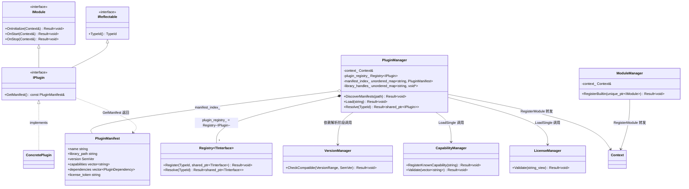
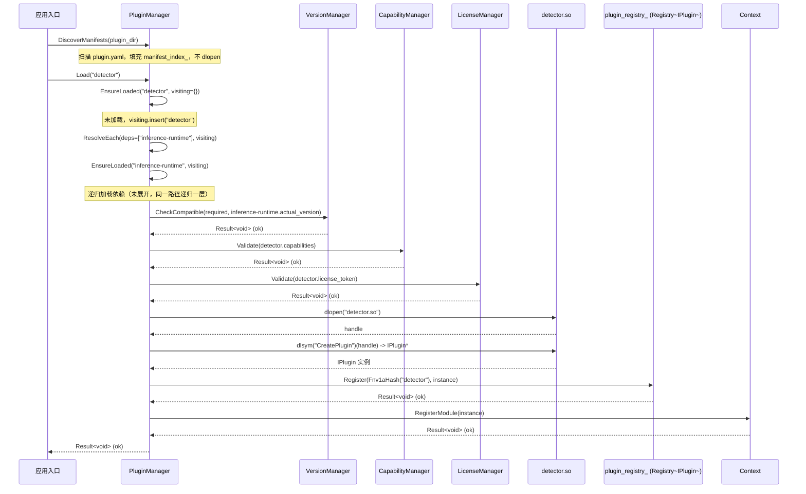

# 1.3 Core 插件体系（Plugin / PluginManager / ModuleManager / VersionManager / LicenseManager / CapabilityManager）

> 里程碑：里程碑 1 —— 基座设施
> 批次依赖：1.1（`Object`、`Result<T>`、`IReflectable`、`TypeId`、`TypeRegistry`、`detail::Fnv1aHash`，均按 1.1 定稿签名直接引用，不重新定义）、1.2（`IModule`、`Context`、`LifecycleState`、`Factory<TInterface>`、`Registry<TInterface>`，均按 1.2 定稿签名直接引用，不重新定义；本批次实例化 `Registry<IPlugin>` 复用 1.2 的模板）
> 本批次定稿的 `IPlugin`、`PluginManifest` 是后续所有涉及动态加载插件的批次（2.1 Device 插件、2.3 IO Exporter 插件等）的唯一基线，一旦定稿不可在其他批次重新定义。

## 1. Purpose

Core 插件体系批次回答 1.2 批次故意留白的问题："哪些功能单元在编译期就固化进二进制，哪些必须在部署期、甚至运行期才能确定其具体实现"。原文档要求"热插拔相机/检测器插件"——同一份框架二进制在不重新编译的前提下，替换一个 `.so` 文件加上一份清单，就能切换到不同厂商的相机驱动或不同版本的检测算法。1.2 批次的 `IModule`/`Context` 只解决"已经拿到一个 `IModule` 实例之后如何驱动它的生命周期"，没有回答"这个实例从哪里来、来的时候要不要检查它是否可信、版本是否匹配"。本批次为此建立五个构件：

- **`Plugin`**：动态库粒度的可插拔单元。区别于 1.2 的 `Module`（编译期粒度，随主二进制一起编译链接）——`Plugin` 是独立编译的 `.so`，随附一份 `plugin.yaml` 清单，在进程启动后才被 `dlopen` 加载。`IPlugin` 派生自 1.2 定稿的 `IModule`，因此一旦加载完成，它与内建模块共享同一套 `OnInitialize`/`OnStart`/`OnStop` 生命周期驱动机制，不需要 `Context` 区分对待。
- **`PluginManifest`**：随 `.so` 一起分发的清单文件（`plugin.yaml`）反序列化后的内存表示，声明该插件的版本号、对外提供的能力标签、依赖的其他插件及其版本范围。
- **`PluginManager`**：运行期动态加载 `.so` 插件的管理者，内部持有一个 `Registry<IPlugin>`（1.2 定稿模板的实例化，不重新定义该模板）用于按 `TypeId` 存放已加载插件，供插件之间、以及框架其余部分按接口解析彼此。
- **`ModuleManager`**：编译期静态链接内建模块的管理者，与 `PluginManager` 的区别见 3. Design——两者最终都调用 `Context::RegisterModule()` 把模块交给 `Context` 驱动生命周期，但模块的来源、发现方式、是否需要版本/许可校验完全不同。
- **`VersionManager`/`LicenseManager`/`CapabilityManager`**：`PluginManager::Load()` 流程中三个独立的前置校验步骤，分别负责语义化版本兼容性、商业许可有效性、能力标签合法性，三者互不感知对方存在，各自只回答一个问题。

## 2. Responsibilities

本批次负责：

- 定义 `IPlugin` 接口，规定插件相对于 1.2 `IModule` 多出的最小契约（暴露自己的 `PluginManifest`）。
- 定义 `PluginManifest`、`SemVer`、`VersionRange`、`PluginDependency` 数据结构，规定清单文件反序列化后的内存表示。
- 定义 `PluginManager`，规定插件发现（扫描清单）、依赖解析（DAG 遍历）、加载（`dlopen` 全流程）、按 `TypeId` 解析已加载插件四组操作的签名与调用时序。
- 定义 `ModuleManager`，规定内建模块的注册转发方式，并明确其与 `PluginManager` 的边界。
- 定义 `VersionManager`（SemVer 区间兼容性判定）、`LicenseManager`（许可校验前置检查）、`CapabilityManager`（能力标签合法性校验）三个独立校验器的最小签名。

本批次不负责：

- 具体插件实现（相机驱动插件、检测器插件等），这些属于里程碑 2 及以后；本批次只定义"插件如何被框架发现、校验、加载、解析"这一套通用机制。
- `plugin.yaml` 的 YAML 语法细节与 yaml-cpp 具体反序列化代码，这属于实现细节；本批次只锁定反序列化后的内存结构（`PluginManifest` 及其字段），不规定 YAML 文件的具体缩进/键名风格。
- 运行期原地热替换（不重启进程、卸载一个正在使用中的插件并加载新版本）——本批次只定义加载路径与进程整体停止时的卸载路径，原地热替换留待未来评估（见 12. Future Extension），且明确不会因此给 1.2 定稿的 `Registry<TInterface>` 模板新增 `Unregister` 方法。
- 许可校验的具体密码学方案（签名算法、在线激活协议）——本批次只锁定 `LicenseManager::Validate()` 的调用契约（入参、`Result<void>` 出参、失败错误码），具体校验算法是部署相关的实现细节。
- 线程池、任务调度——属于 1.4；本批次的插件加载流程本身发生在装配阶段，与 1.2 的装配阶段同属单线程执行范畴。

## 3. Design

**插件以动态库（`.so`）加 清单文件（`plugin.yaml`，yaml-cpp 反序列化）的形式分发，拒绝编译期静态注册插件的方案。** 静态注册要求每一种相机驱动、每一种检测算法在编译主二进制时就已知并链接进去,这意味着新增一款相机型号的支持需要重新编译整个框架、重新走一遍发布流程；这与"热插拔相机/检测器插件"的硬性要求直接冲突——现场需要更换相机型号时,不可能要求客户重新编译整个框架二进制。动态库加清单的方案把"编译"这一步下放到插件开发方自己的构建流程,主框架二进制在插件发布后不需要任何改动,只需要在部署目录里放入新的 `.so` 与 `plugin.yaml`,重启进程后 `PluginManager::DiscoverManifests` 就能发现它。清单文件与 `.so` 分离（不是把版本号等元数据编码进导出符号或者塞进二进制头）,因为 `PluginManager` 需要在决定"是否值得付出 `dlopen` 的开销、是否需要先加载它的依赖"之前就完成版本、能力、许可三项校验——如果这些信息只能通过 `dlopen` 之后调用导出函数才能读到,校验失败时已经付出了加载一个不兼容甚至恶意二进制到进程地址空间的代价,清单文件让这三项校验能在 `dlopen` 之前（版本/能力/许可校验都只读取 YAML 文本,不执行任何插件代码）完成,`dlopen` 本身推迟到全部校验通过之后。

**版本兼容性检查采用语义化版本（SemVer）区间匹配，拒绝简单的字符串相等比较。** 字符串相等要求依赖方声明的版本号与被依赖插件的实际版本号逐字符一致,这意味着被依赖插件发布一个只修复 bug、不改变对外接口的补丁版本（`1.2.3` 到 `1.2.4`）,所有声明依赖 `"1.2.3"` 的插件都会被判定为不兼容,必须逐一重新发布并升级自己声明的版本号字符串——这与插件生态期望的"兼容性次版本/补丁版本升级不强制依赖方跟着重新发布"的诉求直接冲突。SemVer 区间匹配（`VersionRange{ min_inclusive, max_exclusive }`）让依赖方声明一个范围而不是一个精确值,`VersionManager::CheckCompatible` 只需要判断被依赖插件的实际版本号是否落在该范围内,被依赖插件在不越过区间上界（通常对应"引入不兼容变更"的主版本号进位）的前提下自由发布新版本,不需要触发依赖方的联动升级。

**License 校验是 `PluginManager::Load()` 流程中一个返回 `Result<void>` 的前置检查步骤，拒绝用异常中断加载流程的方案。** 与 1.1 批次"异常仅用于构造函数失败、静态初始化失败"的判断规则保持一致——许可校验失败是一个完全可预期、随时可能发生（客户许可到期、部署环境更换）的业务场景,不是"二进制本身有问题"的例外情况,用异常表达意味着调用方（`PluginManager::Load` 自身，以及更上层决定是否继续启动进程的应用入口）必须用 `try/catch` 包裹这条本应线性的校验链,打断本批次统一采用的 `and_then` 链式组合风格（见 5. Workflow）。校验失败返回携带 `ErrorCode::Plugin_LicenseInvalid` 的 `ErrorInfo`,与版本校验失败（`Plugin_VersionIncompatible`）、能力校验失败（`Plugin_CapabilityUnsupported`）走同一条 `Result<void>` 通道,调用方不需要区分"这是哪一类前置检查失败"就能统一处理——三者都意味着 `Load()` 立即停止、不产生任何副作用（不会 `dlopen`,不会调用 `CreatePlugin()`）。

**`PluginManager` 与 `ModuleManager` 是两个独立构件，不合并成一个"统一模块加载器"。** 二者的区别不是表面上的命名,而是三个实质性的不同：来源不同——`ModuleManager` 管理的 `IModule` 实现随主二进制一起编译链接,在进程启动前就已经确定,`ModuleManager::RegisterBuiltin` 的调用方（应用入口）在源码里逐个 `new` 出内建模块实例；`PluginManager` 管理的 `IPlugin` 实现在编译主二进制时完全未知,只能在运行期通过 `PluginManager::DiscoverManifests` 扫描部署目录才能发现有哪些插件存在。是否需要按 `TypeId` 动态查找不同——内建模块的数量与身份在编译期已经写死在应用入口代码里,不存在"运行期按 `TypeId` 查找某个未知模块"的场景,`ModuleManager` 因此不持有任何 `Registry`,只是把 `RegisterBuiltin` 收到的实例原样转发给 `Context::RegisterModule()`；插件之间、以及插件与框架其余部分需要在完全不知道对方具体类型的前提下互相发现和调用（例如检测器插件需要解析相机插件提供的 `ICameraService` 接口,但两者可能来自不同厂商、编译时间不同）,这正是 `Registry<IPlugin>` 存在的理由——`PluginManager` 持有一个 `Registry<IPlugin>` 实例,复用 1.2 定稿的模板,不重新定义。是否需要前置校验不同——内建模块与主二进制同一次编译产出,版本、能力、许可这些问题在编译期已经由构建系统保证一致,不需要运行期校验；插件是独立分发的二进制,必须在 `dlopen` 之前完成三项校验（见 5. Workflow）,`ModuleManager` 没有任何等价步骤。二者共同点仅止于"最终都调用 `Context::RegisterModule()` 让模块进入同一套生命周期驱动"——`IPlugin` 派生自 `IModule`,`Context` 不区分一个 `IModule*` 是通过 `ModuleManager` 还是 `PluginManager` 注册进来的,`OnInitialize`/`OnStart`/`OnStop` 按 1.2 定稿的规则统一驱动,不需要为插件设计第二套生命周期状态机。

**`IPlugin` 额外派生自 `IReflectable`，与 1.2 批次 `IService` 派生 `IReflectable` 的理由完全对应。** `Registry<IPlugin>::Register`/`Resolve` 需要一个 `TypeId` 作为键,这个 `TypeId` 由插件清单里的完全限定名字段经 1.1 批次定稿的 `detail::Fnv1aHash` 计算得到,与插件在 `plugin.yaml` 里声明的名字一一对应；`IPlugin` 继承 `IReflectable` 使插件的具体类型可以用 `SAI_DECLARE_TYPE_ID` 宏声明自己的 `kStaticTypeId`,与清单里的名字字段哈希结果保持一致,不需要为插件系统另外发明一套类型标识机制。拒绝的替代方案是让插件返回一个裸字符串名字、由 `PluginManager` 现场调用 `Fnv1aHash` 转换——这个方案在功能上等价,但会让"名字到 `TypeId` 的转换"这一步散落在 `PluginManager` 内部而不是插件自身通过宏声明的编译期常量,一旦插件实现方手写的清单名字字符串与代码里 `SAI_DECLARE_TYPE_ID` 传入的字符串出现任何一个字符的偏差（例如少写命名空间前缀）,`PluginManager` 现场计算出的 `TypeId` 与插件自身 `TypeId()` 方法返回的 `TypeId` 就会不一致而不自知,这类错误只有在跨插件 `Resolve` 失败时才会暴露,排障成本远高于让插件方从一开始就通过同一个宏、同一份字符串来源保证两处一致。

**插件依赖解析用递归的 DAG 遍历表达，拒绝用多层嵌套循环枚举依赖关系。** 一个插件声明的依赖本身可能还有自己的依赖（检测器插件依赖推理运行时插件，推理运行时插件依赖 GPU 驱动封装插件），这构成一棵以"当前请求加载的插件"为根的依赖图；用嵌套循环（外层遍历直接依赖，内层再遍历每个依赖的依赖，如此嵌套）表达等价逻辑,嵌套深度随依赖链长度线性增长,循环体内还需要手工维护"当前处理到哪一层"的状态。递归函数（`EnsureLoaded` 处理单个节点：已加载则早返回、检测到环则早返回、否则先递归确保其全部依赖已加载再加载自身；`ResolveEach` 处理依赖列表：空列表早返回、否则处理表头节点再递归处理表尾）把每一层的逐层判断都收敛成同一段代码的重复调用,不需要为"第几层"引入额外状态,依赖链多深都不需要修改代码，见 5. Workflow 的完整伪代码。

## 4. Interfaces

以下为本批次定稿的头文件级声明（命名空间统一为 `sai`），非实现细节；后续批次引用这些名称时必须逐字一致。

```cpp
// -----------------------------------------------------------------------
// <sai/plugin/manifest.h>
// -----------------------------------------------------------------------
namespace sai {

struct SemVer {
    std::uint32_t major = 0;
    std::uint32_t minor = 0;
    std::uint32_t patch = 0;
};

// [min_inclusive, max_exclusive) 半开区间；max_exclusive 通常对应"引入不兼容变更"
// 的下一个主版本号，例如依赖方声明 { min_inclusive = 1.2.0, max_exclusive = 2.0.0 }
// 表示接受任意 1.x.y（x>=2 或 x==2 且 y>=0）版本，见 3. Design。
struct VersionRange {
    SemVer min_inclusive;
    SemVer max_exclusive;
};

struct PluginDependency {
    std::string plugin_name;         // 对应被依赖插件 plugin.yaml 中的 name 字段
    VersionRange required_version;
};

// plugin.yaml 反序列化后的内存表示，本批次只锁定字段本身，不锁定 YAML 文本格式。
struct PluginManifest {
    std::string name;                // 完全限定名，经 detail::Fnv1aHash（1.1 定稿）
                                      // 计算出该插件的 TypeId，与 SAI_DECLARE_TYPE_ID
                                      // 在插件实现代码里声明的名字必须逐字一致
    std::string library_path;        // 相对于清单文件所在目录的 .so 路径
    SemVer version;
    std::vector<std::string> capabilities;
    std::vector<PluginDependency> dependencies;
    std::string license_token;       // 交给 LicenseManager::Validate 的原始凭证
};

}  // namespace sai
```

```cpp
// -----------------------------------------------------------------------
// <sai/plugin/plugin.h>
// -----------------------------------------------------------------------
namespace sai {

// IPlugin 派生 IModule（复用 1.2 定稿的生命周期钩子，不新增第二套状态机）与
// IReflectable（复用 1.1 定稿的 TypeId 机制，作为 Registry<IPlugin> 的键类型，
// 理由见 3. Design）。除生命周期钩子外只新增一个只读访问器：暴露加载时已经
// 通过三项校验的清单，供框架其余部分（例如诊断接口列出已加载插件版本）查询，
// 不重新触发任何校验。
class IPlugin : public IModule, public IReflectable {
public:
    virtual ~IPlugin() = default;

    [[nodiscard]] virtual auto GetManifest() const noexcept -> const PluginManifest& = 0;
};

// 每个插件 .so 必须导出这一对 C 符号（extern "C" 避免 C++ 名字修饰在不同编译器
// 间不一致），PluginManager 通过 dlsym 找到它们完成实例的构造与销毁；销毁必须
// 调用同一个 .so 导出的 DestroyPlugin，不允许调用方跨 .so 边界直接 delete，
// 理由见 11. Memory。
extern "C" using CreatePluginFn = IPlugin* (*)();
extern "C" using DestroyPluginFn = void (*)(IPlugin*);

}  // namespace sai
```

```cpp
// -----------------------------------------------------------------------
// <sai/plugin/version_manager.h>
// -----------------------------------------------------------------------
namespace sai {

// 无状态校验器：不持有任何已加载版本的记录，每次调用只对传入的两个参数做
// 一次区间判断，与 1.2 定稿的 Factory<TInterface> 一样是"无记忆"的构件，
// 但不是同一概念——VersionManager 不产出实例，只产出判定结果。
class VersionManager {
public:
    // 找不到兼容版本返回 Plugin_VersionIncompatible 错误。
    [[nodiscard]] static auto CheckCompatible(const VersionRange& required,
                                               const SemVer& actual) noexcept -> Result<void>;
};

}  // namespace sai
```

```cpp
// -----------------------------------------------------------------------
// <sai/plugin/capability_manager.h>
// -----------------------------------------------------------------------
namespace sai {

// 维护"本次部署已知的能力标签集合"，由应用入口在装配阶段根据部署配置调用
// RegisterKnownCapability 登记（例如 "camera.gige"、"detector.onnx"）；
// Validate 在 Load() 流程中检查插件声明的每个能力标签都已登记，防止拼写
// 错误的标签被静默接受为"合法但从未被任何人识别"的标签。
class CapabilityManager {
public:
    // 重复登记同一标签返回 Core_TypeAlreadyRegistered 风格错误而非覆盖，
    // 与 1.1 批次 TypeRegistry::Register 的"不覆盖"策略保持一致的决策路径。
    auto RegisterKnownCapability(std::string capability) -> Result<void>;

    // 存在未登记的标签返回 Plugin_CapabilityUnsupported。
    [[nodiscard]] auto Validate(const std::vector<std::string>& declared_capabilities) const
        -> Result<void>;

private:
    mutable std::shared_mutex mutex_;
    std::unordered_set<std::string> known_capabilities_;
};

}  // namespace sai
```

```cpp
// -----------------------------------------------------------------------
// <sai/plugin/license_manager.h>
// -----------------------------------------------------------------------
namespace sai {

// 只锁定调用契约，不锁定具体校验算法（签名验证/在线激活等属于部署相关的
// 实现细节，见 2. Responsibilities）。校验失败返回 Plugin_LicenseInvalid，
// 不抛异常，理由见 3. Design。
class LicenseManager {
public:
    [[nodiscard]] auto Validate(std::string_view license_token) const -> Result<void>;
};

}  // namespace sai
```

```cpp
// -----------------------------------------------------------------------
// <sai/plugin/module_manager.h>
// -----------------------------------------------------------------------
namespace sai {

// 编译期静态链接内建模块的注册转发者，不持有 Registry（理由见 3. Design），
// 只保存一个 Context 引用把收到的模块原样转发给 Context::RegisterModule。
class ModuleManager {
public:
    explicit ModuleManager(Context& context) noexcept;

    ModuleManager(const ModuleManager&) = delete;
    ModuleManager& operator=(const ModuleManager&) = delete;
    ModuleManager(ModuleManager&&) = delete;
    ModuleManager& operator=(ModuleManager&&) = delete;

    // 调用顺序即依赖顺序（被依赖者先调用），与 1.2 定稿的 Context::RegisterModule
    // 调用时序要求完全一致——ModuleManager 不做任何顺序推断或校验。
    auto RegisterBuiltin(std::unique_ptr<IModule> module) -> Result<void>;

private:
    Context& context_;
};

}  // namespace sai
```

```cpp
// -----------------------------------------------------------------------
// <sai/plugin/plugin_manager.h>
// -----------------------------------------------------------------------
namespace sai {

// 运行期动态加载 .so 插件的管理者。持有 Registry<IPlugin>（1.2 定稿模板的
// 实例化，不重新定义），供插件之间按接口 Resolve 彼此，也供框架其余部分
// 按 TypeId 解析已加载插件。
class PluginManager {
public:
    explicit PluginManager(Context& context) noexcept;
    ~PluginManager();

    PluginManager(const PluginManager&) = delete;
    PluginManager& operator=(const PluginManager&) = delete;
    PluginManager(PluginManager&&) = delete;
    PluginManager& operator=(PluginManager&&) = delete;

    // 扫描目录下所有 plugin.yaml，建立 name -> PluginManifest 索引；只读取
    // 清单文本，不做 dlopen，不做任何版本/能力/许可校验（纯发现步骤）。
    auto DiscoverManifests(const std::filesystem::path& plugin_dir) -> Result<void>;

    // 按插件名加载：递归确保其依赖已加载（见 5. Workflow），再加载插件本身。
    // 若同一 TypeId 已存在于 plugin_registry_，直接返回成功（幂等）。
    auto Load(const std::string& plugin_name) -> Result<void>;

    [[nodiscard]] auto Resolve(TypeId id) const -> Result<std::shared_ptr<IPlugin>>;

private:
    auto LoadSingle(const PluginManifest& manifest) -> Result<void>;
    auto EnsureLoaded(const std::string& plugin_name,
                       std::unordered_set<std::string>& visiting) -> Result<void>;
    auto ResolveEach(const std::vector<PluginDependency>& deps,
                      std::unordered_set<std::string>& visiting) -> Result<void>;

    Context& context_;
    VersionManager version_manager_;
    LicenseManager license_manager_;
    CapabilityManager capability_manager_;
    Registry<IPlugin> plugin_registry_;
    std::unordered_map<std::string, PluginManifest> manifest_index_;
    std::unordered_map<std::string, void*> library_handles_;
};

}  // namespace sai
```

## 5. Workflow

**内建模块装配流程（复用 1.2 定稿的 `Context` 装配阶段，`ModuleManager` 只是转发者）：**

1. 应用入口按依赖顺序依次构造内建模块实例，调用 `module_manager.RegisterBuiltin(std::move(module))`。
2. `ModuleManager::RegisterBuiltin` 内部直接调用 `context.RegisterModule(std::move(module))`（1.2 定稿签名），不做任何额外处理。
3. 后续 `context.Initialize()`/`Start()`/`Stop()` 完全按 1.2 定稿的规则驱动，`ModuleManager` 不参与运行期任何调用。

**插件加载流程（`PluginManager::Load`，装配阶段，单线程）：**

```cpp
auto PluginManager::Load(const std::string& plugin_name) -> Result<void> {
    std::unordered_set<std::string> visiting;
    return EnsureLoaded(plugin_name, visiting);
}

auto PluginManager::EnsureLoaded(const std::string& plugin_name,
                                  std::unordered_set<std::string>& visiting) -> Result<void> {
    const auto type_id = detail::Fnv1aHash(plugin_name);
    if (plugin_registry_.Resolve(type_id).has_value()) {
        return Result<void>{};  // 已加载，幂等返回成功（递归基之一）
    }
    if (visiting.contains(plugin_name)) {
        return Result<void>(tl::unexpect,
            ErrorInfo{ErrorCode::Plugin_CircularDependency, /* ... */});
    }
    visiting.insert(plugin_name);

    return FindManifest(plugin_name)                       // manifest_index_ 查找，包一层 Result
        .and_then([this, &visiting](const PluginManifest& manifest) -> Result<void> {
            return ResolveEach(manifest.dependencies, visiting)
                .and_then([this, &manifest] { return LoadSingle(manifest); });
        });
}

auto PluginManager::ResolveEach(const std::vector<PluginDependency>& deps,
                                 std::unordered_set<std::string>& visiting) -> Result<void> {
    if (deps.empty()) {
        return Result<void>{};  // 递归基：没有更多依赖
    }
    const auto& head = deps.front();
    return EnsureLoaded(head.plugin_name, visiting)
        .and_then([this, &head](/* 已加载依赖的实际 SemVer */) {
            return version_manager_.CheckCompatible(head.required_version, /* actual */);
        })
        .and_then([this, &deps, &visiting] {
            const std::vector<PluginDependency> rest(deps.begin() + 1, deps.end());
            return ResolveEach(rest, visiting);
        });
}
```

`EnsureLoaded` 与 `ResolveEach` 互相递归：前者沿依赖图向下探索单个节点（DFS），后者沿依赖列表向右遍历（表头/表尾递归）。`visiting` 集合承担环检测——同一插件名在尚未完成加载前再次出现在解析路径上，说明依赖图违反 DAG 前提（存在环），立即返回 `Plugin_CircularDependency` 而不是无限递归。一个插件完成加载后已经存在于 `plugin_registry_`，被多个其他插件共同依赖（菱形依赖）时，第二次到达它会在 `EnsureLoaded` 最上方的 `Resolve` 检查处直接早返回，不会误判为环。

`LoadSingle` 是单个插件真正的加载步骤，对应原文档要求的完整链路：

```cpp
auto PluginManager::LoadSingle(const PluginManifest& manifest) -> Result<void> {
    return capability_manager_.Validate(manifest.capabilities)
        .and_then([this, &manifest] { return license_manager_.Validate(manifest.license_token); })
        .and_then([this, &manifest]() -> Result<void*> { return DlOpen(manifest.library_path); })
        .and_then([this, &manifest](void* handle) -> Result<std::shared_ptr<IPlugin>> {
            library_handles_[manifest.name] = handle;
            return CreateInstance(handle, manifest);  // dlsym("CreatePlugin") 后调用
        })
        .and_then([this, &manifest](std::shared_ptr<IPlugin> instance) -> Result<void> {
            return plugin_registry_.Register(detail::Fnv1aHash(manifest.name), std::move(instance));
        })
        .and_then([this, &manifest]() -> Result<void> {
            // IPlugin 派生 IModule，仍需交给 Context 驱动生命周期钩子。
            return context_.RegisterModule(/* 从 plugin_registry_ 取出的 shared_ptr 包装为
                                                unique_ptr 语义的转交，具体所有权表达方式
                                                由实现细节决定，本批次只锁定"必须转发"这一步 */);
        });
}
```

完整链路依次为：读取清单（发生在 `DiscoverManifests`，先于本函数）→ `CapabilityManager` 校验 → `LicenseManager` 校验 → `dlopen` → 插件导出的 `CreatePlugin()` 工厂函数 → `Registry<IPlugin>::Register()` → 转发 `Context::RegisterModule()`。`VersionManager` 的校验点在 `ResolveEach` 而非 `LoadSingle`——版本兼容性检查的对象是"依赖方声明的版本范围 vs 被依赖插件的实际版本"，这是一个双方关系，只有在解析依赖边时才有意义；`LoadSingle` 加载的是单个插件自身，没有"自己与自己的版本关系"需要检查。任一环节失败，`and_then` 链短路返回原始错误，不产生任何副作用残留：`dlopen` 失败不会有已加载的 handle 残留在 `library_handles_`（赋值语句在 `dlopen` 成功之后才执行），`Register` 失败（`Core_TypeAlreadyRegistered`，理论上不会发生，因为 `EnsureLoaded` 已经在最上方检查过）也不会走到 `RegisterModule` 这一步。

**进程整体停止时的插件卸载流程：**

1. 应用入口调用 `context.Stop()`（1.2 定稿签名），按注册顺序的逆序对所有已注册模块（内建模块与插件混合在同一个 `modules_` 列表里，`Context` 不区分）调用 `OnStop`——插件与内建模块共享同一套关闭顺序规则,不需要 `PluginManager` 另行处理。
2. `PluginManager` 析构时，对 `library_handles_` 中每一项调用该 `.so` 导出的 `DestroyPlugin(instance)` 销毁插件实例（理由见 11. Memory），再 `dlclose` 该 handle。此时 `plugin_registry_`（`Registry<IPlugin>` 实例）随 `PluginManager` 一起整体销毁，不需要调用任何"移除单个条目"的方法，因此不需要给 1.2 定稿的 `Registry<TInterface>` 模板新增 `Unregister`——整表随所有者一起销毁与"移除单个条目后表继续存活"是两个不同的需求,本批次只覆盖前者。

## 6. Data Structure

**插件加载过程中三项前置校验与其错误码的对应关系：**

| 校验步骤 | 执行者 | 输入 | 失败错误码 |
|---|---|---|---|
| 能力标签合法性 | `CapabilityManager::Validate` | `manifest.capabilities` | `Plugin_CapabilityUnsupported` |
| 许可有效性 | `LicenseManager::Validate` | `manifest.license_token` | `Plugin_LicenseInvalid` |
| 版本区间兼容性 | `VersionManager::CheckCompatible` | 依赖方 `PluginDependency.required_version` vs 被依赖插件实际 `SemVer` | `Plugin_VersionIncompatible` |
| 依赖图环检测 | `PluginManager::EnsureLoaded` 内部 `visiting` 集合 | 解析路径上的插件名序列 | `Plugin_CircularDependency` |

四项检查中前两项只作用于插件自身，第三项作用于依赖边（两个插件之间的关系），第四项作用于整张依赖图的结构；`LoadSingle` 只覆盖前两项，第三、四项发生在 `EnsureLoaded`/`ResolveEach` 递归过程中，理由见 5. Workflow 末段。

| 类型 | 归属场景 | 关键字段/成员 | 生命周期 |
|---|---|---|---|
| `PluginManifest` | `PluginManager::manifest_index_` 的值类型 | `name`/`library_path`/`version`/`capabilities`/`dependencies`/`license_token` | 值语义，随 `DiscoverManifests` 扫描结果构造，随 `PluginManager` 销毁 |
| `Registry<IPlugin>` 内部表 | `PluginManager::plugin_registry_` | 与 1.2 定稿的 `Registry<TInterface>::entries_` 同一结构（`unordered_map<TypeId, shared_ptr<IPlugin>>` + `shared_mutex`） | 随 `PluginManager` 构造/销毁，见 1.2 批次 6. Data Structure 的同一行 |
| `library_handles_` | `PluginManager` 内部 | `unordered_map<std::string, void*>`，`dlopen` 返回的句柄 | 随 `PluginManager` 构造/销毁，析构时逐个 `DestroyPlugin` + `dlclose` |

`PluginManifest` 与 `Registry<IPlugin>` 存储的 `shared_ptr<IPlugin>` 是两个独立的表，不合并：`manifest_index_` 在 `DiscoverManifests` 阶段就已经填充（哪怕对应插件从未被 `Load`），`plugin_registry_` 只在插件真正加载成功后才有对应条目——一个插件"已被发现但未加载"是合法的中间状态（例如某些能力标签在当前部署环境不需要，永远不会被 `Load`），两张表分离让这一状态可以被准确表达。

## 7. Class Diagram



## 8. Sequence Diagram



## 9. Thread Model

插件加载与卸载的并发模型与装配/停止阶段完全对齐 1.2 批次的既有结论，不引入新的并发场景：

- **加载阶段（`Context::state_ == Created`）**：`PluginManager::DiscoverManifests`、`Load` 均发生在应用入口的单线程启动序列中，与 1.2 定稿的模块注册处于同一时间窗口。`plugin_registry_`（`Registry<IPlugin>` 实例）内部仍然获取 `std::unique_lock` 完成写入，理由与 1.1/1.2 批次相同：接口契约不依赖调用方遵守"启动阶段单线程"这一约定就能保证正确性。
- **运行阶段（`Context::state_ == Running`）**：其他模块（内建或插件）通过 `PluginManager::Resolve(TypeId)` 查询已加载插件，可能被任意数量工作线程并发调用，`plugin_registry_.Resolve` 内部使用 `std::shared_lock`，与 1.2 定稿的 `Registry<IService>::Resolve` 同一套并发保证。此阶段不存在新的 `Load` 调用——`PluginManager::Load` 与 `Context::Register<T>()` 一样只在装配阶段有意义，本批次不额外定义"运行期加锁禁止 `Load`"的门禁，因为运行期本就不存在调用 `Load` 的合法场景（应用入口的启动序列已经结束）。
- **停止阶段**：与 1.2 定稿的 `Context::Stop()` 单线程逆序调用完全一致（插件的 `OnStop` 与内建模块的 `OnStop` 在同一个 `modules_` 列表里被统一驱动）；`PluginManager` 析构时的 `DestroyPlugin`/`dlclose` 序列发生在 `Context::Stop()` 返回之后，同样单线程执行，不需要额外锁。

不为跨插件 `Resolve` 调用引入无锁结构，理由与 1.1/1.2 批次相同：插件间的相互 `Resolve` 通常发生在模块装配、偶发的能力查询，不是逐帧调用的热路径，`shared_mutex` 的开销不构成瓶颈。

## 10. Performance

- `PluginManager::DiscoverManifests` 的开销与部署目录下插件数量成正比（每个插件一次文件读取 + YAML 解析），只发生在启动阶段一次，预期插件数量在数十量级，累计耗时不进入运行期性能预算。
- `PluginManager::Load` 单次调用的开销由 `dlopen` 本身主导（操作系统级动态链接，通常在毫秒级），三项前置校验（版本/能力/许可）均为内存中的字符串/数值比较，相对 `dlopen` 的开销可忽略；依赖解析的递归遍历深度等于依赖链长度（预期个位数），单次调用开销不计入热路径预算。
- `PluginManager::Resolve(TypeId)` 与 1.2 定稿的 `Registry<IService>::Resolve` 同量级（`shared_lock` + `unordered_map` 平均 O(1) 查找），预期单次耗时低于 100 纳秒。
- `VersionManager::CheckCompatible` 是三次整数比较（`major`/`minor`/`patch` 的区间判断），纳秒级，不设专门的性能指标。

## 11. Memory

- 插件实例的构造与销毁必须分别通过同一个 `.so` 导出的 `CreatePlugin`/`DestroyPlugin` 完成，`PluginManager` 不允许对 `dlopen` 得到的 `IPlugin*` 直接 `delete`。理由：`.so` 内部的堆分配器状态（尤其是插件使用了与主二进制不同版本的 C++ 标准库或不同的 `operator new` 重载时）与主二进制不保证一致，跨 `.so` 边界 `delete` 一个由另一个 `.so` 内部 `new` 出来的对象是未定义行为的常见来源；由同一个 `.so` 内部的 `DestroyPlugin` 调用 `delete` 保证分配与释放发生在同一个堆分配器上下文。
- `plugin_registry_`（`Registry<IPlugin>`）存储 `shared_ptr<IPlugin>`，理由与 1.2 定稿的 `Registry<IService>` 完全一致（多个消费者需要共享同一插件实例），本批次不重复论证。
- `library_handles_` 只存储 `dlopen` 返回的 `void*` 句柄，不额外持有插件内部分配的任何内存；插件内部的资源（GPU 显存、相机句柄）由插件自身通过 1.1 定稿的 `Resource` 基类管理，与 `PluginManager` 的内存管理职责正交。
- 运行期原地卸载单个插件（不重启整个进程）要求确认 `plugin_registry_` 中对应 `shared_ptr` 的引用计数恰好为 1（没有其他插件或框架代码仍持有指向它的 `shared_ptr`）才能安全 `dlclose`，否则任何后续对已释放代码段的虚函数调用都是未定义行为；本批次不提供这一保证的实现（见 12. Future Extension），当前唯一支持的卸载路径是随 `PluginManager` 整体销毁（进程停止）一起发生。

## 12. Future Extension

- 若未来需要运行期原地热替换单个插件（不重启进程），需要先解决"如何确认没有任何其他代码仍持有指向该插件的 `shared_ptr`"这一问题（见 11. Memory），且需要为 1.2 定稿的 `Registry<TInterface>` 补充 `Unregister(TypeId)` 方法——1.2 批次的 12. Future Extension 已经预告了这一缺口并主动推迟到本批次评估；本批次澄清了缺口的形状（引用计数确认是安全卸载的前提），但认为这一前提尚不能仅靠框架自身保证（14. Anti Pattern 禁止跨插件裸指针只解决了"框架能检测到的持有方式"，无法排除插件方绕过约束的可能），因此仍不在本批次给 `Registry<TInterface>` 新增该方法，留待有了可靠的引用计数确认机制之后再一次性设计。
- 若未来需要插件市场式的远程分发（而非本地部署目录扫描），`PluginManifest` 的字段本身不需要变化，只需要在 `DiscoverManifests` 之外新增一个"从远程仓库下载 `.so` 与 `plugin.yaml` 到本地部署目录"的步骤，`Load` 流程不需要感知插件的来源是本地还是远程下载。
- `ErrorCode` 的 `Plugin_*` 前缀完整分类表由 1.6 批次补完，本批次只锁定与本批次直接相关的最小子集（`Plugin_VersionIncompatible`/`Plugin_CapabilityUnsupported`/`Plugin_LicenseInvalid`/`Plugin_CircularDependency`）。

## 13. Best Practice

- 插件清单里的 `dependencies` 只声明直接依赖，不需要（也不应该）把依赖的依赖展开列出——`PluginManager::EnsureLoaded`/`ResolveEach` 的递归遍历已经处理了传递依赖，重复声明只会增加清单维护成本且可能与实际代码依赖不一致。
- `VersionRange` 的 `max_exclusive` 应设置为"下一个预期引入不兼容变更的主版本号"，不要设置成一个具体的、需要随每次小版本发布手动更新的上界——这会退化成事实上的字符串相等比较，违背 3. Design 采用 SemVer 区间的初衷。
- `CapabilityManager::RegisterKnownCapability` 应在应用入口装配阶段、`PluginManager::Load` 之前完成全部登记，不要在插件加载过程中动态补充已知能力标签集合——能力标签的合法值集合本身是部署配置的一部分，应该与插件清单一样在装配阶段就确定。
- 插件之间需要互相调用时，始终通过 `PluginManager::Resolve(TypeId)` 或框架内其余基于 `Registry<TInterface>` 的解析入口获取对方实例，不要在插件的 `OnInitialize`/`OnStart` 里缓存对方的裸指针供后续跨版本使用，理由见 14. Anti Pattern。

## 14. Anti Pattern

- 不要让插件直接持有其他插件的裸指针（或者绕过 `shared_ptr` 引用计数的任何等价形式）跨插件版本边界调用；插件 A 在自己的 `OnInitialize` 里通过 `PluginManager::Resolve` 拿到插件 B 的 `shared_ptr<IPluginB>` 后缓存原始指针，一旦插件 B 后续被卸载重载（即便当前批次只支持随进程停止一起卸载，未来批次一旦支持原地卸载），插件 A 缓存的裸指针立即变成悬挂指针；正确方式是每次需要调用对方时重新调用 `Registry<TInterface>::Resolve()`（或缓存 `shared_ptr` 而非裸指针，让引用计数天然阻止对方在自己仍持有引用时被销毁）。
- 不要用字符串相等比较代替 `VersionManager::CheckCompatible` 做版本校验；即便某个具体场景下"看起来只需要判断相等"，这会在依赖插件发布补丁版本时制造不必要的强制升级链，3. Design 已说明原因。
- 不要在 `LicenseManager::Validate`/`VersionManager::CheckCompatible`/`CapabilityManager::Validate` 失败时抛异常来中断 `Load()` 流程；三者必须走 `Result<void>` 通道并通过 `and_then` 链式组合，3. Design 已说明与 1.1 批次异常使用规则保持一致的理由。
- 不要把 `ModuleManager` 和 `PluginManager` 合并成一个类，或者让 `ModuleManager` 也持有一个 `Registry<IModule>`；内建模块在编译期已知身份，不存在按 `TypeId` 动态查找的场景，为它引入 `Registry` 是无意义的额外开销与复杂度，3. Design 已说明二者边界。
- 不要用多层嵌套循环手写依赖图遍历（外层遍历直接依赖、内层再嵌套遍历依赖的依赖）；应使用 `EnsureLoaded`/`ResolveEach` 的递归结构，深度随依赖链长度自然增长而不需要修改代码，5. Workflow 已给出完整实现。
- 不要跳过 `visiting` 集合的环检测直接假设依赖声明一定构成合法 DAG；插件清单是插件开发方手写或工具生成的外部输入，不能假设它天然无环，省略环检测会在真正出现循环声明时导致无限递归直至栈溢出。
