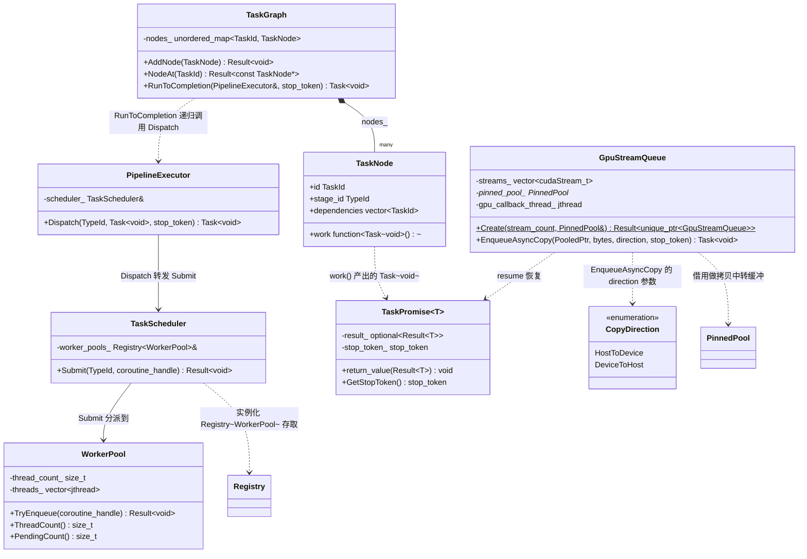
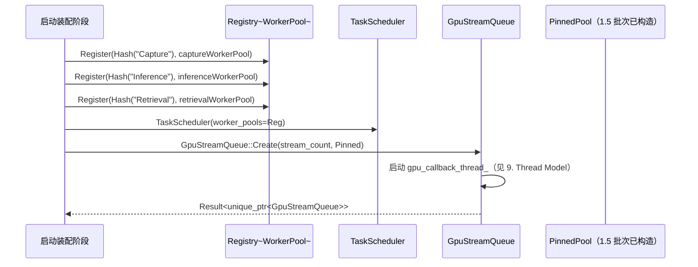
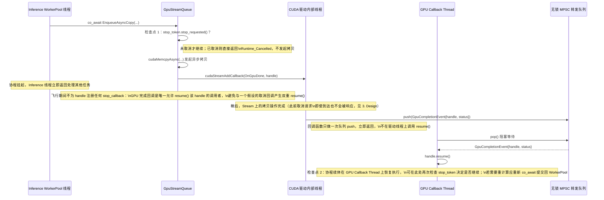

# 1.4 Runtime（TaskScheduler / WorkerPool / GpuStreamQueue / TaskGraph / PipelineExecutor）

> 里程碑：里程碑 1 —— 基座设施
> 批次依赖：1.1（`Result<T>`、`TypeId`、`detail::Fnv1aHash`，均按 1.1 定稿签名直接引用，不重新定义）、1.2（`Registry<TInterface>`，本批次实例化为 `Registry<WorkerPool>` 复用该模板，不重新定义其签名）、1.5（`IMemoryPool`、`GpuPool`、`PinnedPool`、`PooledPtr<T>`、`ArenaAllocator`，均按 1.5 定稿签名直接引用；本批次的 `GpuStreamQueue` 直接持有一个 1.5 批次定稿的 `PinnedPool` 实例做 host-device 异步拷贝的中转缓冲）
> 计划文档中 1.4 原本排在 1.5 之前，实际执行顺序调整为 1.5 先于 1.4（见 1.5 批次文档头部说明）：本批次的 `GpuStreamQueue` 需要引用 1.5 定稿的 `PinnedPool`/`PooledPtr<T>` 类型名与所有权语义搬运 GPU 数据，因此必须等 1.5 定稿后才能设计。
> 本批次定稿的 `TaskScheduler`/`WorkerPool`/`TaskGraph`/`PipelineExecutor`/`GpuStreamQueue`/`Task<T>` 是里程碑 6（编排调度）批次 6.1/6.2 的唯一基线：6.2 批次把 Pipeline 节点落到本批次定义的线程池模型，只做"如何配置更多阶段、更多节点"的扩展，不重新定义调度原语本身。

## 1. Purpose

Runtime 批次为 Surface AI Framework 建立驱动"一帧数据从相机采集到推理决策落地"全过程的执行引擎。里程碑 1 的其他批次回答了"错误怎么传播"（1.1）、"对象怎么组织和启动"（1.2）、"内存从哪里来"（1.5）这些静态问题，但没有回答一个更根本的动态问题：Capture/Inference/Retrieval/Reason/IO 这些异步、相互依赖、且部分工作发生在 GPU 上的阶段，具体由哪些线程执行、彼此之间如何等待、失败或取消时如何不遗漏地传播。本批次交付的目标是让"提交一个任务""等待一个 GPU 操作完成""取消一条正在执行的流水线"这些动作，在代码层面收敛成统一、可预测、不产生忙等或无界内存增长的原语，供里程碑 6 的 Pipeline/Scheduler 直接组装使用。

本批次交付：

- **`TaskScheduler`/`WorkerPool`**：固定线程数的任务执行单元与其对外提交入口，规定"提交一个待恢复的协程"与"队列满时拒绝"的完整语义。
- **`Task<T>`**：`std::coroutine_handle<TaskPromise<T>>` 的别名，是本框架所有异步工作的统一返回类型；`TaskPromise<T>` 规定协程如何与 `Result<T>` 错误通道、`std::stop_token` 取消传播衔接。
- **`GpuStreamQueue`**：封装 `cudaStream_t` 池的 GPU 任务提交入口，规定"GPU 操作完成如何跨线程恢复对应协程"这一本批次唯一需要新发明机制的问题的确切答案（见 3. Design、9. Thread Model）。
- **`TaskGraph`/`PipelineExecutor`**：DAG 任务图的节点/边表示与其驱动执行的引擎，规定依赖解析用递归表达而非嵌套循环。

本批次不解决具体业务问题（Capture 具体怎么读一帧、Inference 具体怎么跑一次 TensorRT 推理），只提供"这些工作应该在哪个线程池上跑、跑之前要等谁、跑完了通知谁"这一层通用执行契约。

## 2. Responsibilities

本批次负责：

- 定义 `WorkerPool`，规定固定线程数、启动时创建、运行期不动态伸缩的线程池模型。
- 定义 `TaskScheduler`，规定有界队列 + 拒绝新任务的背压策略与 `Submit()` 的完整签名。
- 定义 `Task<T>`/`TaskPromise<T>`，规定协程如何返回 `Result<T>`、如何持有并检查 `std::stop_token`、如何通过统一的重新提交机制恢复而不是被任意线程直接 `resume()`。
- 定义 `GpuStreamQueue`，规定 CUDA Stream 池的组织方式与"`cudaStreamAddCallback` 回调在任意驱动线程上触发"这一跨线程恢复协程问题的具体中转设计。
- 定义 `TaskGraph`/`TaskNode`，规定 DAG 节点/边的数据表示与拓扑执行的递归遍历算法。
- 定义 `PipelineExecutor`，规定如何把 `TaskGraph` 的节点分派到各阶段对应的 `WorkerPool`。
- 明确排除 Fiber 与硬实时/Deadline 调度器（见 3. Design），为里程碑 6 的调度扩展划定边界。

本批次不负责：

- 具体 Pipeline 节点图的配置化描述格式（YAML DAG 定义语法）——属于里程碑 6 批次 6.1；本批次只提供 `TaskGraph`/`TaskNode` 的内存表示，不规定这份表示如何从配置文件反序列化而来。
- Capture/Inference/Retrieval/Reason/IO 各阶段具体的业务逻辑——属于里程碑 2-5；本批次只规定这些逻辑将来以协程形式跑在哪个 `WorkerPool` 上。
- 具体 `ErrorCode` 分类表的完整定义——延续 1.1/1.2/1.3/1.5 的做法，本批次只新增 `Runtime_*` 前缀下与本批次直接相关的最小必需子集，完整表由 1.6 补完。
- Retry（失败重试）与 Metrics（指标采集）的具体策略——虽然计划文档把它们列在本批次范围内，但重试策略与业务语义强耦合（"推理失败重试一次"与"相机断连重试"含义完全不同，通用重试原语容易变成参数堆砌的伪抽象），指标采集依赖 1.6 批次尚未定稿的 Logging/Config 基础设施；本批次只交付两者都必须依赖的底层原语（`Task<T>` 的 `Result<T>` 返回通道、`TaskScheduler::Submit` 的失败信号），具体 Retry/Metrics 留给消费本批次接口的上层批次（里程碑 6）设计，本版本不越界定义。

## 3. Design

**调度模型采用 C++20 协程（`co_await`）+ 固定阶段 Worker Pool，明确排除 Fiber（如 Boost.Fiber），明确不实现硬实时/Deadline 调度器。** 原始需求文档中"Real Time Scheduler"一项在本版本明确排除，不是"暂不支持但已预留接口"的折中，理由是可执行的判断规则而非模糊表态：固定线程数的 Worker Pool 配合协程能提供的是"任务按提交顺序尽快被某个空闲线程处理"这一软实时保证，任务从提交到实际开始执行的延迟受线程池当前负载、操作系统调度器时间片、协程恢复路径上的锁竞争等多个不可完全消除的因素影响，不存在上界证明；硬实时/Deadline 调度器要求的是"任务在确定的时间窗口内必然完成，超时是可预见并有处理路径的系统级事件"，这需要独立于通用操作系统调度器之外的时间保证机制（例如 RTOS 的抢占式优先级调度、PLC 的固定周期扫描），固定线程池 + 用户态协程这一组合天生构建在通用操作系统调度器之上，无法绕过操作系统调度延迟的不确定性去提供这种保证。若未来产线场景确实需要真正的硬实时闭环（例如"检测到异常后 N 毫秒内必须触发机械臂停机"这类安全关键路径），应该由独立的 PLC/RTOS 侧闭环直接处理，不经过本框架的 Runtime 层——把这类需求强行塞进本框架会导致 Runtime 同时背负"尽力而为的软实时流水线调度"与"有法律/安全含义的硬实时保证"两种矛盾的职责，一旦本框架的软件缺陷（例如某个 Inference 任务偶发耗时过长）拖慢了本该独立运行的安全停机逻辑，故障域会从"这一帧检测结果晚了"扩大成"安全机制失效"。Fiber 同样明确排除：Fiber（用户态协作式线程，需要显式或运行时介入的栈切换）解决的是"在少量操作系统线程上承载大量并发执行单元、且这些单元之间需要类似同步阻塞调用的编程体验"这一问题，但 C++20 协程已经是标准库层面的无栈协程机制，`co_await` 挂起点由编译器生成的状态机在原生调用栈之外保存续体，不需要 Fiber 库为每个并发单元维护独立的调用栈；同时引入 Fiber 与协程会让"一段异步代码到底在协程状态机里执行还是在 Fiber 栈上执行"成为需要逐处确认的问题，两种机制在语义上大量重叠但互不兼容（协程的挂起点与 Fiber 的调度点是两套独立的调度决策，混用会让"当前是否可以安全阻塞"这一判断在两套机制的边界处失去单一权威来源），这正是需求文档自身也承认的"这些机制在工程上通常互斥"（见计划文档背景）。

**每个 Pipeline 阶段（Capture/Inference/Retrieval/Reason/IO）绑定一个独立的 `WorkerPool` 实例，线程数在 YAML 配置中声明，启动时创建、运行期不动态伸缩，拒绝"弹性线程池"（运行期根据负载自动增减线程数）方案。** 弹性线程池需要额外的负载监测逻辑（何时判断"负载高需要扩容"、何时判断"负载低可以缩容而不影响正在处理的任务"）与线程创建/销毁本身的同步开销，这些复杂度只有在负载模式真正呈现"长时间低谷与突发峰值交替"的场景下才能换回收益；工业产线的相机采集频率与推理负载是稳定周期性的（由产线节拍决定，不是互联网服务那种流量随时段剧烈波动的模式），针对一个不存在的负载波动场景引入弹性伸缩机制，只会在没有实际收益的前提下增加线程池实现与调试的复杂度。各阶段独立 `WorkerPool` 而非全阶段共享一个大线程池，理由是不同阶段的负载特征不同（Inference 是 GPU 密集但 CPU 侧只需要提交/等待，Retrieval 是纯 CPU 密集的 FAISS 查询），共享同一个线程池意味着一个阶段的任务积压会占用本该服务另一个阶段的线程，独立线程池让每个阶段的并发度可以按其自身特征在配置文件中单独调优，互不挤占。

**GPU 任务通过 `GpuStreamQueue` 提交到 CUDA Stream，完成时用 `cudaStreamAddCallback` 回调恢复对应协程，拒绝忙等（busy-wait）轮询 `cudaStreamQuery`。** 忙等轮询意味着某个线程需要持续调用 `cudaStreamQuery` 直到返回"已完成"，这个线程在等待期间会占满一个 CPU 核心且不释放，若 Inference 阶段的每次 GPU 任务提交都配一个忙等线程，占用的 CPU 核心数会随并发 GPU 任务数线性增长，与其他阶段的 `WorkerPool`（Retrieval/Reason 是 CPU 密集）争抢核心，直接违背"各阶段独立线程池互不挤占"这一设计前提。`cudaStreamAddCallback` 是 CUDA 驱动提供的异步完成通知机制，注册的回调函数在对应 Stream 上的操作全部完成后由驱动内部线程触发，不需要任何用户态线程持续轮询；本批次用这个回调作为"GPU 操作完成"这一事件的唯一来源，把等待完成的成本从"占满一个核心的忙等"降低为"零 CPU 占用的事件驱动等待"（回调触发前，等待中的协程对应的执行上下文不占用任何 `WorkerPool` 线程）。回调本身运行在驱动内部管理的、不受本框架控制的任意线程上，直接在回调里调用 `std::coroutine_handle::resume()` 会有风险，本批次为此设计了明确的跨线程转发机制，见下一段与 9. Thread Model。

**GPU 完成回调到协程恢复之间显式经过 GPU Callback Thread 转发一次，不在 `cudaStreamAddCallback` 的驱动线程上直接调用 `resume()`。** 这是本批次需要单独讲清楚的关键机制：`cudaStreamAddCallback` 注册的回调函数运行在 CUDA 驱动内部管理的线程上，这个线程不是本框架创建、不受本框架的线程数或生命周期管理，且 CUDA 官方文档明确要求回调函数本身必须快速返回、不能调用可能阻塞或长时间运行的 CUDA API（否则会阻塞驱动后续的 Stream 处理）。若在回调里直接执行 `handle.resume()`，协程续体里的代码（可能是把结果写回业务缓冲区、触发下一个 GPU 任务提交等任意长度的同步逻辑）会在驱动线程的调用栈上原地执行，这既违反"回调必须快速返回"的驱动约束，也让驱动线程的身份被"借用"去执行本框架的业务逻辑，一旦某次协程续体执行时间过长，会拖慢驱动处理其他 Stream 上排队操作的速度，故障会从"这个协程慢一点"扩散成"所有共享同一 CUDA context 的 Stream 都变慢"。本批次的设计是：回调函数本身只做一件事，把"哪个协程句柄需要恢复"这一信息（一个 `std::coroutine_handle<>` 加上完成状态）投递进一个专用的、有界的无锁队列，然后立即返回；一个独立、专门的 GPU Callback Thread（见 9. Thread Model）持续消费这个队列，取出协程句柄后才真正调用 `resume()`。这样"驱动线程"与"执行本框架业务逻辑的线程"被彻底分开，驱动线程上发生的唯一动作是一次队列 push（`std::atomic` 操作，微秒级、无阻塞），协程续体的实际执行发生在本框架完全掌控的 GPU Callback Thread 上。GPU Callback Thread 只做"从队列取句柄、调用 resume"这一件事，不直接跑重业务逻辑：`resume()` 恢复的协程续体如果需要做 CPU 密集或阻塞操作，应该在续体内部再次通过 `co_await` 把自己重新提交回对应阶段的 `WorkerPool`，而不是让 GPU Callback Thread 变成事实上的第二个业务线程池——这一点与"各阶段独立 WorkerPool 互不挤占"的设计前提一致：GPU Callback Thread 的唯一职责是尽快把控制权转移，不承担计算职责。

**Cancellation 用 C++20 `std::stop_token` 传递，拒绝自定义 `bool cancelled` 标志位。** 自定义标志位方案要求每一个可能长时间运行或多步等待的协程在每个逻辑分叉点手动检查这个标志，一旦某处协程的作者忘记检查（尤其是在深层嵌套的 `co_await` 链条中间某一段），取消请求会被静默吞掉，协程继续执行直到自然结束，调用方无法通过类型系统或编译器发现这类遗漏；`bool` 标志位本身如果要被多个线程安全地读写还需要额外声明为 `std::atomic<bool>`，这类临时拼凑的同步原语容易在不同模块间产生不一致的内存序约定。`std::stop_token`/`std::stop_source`/`std::stop_callback` 是标准库为取消场景专门设计的组合：`TaskGraph`/`PipelineExecutor` 持有一个 `std::stop_source`，通过 `TaskPromise<T>` 把对应的 `std::stop_token` 传递给每个协程，协程内部等待 `WorkerPool` 调度这一类挂起点统一通过检查 `token.stop_requested()` 或注册 `std::stop_callback` 来响应取消，取消传播路径与协程的挂起点天然对齐，不需要等到协程下一次被调度器唤醒才检查标志位。等待 `GpuStreamQueue` 完成这一类挂起点是这一通用规则的例外，理由见下一段——GPU 操作在飞行中的这段区间刻意不注册 `stop_callback`，取消信号在这段区间内被推迟到操作完成后的下一个检查点才生效，不是遗漏。

**GPU 操作一旦发起（`cudaMemcpyAsync` + `cudaStreamAddCallback` 已调用），在其完成之前视为不可取消，取消检查点只设在发起之前与完成之后这两处，拒绝在飞行期间也注册 `stop_callback` 尝试"主动收尾"的方案。** 这是 Cancellation 决策在 GPU 路径上的具体落地，需要单独讲清楚两层原因。第一层是硬件/驱动层面的事实约束：`cudaMemcpyAsync` 一旦提交给 Stream，数据传输由 GPU 硬件与驱动接管执行，CUDA 并未提供"召回"或"中止"一次已提交的异步拷贝的官方 API，`cudaStreamDestroy`/`cudaDeviceReset` 这类粗粒度手段代价是销毁整条 Stream 甚至整个 Device 上下文，不是可用于"取消单个操作"的工具；协程无论在飞行期间收到多少次取消通知，都无法让已经在硬件上执行的拷贝提前结束，因此在这段区间内检查 `stop_token` 不会带来任何真实的提前退出能力，只会让协程在"已经无法回头"的操作上产生一个无法兑现的取消承诺。第二层是并发正确性约束：如果在飞行期间额外注册一个 `stop_callback`，一旦取消请求到达就在 `stop_callback` 里对同一个协程句柄调用 `resume()`，而 GPU 硬件稍后真正完成时 `cudaStreamAddCallback` 的驱动回调又会把同一个句柄投进 GPU Callback Thread 的转发队列并再次触发 `resume()`，同一个 `coroutine_handle` 就会被两个互相不知道对方存在的调用者各自 `resume()` 一次，这是未定义行为（协程帧在第一次 `resume()` 后已经继续执行甚至可能已经销毁，第二次 `resume()` 作用在失效状态上）。本设计拒绝这一方案，采用"飞行期间不注册任何会触发 `resume()` 的取消回调"，让"GPU 完成回调"成为唯一被允许恢复这个协程句柄的调用者——单一恢复者，而不是两个互相竞争的恢复者，从结构上消除双重 `resume()` 的可能性，不依赖运行期判断"谁先谁后"这类时序竞争的应对逻辑。取消检查点因此只设在两处：`co_await EnqueueAsyncCopy(...)` 发起之前（协程在还没有真正调用 `cudaMemcpyAsync` 时检查 `stop_token`，若已被请求取消，直接返回 `Runtime_Cancelled`，不发起这次拷贝），以及协程被 GPU 完成回调恢复之后、准备执行下一步之前（此时协程已经处于正常的、随时可以安全查询 `stop_token` 的恢复状态）。代价是一次已经发起的 GPU 拷贝无法被提前打断，任务会一直运行到这次拷贝完成对应的检查点才真正响应取消——这是本设计接受的延迟上界（上界是单次 `cudaMemcpyAsync` 的实际传输耗时），不是遗留的缺陷；这一延迟与"取消传播路径与协程的挂起点天然对齐、不遗漏任何一个挂起窗口"这一 Cancellation 总原则并不矛盾，因为"对齐"指的是不遗漏可以安全响应取消的挂起窗口，飞行中的 GPU 操作从一开始就不是一个可以安全响应取消的窗口。`EnqueueAsyncCopy` 接收的 `stop_token` 参数因此只在方法入口处（发起拷贝之前）被读取一次，不在方法内部为飞行期间的等待再注册 `stop_callback`；具体检查逻辑见 5. Workflow。

**Back Pressure 采用有界队列 + 拒绝新任务策略，`TaskScheduler::Submit()` 在队列满时返回 `Result<void>::error(ErrorCode::Runtime_QueueFull)`，拒绝无界队列。** 无界队列在相机持续采集但下游推理跟不上时（例如某一路相机的检测算法临时变慢，或某次 GPU 任务排队变长）会让 Capture 侧不断把新任务塞进队列而不受限制，队列本身占用的内存（每个排队任务背后可能挂着一个尚未归还的 `PooledPtr<uint8_t>`，见 11. Memory）随积压时间线性增长，这与 1.5 批次为 Memory 模块设定的"No Memory Leak"目标直接冲突——队列无限增长不是传统意义上的内存泄漏（内存最终会被正确释放），但表现为同样的"可用内存耗尽"故障，且比真正的内存泄漏更隐蔽（只在负载超过处理能力的场景下才会显现，压力测试覆盖不到就可能被忽略）。有界队列 + 拒绝新任务把"处理能力跟不上"这一情况在源头暴露成一个 `Submit()` 调用的显式失败，调用方（通常是 Capture 阶段的协程）拿到 `Runtime_QueueFull` 错误后可以决定丢弃当前帧、记录一次背压事件或做其他业务侧决策，这个决策留给调用方而不是让 `TaskScheduler` 自己决定"丢弃哪一个任务"——`TaskScheduler` 本身不理解业务语义（不知道哪一帧更重要），不应该代替调用方做丢弃决策。

## 4. Interfaces

以下为本批次定稿的头文件级声明（命名空间统一为 `sai::runtime`），非实现细节；里程碑 6 及后续批次引用这些名称时必须逐字一致。

```cpp
// -----------------------------------------------------------------------
// <sai/runtime/task.h>
// -----------------------------------------------------------------------
namespace sai::runtime {

// 协程 Promise：规定协程如何把最终结果交回 Result<T> 通道，以及如何持有
// 取消令牌。本批次所有异步工作函数的返回类型统一是 Task<T>，不允许
// 直接返回裸的 std::coroutine_handle 或自定义 awaitable 类型。
template <typename T>
class TaskPromise {
public:
    // 协程体内 co_return value 时调用；co_return 一个 Result<T> 的错误分支
    // 时同样调用本方法，最终结果始终以 Result<T> 形式暴露给调用方。
    void return_value(Result<T> value) noexcept;

    // 协程体内未捕获异常时调用；本批次的协程体内部不允许出现未捕获异常
    // （异常仅允许出现在构造函数/静态初始化，见 1.1 批次 3. Design），
    // 本方法的存在只是满足协程 Promise 的语法要求，实现为直接 std::terminate。
    void unhandled_exception() noexcept;

    // 构造时从当前 stop_source 派生的 stop_token，co_await 链条上的每一层
    // 挂起点通过本方法取得取消信号，见 3. Design 的 Cancellation 决策。
    [[nodiscard]] auto GetStopToken() const noexcept -> std::stop_token;

    auto get_return_object() noexcept -> Task<T>;
    auto initial_suspend() noexcept -> std::suspend_always;
    auto final_suspend() noexcept -> std::suspend_always;

private:
    std::optional<Result<T>> result_;
    std::stop_token stop_token_;
};

// 本框架所有异步工作函数的统一返回类型别名；调用方通过 co_await 组合，
// 不直接操作底层的 coroutine_handle（Resume 由 WorkerPool/GpuStreamQueue
// 的内部调度逻辑触发，不对外暴露）。final_suspend() 返回 suspend_always，
// 协程帧不会在执行完毕后自动销毁：持有该句柄的一方（TaskScheduler::Submit
// 的调用方，或代表 TaskGraph 节点持有句柄的 PipelineExecutor）必须在
// handle.done() 为真且已取走结果后手动调用 handle.destroy()，这是手动所有权
// 纪律而非 RAII，理由与完整规则见 11. Memory、13. Best Practice、14. Anti Pattern。
template <typename T>
using Task = std::coroutine_handle<TaskPromise<T>>;

}  // namespace sai::runtime
```

```cpp
// -----------------------------------------------------------------------
// <sai/runtime/worker_pool.h>
// -----------------------------------------------------------------------
namespace sai::runtime {

// 固定线程数的工作线程池，一个 Pipeline 阶段（Capture/Inference/Retrieval/
// Reason/IO）绑定一个独立实例；thread_count 在构造时一次性确定，来自 YAML
// 配置，运行期不提供任何调整线程数的接口（见 3. Design）。
class WorkerPool final {
public:
    // thread_count：本池固定持有的工作线程数；queue_capacity：内部有界队列的
    // 容量上限，队列满时由调用方（通常是 TaskScheduler）决定拒绝策略，本类
    // 自身只负责"能不能再塞进去一个任务"这一判断。
    WorkerPool(std::size_t thread_count, std::size_t queue_capacity) noexcept;
    ~WorkerPool() noexcept;

    WorkerPool(const WorkerPool&) = delete;
    WorkerPool& operator=(const WorkerPool&) = delete;
    WorkerPool(WorkerPool&&) = delete;
    WorkerPool& operator=(WorkerPool&&) = delete;

    // 把一个待恢复的协程句柄投递进内部队列，某个空闲工作线程稍后取出并调用
    // resume()。队列已满返回 Runtime_QueueFull，不阻塞调用方等待空位。
    [[nodiscard]] auto TryEnqueue(std::coroutine_handle<> handle) noexcept
        -> Result<void>;

    [[nodiscard]] auto ThreadCount() const noexcept -> std::size_t;
    [[nodiscard]] auto PendingCount() const noexcept -> std::size_t;

private:
    std::size_t thread_count_;
    std::vector<std::jthread> threads_;  // jthread 内建 stop_token，用于整体关停
};

}  // namespace sai::runtime
```

```cpp
// -----------------------------------------------------------------------
// <sai/runtime/task_scheduler.h>
// -----------------------------------------------------------------------
namespace sai::runtime {

// 对外的任务提交入口，内部按阶段名持有若干 WorkerPool（通过 1.2 批次定稿的
// Registry<TInterface> 实例化为 Registry<WorkerPool>，按阶段名字符串对应的
// TypeId 存取，不是每次提交都新建一个 WorkerPool 查找路径）。
class TaskScheduler final {
public:
    explicit TaskScheduler(Registry<WorkerPool>& worker_pools) noexcept;

    // stage_id：目标阶段（Capture/Inference/Retrieval/Reason/IO 等）对应的
    // TypeId，由调用方通过 1.1 批次的 Fnv1aHash 对阶段名字符串求值得到。
    // 队列已满时返回 Runtime_QueueFull（见 3. Design），不重试、不阻塞。
    [[nodiscard]] auto Submit(TypeId stage_id, std::coroutine_handle<> handle) noexcept
        -> Result<void>;

private:
    Registry<WorkerPool>& worker_pools_;
};

}  // namespace sai::runtime
```

```cpp
// -----------------------------------------------------------------------
// <sai/runtime/gpu_stream_queue.h>
// -----------------------------------------------------------------------
namespace sai::runtime {

// GPU 完成事件与待恢复协程句柄的配对，由 cudaStreamAddCallback 的驱动线程
// 投递进内部无锁队列，由专用 GPU Callback Thread 取出后调用 resume()；
// 具体转发机制见 3. Design、9. Thread Model。
struct GpuCompletionEvent {
    std::coroutine_handle<> handle;
    cudaError_t status;
};

// EnqueueAsyncCopy 的拷贝方向：本批次的 host-device 异步拷贝只服务 Capture
// 阶段把主机内存中的一帧数据搬到显存供推理消费，以及 Inference 阶段把推理
// 结果搬回主机内存这两个方向，均以 PinnedPool 的中转缓冲为一端、GPU 侧
// PooledPtr<uint8_t> 为另一端；两个枚举值已经覆盖本批次全部已知需求，不额外
// 定义 DeviceToDevice（同一 GPU 内部或跨 GPU 的显存到显存拷贝不经过
// PinnedPool 中转，本批次不涉及这一场景，若未来批次需要，应在那时评估是否
// 复用本枚举或另开专门的方法，见 12. Future Extension）。
enum class CopyDirection {
    HostToDevice,
    DeviceToHost,
};

// 封装 cudaStream_t 池的 GPU 任务提交入口。host-device 异步拷贝所需的中转
// 缓冲直接来自构造时传入的 1.5 批次 PinnedPool 实例，本类不自己管理任何
// cudaHostAlloc 区域，也不重新定义 PooledPtr<T> 的归还语义。
class GpuStreamQueue final {
public:
    // stream_count：内部维护的 cudaStream_t 数量，提交的 GPU 任务在这些
    // Stream 之间轮询分配；pinned_pool：host-device 拷贝中转缓冲来源，
    // 调用方负责保证其生命周期覆盖本队列的整个生命周期。
    [[nodiscard]] static auto Create(std::size_t stream_count, PinnedPool& pinned_pool) noexcept
        -> Result<std::unique_ptr<GpuStreamQueue>>;

    ~GpuStreamQueue() noexcept;

    GpuStreamQueue(const GpuStreamQueue&) = delete;
    GpuStreamQueue& operator=(const GpuStreamQueue&) = delete;
    GpuStreamQueue(GpuStreamQueue&&) = delete;
    GpuStreamQueue& operator=(GpuStreamQueue&&) = delete;

    // stop_token 只在方法入口处检查一次：若已被请求取消，直接返回
    // Runtime_Cancelled，不发起 cudaMemcpyAsync。一旦通过这一检查并发起
    // cudaMemcpyAsync + cudaStreamAddCallback，本方法内部不再为 stop_token
    // 注册任何 stop_callback——飞行中的 GPU 操作视为不可取消（硬件/驱动没有
    // 召回一次已提交异步拷贝的机制），且唯一允许 resume() 这个协程句柄的调用者
    // 是 GPU 完成回调本身，避免与一个假设的取消回调产生双重 resume()（见
    // 3. Design 的完整理由）。从 pinned_pool 借出一块中转缓冲，发起
    // cudaMemcpyAsync（host->device 或 device->host，由 direction 指定），
    // 并在选定的 Stream 上注册 cudaStreamAddCallback；返回的 Task<void> 在
    // GPU 操作完成、回调经由 GPU Callback Thread 转发 resume() 之后才恢复到
    // co_await 之后的代码——调用方在恢复后的下一步可以再次检查 stop_token。
    [[nodiscard]] auto EnqueueAsyncCopy(PooledPtr<uint8_t> device_or_host_src,
                                         std::size_t bytes,
                                         CopyDirection direction,
                                         std::stop_token stop_token) noexcept -> Task<void>;

    [[nodiscard]] auto StreamCount() const noexcept -> std::size_t;

private:
    GpuStreamQueue() noexcept = default;

    std::vector<cudaStream_t> streams_;
    PinnedPool* pinned_pool_ = nullptr;              // 借用指针，不拥有生命周期
    std::jthread gpu_callback_thread_;                // 见 9. Thread Model
    // 无锁 MPSC 队列：cudaStreamAddCallback 的驱动线程作为生产者投递
    // GpuCompletionEvent，gpu_callback_thread_ 作为唯一消费者取出并 resume()。
};

}  // namespace sai::runtime
```

```cpp
// -----------------------------------------------------------------------
// <sai/runtime/task_graph.h>
// -----------------------------------------------------------------------
namespace sai::runtime {

using TaskId = std::uint64_t;

// DAG 节点：work 是产出该节点异步工作的无参可调用体，stage_id 指明该节点应该
// 被分派到哪个 Pipeline 阶段对应的 WorkerPool（与 TaskScheduler::Submit、
// PipelineExecutor::Dispatch 的 stage_id 参数是同一枚 TypeId，均由阶段名字符串
// 的 Fnv1aHash 结果得到），dependencies 列出本节点必须等待哪些节点先完成；
// 边隐含在 dependencies 字段中，不设独立的边集合数据结构（见 6. Data Structure
// 的完整理由）。
struct TaskNode {
    TaskId id;
    TypeId stage_id;
    std::function<Task<void>()> work;
    std::vector<TaskId> dependencies;
};

// DAG 任务图本身：只持有节点集合与拓扑遍历所需的最小状态，不持有任何
// WorkerPool 引用（分派到哪个 WorkerPool 是 PipelineExecutor 的职责）。
class TaskGraph final {
public:
    [[nodiscard]] auto AddNode(TaskNode node) noexcept -> Result<void>;

    // 只读查询：按 TaskId 取回节点内容，供 5. Workflow 的递归拓扑遍历在下钻
    // 每一层依赖时使用。id 不对应任何已 AddNode 过的节点时返回
    // Runtime_NodeNotFound（依赖列表引用了图中不存在的节点，属于图结构错误，
    // 不是运行期可恢复的正常路径），不用断言/panic 表达。返回值是指向内部
    // nodes_ 存储的裸指针而非拷贝，指针生命周期与 TaskGraph 本身一致（节点表
    // 在装配阶段构造完成后运行期只读，不会被移动或销毁，见 6. Data Structure）。
    [[nodiscard]] auto NodeAt(TaskId id) const noexcept -> Result<const TaskNode*>;

    // 递归拓扑遍历驱动执行：见 5. Workflow、6. Data Structure 的完整算法与
    // 递归表达理由；本方法不对外暴露迭代版本的实现细节。
    [[nodiscard]] auto RunToCompletion(PipelineExecutor& executor,
                                        std::stop_token stop_token) noexcept -> Task<void>;

private:
    std::unordered_map<TaskId, TaskNode> nodes_;
};

}  // namespace sai::runtime
```

```cpp
// -----------------------------------------------------------------------
// <sai/runtime/pipeline_executor.h>
// -----------------------------------------------------------------------
namespace sai::runtime {

// 把 TaskGraph 的单个节点分派到其所属阶段的 WorkerPool；节点到阶段的映射
// 由调用方在装配阶段通过配置文件确定（例如 Capture 类节点分派到
// "Capture" 阶段的 WorkerPool），本类不做业务语义判断。
class PipelineExecutor final {
public:
    explicit PipelineExecutor(TaskScheduler& scheduler) noexcept;

    // stage_id 由调用方在构造 TaskNode 时一并确定并传入（本签名与
    // TaskScheduler::Submit 的 stage_id 参数含义相同），返回的 Task<void>
    // 在该节点的 work() 产出的协程被对应 WorkerPool 执行完成后恢复。
    [[nodiscard]] auto Dispatch(TypeId stage_id, Task<void> work,
                                std::stop_token stop_token) noexcept -> Task<void>;

private:
    TaskScheduler& scheduler_;
};

}  // namespace sai::runtime
```

## 5. Workflow

**装配阶段（启动时，单线程，发生在 `Context` 装配流程内某个模块的 `OnInitialize`/`OnStart` 钩子中）：**

1. 框架读取配置文件中各 Pipeline 阶段（Capture/Inference/Retrieval/Reason/IO）声明的 `thread_count`/`queue_capacity`，为每个阶段构造一个 `WorkerPool`，通过 1.2 批次定稿的 `Registry<TInterface>` 实例化为 `Registry<WorkerPool>`，以阶段名字符串的 `Fnv1aHash` 结果为 `TypeId` 逐个 `Register`。
2. 构造一个 `TaskScheduler`，持有对上一步 `Registry<WorkerPool>` 的引用。
3. 按配置的 `stream_count` 与已经在 1.5 批次装配阶段构造好的某个 `PinnedPool` 实例，调用 `GpuStreamQueue::Create` 构造 GPU 任务提交入口；`GpuStreamQueue` 构造内部启动那个专用的 GPU Callback Thread（见 9. Thread Model）。
4. 构造 `PipelineExecutor`，持有对 `TaskScheduler` 的引用。
5. 任一步失败（`WorkerPool` 构造失败、`GpuStreamQueue::Create` 失败），装配流程通过 `Result<T>` 的 `and_then` 链路短路失败，不进入 `Running` 状态，与 1.2 批次定稿的"装配失败不做自动回滚"结论一致。

**`TaskGraph` 拓扑执行流程（运行期，递归驱动，不使用嵌套循环）：**

`RunToCompletion` 内部按以下递归结构驱动（伪代码，省略部分 noexcept/引用细节，完整签名见 4. Interfaces）：

```cpp
// 递归基：节点已经完成（结果已缓存）直接返回，不重复调度。
// 递归步：先递归确保本节点的全部依赖节点已完成，再调度本节点自身。
auto EnsureCompleted(TaskId id, TaskGraph& graph, PipelineExecutor& executor,
                      std::unordered_map<TaskId, Result<void>>& completed,
                      std::stop_token stop_token) -> Task<Result<void>> {
    if (completed.contains(id)) {
        co_return completed.at(id);  // 递归基：已完成，幂等返回缓存结果
    }
    if (stop_token.stop_requested()) {
        co_return Result<void>::error(ErrorCode::Runtime_Cancelled);  // 递归基：取消
    }

    auto node_result = graph.NodeAt(id);
    if (!node_result) {
        Result<void> err(tl::unexpect, node_result.error());  // 原样保留底层 ErrorInfo，与
                                                                // 1.3 批次 EnsureLoaded 同一写法
        completed.emplace(id, err);
        co_return err;  // 图结构错误（依赖引用了不存在的节点），原样向上传播
    }
    const TaskNode& node = *node_result.value();

    auto deps_result = co_await ResolveDependencies(node.dependencies, graph, executor,
                                                      completed, stop_token);
    if (!deps_result) {
        completed.emplace(id, deps_result);
        co_return deps_result;  // 依赖失败，本节点不再调度，原样向上传播
    }

    auto result = co_await executor.Dispatch(node.stage_id, node.work(), stop_token);
    completed.emplace(id, result);
    co_return result;
}

// 依赖列表的表头/表尾递归：与 1.3 批次 PluginManager::ResolveEach 同一结构。
// 递归基：依赖列表为空，直接成功返回。
// 递归步：先完成表头依赖，再递归处理表尾剩余依赖。
auto ResolveDependencies(const std::vector<TaskId>& deps, TaskGraph& graph,
                          PipelineExecutor& executor,
                          std::unordered_map<TaskId, Result<void>>& completed,
                          std::stop_token stop_token) -> Task<Result<void>> {
    if (deps.empty()) {
        co_return Result<void>{};  // 递归基：没有更多依赖
    }
    auto head_result = co_await EnsureCompleted(deps.front(), graph, executor, completed,
                                                 stop_token);
    if (!head_result) {
        co_return head_result;  // 表头依赖失败，短路，不再递归处理表尾
    }
    co_return co_await ResolveDependencies(
        std::vector<TaskId>(deps.begin() + 1, deps.end()), graph, executor, completed,
        stop_token);
}
```

`EnsureCompleted` 沿依赖图向下探索单个节点（与 1.3 批次 `PluginManager::EnsureLoaded` 同一形态），`ResolveDependencies` 沿依赖列表向右遍历（表头/表尾递归，与 1.3 批次 `ResolveEach` 同一形态）；两个函数互相递归，递归深度等于依赖图的最长路径长度，不需要为"当前处理到第几层依赖"引入额外的循环计数状态。`completed` 表兼任结果缓存与环检测的基础设施——若 `TaskGraph` 的构造方（里程碑 6 的 DAG 配置反序列化逻辑）保证输入是合法 DAG，本递归天然终止；本批次的 `TaskNode`/`TaskGraph` 数据结构本身不内置环检测（不同于 1.3 批次插件依赖图的 `visiting` 集合方案），因为 Pipeline 节点图在装配阶段就已经从配置文件静态构造完成、数量远小于插件依赖图的动态加载场景，图结构校验属于里程碑 6 批次 6.1 DAG 配置反序列化阶段的职责，不在本批次的执行引擎内重复实现。

**GPU 异步拷贝任务的提交与恢复流程（运行期，跨 Capture/Inference 线程与 GPU Callback Thread）：**

```cpp
auto CopyFrameToDevice(GpuStreamQueue& gpu_queue, PooledPtr<uint8_t> host_frame,
                        std::size_t bytes, std::stop_token stop_token) -> Task<Result<void>> {
    // 检查点 1（发起前）：EnqueueAsyncCopy 入口处检查 stop_token，已取消则
    // 不发起 cudaMemcpyAsync，直接返回 Runtime_Cancelled（见 4. Interfaces）。
    auto result = co_await gpu_queue.EnqueueAsyncCopy(
        std::move(host_frame), bytes, CopyDirection::HostToDevice, stop_token);

    // 检查点 2（完成后）：协程在此处已经被 GPU 完成回调 resume()，本次拷贝
    // 已经无法再被取消，但下一步是否继续（例如是否发起下一个依赖此结果的
    // GPU 任务）仍可以按 stop_token 决定；本函数把决定权交给调用方，
    // 自身只透传 result，不额外插入停止逻辑。
    co_return result;
}
```

`co_await` 挂起当前协程后，`EnqueueAsyncCopy` 内部完成 `cudaMemcpyAsync` 的发起与 `cudaStreamAddCallback` 的注册即返回，不阻塞调用线程；这一区间之后到 GPU 完成回调触发之前，本协程句柄不会被任何取消路径提前 `resume()`（见 3. Design 对飞行期间不可取消的完整论证）。协程真正恢复的时机与线程见 9. Thread Model 的完整机制说明。

## 6. Data Structure

| 类型 | 归属场景 | 关键字段/成员 | 生命周期 |
|---|---|---|---|
| `TaskNode` | `TaskGraph` 的节点表示 | `id` / `stage_id`（`TypeId`，本节点应分派到的 Pipeline 阶段）/ `work`（`std::function<Task<void>()>`）/ `dependencies`（`std::vector<TaskId>`） | 值语义，随所属 `TaskGraph` 的节点表构造/销毁；边隐含在 `dependencies` 字段中，不设独立的边集合类型 |
| `TaskGraph` 内部节点表 | 运行期 DAG 表示 | `std::unordered_map<TaskId, TaskNode>` | 装配阶段一次性构造（`AddNode` 逐个插入），运行期只读遍历，不在运行期新增/删除节点 |
| `GpuCompletionEvent` | GPU Callback Thread 转发队列的元素 | `handle`（`std::coroutine_handle<>`）/ `status`（`cudaError_t`） | 值语义，从驱动线程投递到取出恢复之间短暂存在于队列中，取出后立即失效 |
| `TaskPromise<T>` 内部结果槎 | 协程状态机的一部分 | `result_`（`std::optional<Result<T>>`）/ `stop_token_` | 随协程帧的生命周期，协程执行完毕或被析构时一起释放 |

**节点/边表示的设计理由：** `TaskNode::dependencies` 用 `std::vector<TaskId>` 而不是让 `TaskGraph` 额外维护一张独立的边表（例如 `std::vector<std::pair<TaskId, TaskId>>`），因为拓扑遍历（见 5. Workflow）天然是"给定一个节点，问它依赖哪些节点"这一查询方向，`dependencies` 字段直接就是这个查询的答案，不需要在独立边表里按目标节点做二次索引；反向查询（"给定一个节点，问哪些节点依赖它"）本批次不提供，因为拓扑执行的驱动方向始终是从终止节点递归向上探索依赖，不需要反向遍历，若未来某个批次确实需要反向查询（例如可视化 DAG 结构），应在那个批次按需构建一次性的反向索引，而不是让 `TaskNode` 本身长期维护一份很少被使用的反向边集合。

## 7. Class Diagram



## 8. Sequence Diagram

**装配阶段：**



**GPU 任务完成后跨线程恢复协程的关键路径：**



## 9. Thread Model

线程职责表：

| 线程/线程池 | 数量 | 职责 |
|---|---|---|
| Capture Thread | 1 | 绑定相机采集回调，驱动 Capture 阶段协程的初始提交 |
| Inference WorkerPool | N（N = GPU 数量） | 处理 TensorRT 推理相关的协程，CPU 侧负责提交 GPU 任务与等待结果 |
| Retrieval WorkerPool | M（M 由 YAML 配置声明） | CPU 密集，处理 FAISS 查询相关协程 |
| Reason WorkerPool | 复用 Retrieval 的 `WorkerPool` 实例 | 同为 CPU 密集，与 Retrieval 共享同一线程池而非独立创建 |
| GPU Callback Thread | 1 | 专门消费 `cudaStreamAddCallback` 回调投递的 `GpuCompletionEvent`，调用 `resume()`；不承担计算职责 |

**Capture Thread 数量固定为 1，绑定相机采集回调，不为每一路相机各配一个线程。** 相机 SDK（GenICam/GigE Vision，属于里程碑 2 范畴）通常以回调方式通知"新的一帧到达"，本批次的 Capture Thread 职责是承载这个回调触发的入口逻辑并把后续处理（内存申请、提交给 Inference 阶段）转换成协程提交进对应 `WorkerPool`；16 路相机共用同一个 Capture Thread 的入口逻辑（每路相机各自的采集驱动线程属于里程碑 2 的 Device 批次范畴，本批次只定义"进入 Runtime 层"这一个入口点的线程语义），避免本批次的线程模型与具体相机数量耦合。

**Inference WorkerPool 的线程数等于 GPU 数量，不是一个与 GPU 数量无关的通用配置值。** 每个 GPU 设备的 TensorRT 推理上下文通常与特定 CUDA context/device 绑定，一个 Inference 线程负责向一个特定 GPU 提交任务与管理其推理上下文的生命周期，线程数与 GPU 数量脱钩（例如配置成比 GPU 数量更多的线程）会导致多个线程竞争同一个 GPU 设备的推理上下文，引入本可避免的同步开销；这一约束体现在部署时的配置文件里（`thread_count` 必须与实际 GPU 数量一致），本批次的 `WorkerPool` 构造签名本身不做这一层业务校验（`WorkerPool` 不知道"GPU 数量"这个概念），校验属于装配阶段读取配置后的职责。

**Retrieval 与 Reason 复用同一个 `WorkerPool` 实例，不是各自独立创建。** 二者都是 CPU 密集型工作（Retrieval 是 FAISS 向量检索，Reason 是规则/推理引擎的 CPU 计算），且流水线中 Reason 阶段通常紧跟在 Retrieval 阶段之后消费其结果，两阶段的负载曲线高度相关（检索量大时推理计算量往往也大）；拆成两个独立线程池需要为两组线程分别设置 `thread_count`，但二者的合理取值高度相关（本质上是同一份 CPU 资源的两种用途），拆分只会增加配置复杂度而不会带来隔离收益（不同于 Inference 与 Capture 之间那种"GPU 密集 vs 回调驱动"的真实异构负载差异）。复用同一 `WorkerPool` 意味着 Retrieval 与 Reason 阶段的 `TaskNode` 在装配阶段被赋予同一个 `stage_id` 对应的线程池，二者的任务在同一批工作线程上按提交顺序竞争执行，这是本批次刻意接受的资源共享，不是遗漏。

**GPU Callback Thread 固定为 1 个专用线程，不与任何 `WorkerPool` 共用，也不是多个线程各自处理各自 Stream 的回调。** 理由已在 3. Design 详述：`cudaStreamAddCallback` 的驱动线程不受本框架控制，必须尽快返回，因此需要一个本框架完全掌控、职责单一的线程负责"从转发队列取出事件、调用 `resume()`"这一件事。固定 1 个而不是按 Stream 数量或 GPU 数量配多个的理由：GPU Callback Thread 本身只做队列 pop + `resume()` 调用这一极轻量操作（真正的计算发生在 `resume()` 恢复后的协程续体里，续体应该重新 `co_await` 提交回对应阶段的 `WorkerPool`，见 3. Design），这个操作的耗时不随 Stream 数量增长而显著增加，1 个线程足以承载所有 Stream 的完成事件转发；若未来性能数据证明单一 GPU Callback Thread 成为瓶颈（例如极高频的小粒度 GPU 任务导致转发队列持续积压），应在 12. Future Extension 描述的路径下重新评估，而不是在当前版本预先引入多线程转发的复杂度换取一个尚未证明存在的收益。

**驱动线程到 GPU Callback Thread 之间的转发队列是 MPSC（多生产者单消费者），用无锁结构而非 `std::mutex`。** 生产者是 CUDA 驱动内部可能并发触发多个 Stream 完成回调的多个线程（多生产者），消费者只有 GPU Callback Thread 一个（单消费者）；驱动线程侧的约束（必须快速返回，不能阻塞）决定了这个队列的 push 操作不能有任何可能阻塞的路径，`std::mutex` 在锁被 GPU Callback Thread 短暂持有时会让驱动线程陷入等待，这与"驱动回调必须快速返回"的硬性要求直接冲突；无锁队列的 push 端在最坏情况下也只是 CAS 重试，不会真正阻塞驱动线程。

## 10. Performance

- `TaskScheduler::Submit`/`WorkerPool::TryEnqueue` 的时间复杂度是 O(1)（一次有界队列的入队尝试，满则立即返回错误），不随已排队任务数量增长而变慢，这与 1.5 批次内存池 `Acquire`/`Release` 的 O(1) 设计目标一致。
- GPU 任务从 `cudaStreamAddCallback` 触发到协程续体开始执行的延迟由两段构成：驱动线程到转发队列的 push（微秒级，无阻塞）与 GPU Callback Thread 的队列 pop 到 `resume()` 调用（同样微秒级）；这一延迟不随其他阶段 `WorkerPool` 的负载变化而波动，因为 GPU Callback Thread 是独立线程，不与任何业务 `WorkerPool` 共享调度资源。
- `TaskGraph::RunToCompletion` 的递归遍历深度等于 DAG 的最长依赖链长度（预期个位数到十位数量级，与里程碑 6 实际配置的 Pipeline 节点图规模相关），单次调用的遍历开销本身不计入热路径性能预算（真正的耗时由各节点 `work()` 产出的协程实际执行时间主导）；`completed` 结果缓存表保证同一节点在同一次 `RunToCompletion` 内不会被重复调度执行。
- 各阶段 `WorkerPool` 的线程数固定，不产生运行期线程创建/销毁的开销（弹性线程池的伸缩开销在本设计中不存在，见 3. Design）。

## 11. Memory

本批次自身不引入新的内存池化机制，运行期内存行为完全依赖 1.5 批次定稿的 `IMemoryPool`/`GpuPool`/`PinnedPool`：`GpuStreamQueue::EnqueueAsyncCopy` 借用调用方传入的 `PooledPtr<uint8_t>`（其归还语义由 1.5 批次的引用计数规则决定，本批次不重新定义），host-device 拷贝所需的中转缓冲从构造时传入的 `PinnedPool` 实例 `Acquire` 得到，使用完毕后随 `PooledPtr` 析构自动归还，不由 `GpuStreamQueue` 显式管理归还时机。

`TaskScheduler`/`WorkerPool` 内部的有界队列本身占用的内存在装配阶段随 `queue_capacity` 一次性确定（预分配固定容量的环形缓冲或等价结构，不使用运行期可无限增长的容器），这是"拒绝无界队列"决策（见 3. Design）在内存占用侧的直接体现：队列满时新任务被拒绝而不是让队列继续增长，队列自身的内存占用上界在装配阶段就已经确定且不会突破。

`GpuCompletionEvent` 转发队列同样是有界的（容量与 `GpuStreamQueue` 的 `stream_count` 及预期并发 GPU 任务数相关，具体容量由装配阶段的配置决定），驱动线程侧的 push 若在极端情况下遇到队列已满（GPU Callback Thread 处理跟不上驱动完成事件的产生速度），本批次的处理策略与 `TaskScheduler::Submit` 一致——不阻塞驱动线程等待空位，而是记录一次背压事件并让调用方（`GpuStreamQueue::EnqueueAsyncCopy` 对应的协程）收到失败结果，避免驱动线程因等待本框架的队列空位而被阻塞。

`std::coroutine_handle<>` 本身不持有由 1.5 批次池化管理的内存，但协程帧（`TaskPromise<T>` 及协程局部变量的存储）默认由标准库通过 `operator new`/`operator delete` 分配，本批次不覆盖协程帧的分配器（不同于 1.5 批次业务数据 slab 那样的池化路径）——协程的创建/销毁频率（每个 Pipeline 节点的一次 `work()` 调用对应一个协程帧）远低于逐字节的图像/张量数据分配频率，标准堆分配器在这一频率下不构成瓶颈；若未来性能数据证明协程帧分配是热路径瓶颈，应在 12. Future Extension 描述的路径下评估自定义协程帧分配器，本版本不预先引入。

**`Task<T>` 的协程帧由持有该句柄的一方手动调用 `handle.destroy()` 释放，采用手动所有权纪律，拒绝为 `Task<T>` 再包一层 RAII 句柄类型来自动管理销毁。** `Task<T>` 按 1. Purpose/4. Interfaces 的定义是 `std::coroutine_handle<TaskPromise<T>>` 的裸别名，且 `TaskPromise<T>::final_suspend()` 返回 `std::suspend_always`——这意味着协程执行到 `co_return` 之后停在最终挂起点，协程机制本身不会自动调用 `destroy()`，帧的存活期完全取决于外部代码是否显式调用这一方法，不调用就是一次实打实的堆内存泄漏（`operator new` 分配出的协程帧永远不被 `operator delete` 回收）。本批次把这一责任明确交给提交任务的一方：直接通过 `TaskScheduler::Submit` 提交独立协程的调用方，或者代表 `TaskGraph` 节点持有其 `Task<void>` 的 `PipelineExecutor`，在确认 `handle.done()` 为真、且已经通过 `TaskPromise<T>` 暴露的结果通道取走 `Result<T>` 之后，负责调用一次 `handle.destroy()`；这之前不允许该句柄的持有者离开作用域而不做任何处理。拒绝引入一个额外的 RAII 句柄类型（例如 `UniqueTask<T>`，析构时自动 `destroy()`）来包装 `Task<T>`，理由是本批次的需求约束已经把 `Task<T>` 锁定为协程返回类型的裸句柄别名，新增一层包装类型意味着框架里同时存在"裸 `Task<T>`"与"RAII 包装的 `Task<T>`"两种表示同一件事的类型，调用方要在每个签名处判断当前拿到的是哪一种，这类新增的类型系统复杂度不是本批次范围内被要求解决的问题；手动纪律的代价是调用方必须记住调用 `destroy()`，这一代价通过 13. Best Practice/14. Anti Pattern 明确写成规则来降低遗漏概率，而不是通过引入新类型来规避。

## 12. Future Extension

- Retry（失败重试）策略：本批次只提供 `Result<T>` 作为失败信号的统一通道,不内置任何重试原语；具体重试策略（次数、退避策略、是否重试取决于错误类型）与业务语义强耦合,留给里程碑 6 的 Pipeline/Scheduler 批次基于本批次的 `TaskGraph`/`PipelineExecutor` 设计,本版本不预先锁定一个可能不匹配未来需求的重试接口。
- Metrics（指标采集）：本批次的 `WorkerPool::PendingCount()`/`ThreadCount()` 提供了指标采集可以复用的最小查询点,但完整的指标采集与上报机制依赖 1.6 批次尚未定稿的 Logging/Config 基础设施,本批次不预先设计指标的聚合、导出格式。
- 若未来性能数据证明单一 GPU Callback Thread 或有界转发队列的容量成为瓶颈,需要重新评估是否按 GPU 设备数量拆分多个 GPU Callback Thread、或动态调整转发队列容量;本批次不为此预留占位参数,理由与 9. Thread Model 对"固定 1 个 GPU Callback Thread"的论证一致——没有性能数据支撑的前提下引入这一层复杂度只是提前为一个不存在的问题付费。
- 协程帧自定义分配器：若未来协程创建频率大幅提高（例如 Pipeline 节点粒度细化到远超当前预期的数量）,且性能数据证明标准堆分配器成为瓶颈,可以考虑为 `TaskPromise<T>` 提供自定义 `operator new`/`operator delete`（复用 1.5 批次的 `ArenaAllocator` 思路）;本批次不预先实现,理由见 11. Memory。
- 若未来产线场景确实需要硬实时保证,应独立于本框架评估 PLC/RTOS 侧闭环方案（见 3. Design 对 Real Time Scheduler 的排除论证）,不在本 Runtime 批次的任何未来版本中重新引入 Fiber 或 Deadline 调度器。

## 13. Best Practice

- 各 Pipeline 阶段的 `thread_count` 应基于实际负载特征配置（Inference 按 GPU 数量、Retrieval/Reason 按 CPU 核心数与预期并发查询量），不要把所有阶段配置成同一个默认值；配置文件应该显式声明每个阶段的线程数，不要依赖代码里的隐式默认值。
- GPU 任务的协程续体（`resume()` 之后立即执行的代码）应尽快完成或重新 `co_await` 提交回对应阶段的 `WorkerPool`，不要在 GPU Callback Thread 上直接执行重计算逻辑；这是维持"GPU Callback Thread 职责单一"这一设计前提的调用方责任。
- 消费 `TaskScheduler::Submit`/`GpuStreamQueue::EnqueueAsyncCopy` 的 `Result<T>` 返回值时优先用 `and_then`/`or_else` 链式组合处理"提交成功继续、队列满记录背压并降级"两条路径，保持与 1.1/1.2/1.5 批次一致的错误传播风格。
- 需要取消一条正在执行的 Pipeline（例如收到停止信号）时，应通过持有的 `std::stop_source` 调用 `request_stop()`，让取消信号沿 `std::stop_token` 自然传播到所有正在 `co_await` 的挂起点，不要试图手动遍历所有正在执行的协程句柄逐个中断；唯一例外是正在飞行中的 `GpuStreamQueue::EnqueueAsyncCopy` 操作，这段区间取消信号会被推迟到操作完成后的检查点才生效，这是 3. Design 中论证过的接受代价，不需要（也不应该）额外补一层机制去"加速"这段区间内的取消响应。
- `TaskGraph` 的节点划分粒度应与 Pipeline 阶段划分粒度对齐（一个节点对应一次明确的阶段内工作单元），不要把整个阶段的全部逻辑塞进一个节点的 `work()` 里，否则 `TaskGraph` 提供的依赖并行调度能力无法在阶段内部发挥作用。
- 持有任何 `Task<T>` 句柄的一方（`TaskScheduler::Submit` 的调用方、`PipelineExecutor`）应在 `handle.done()` 为真且已经取走 `Result<T>` 结果之后立即调用 `handle.destroy()`，不要让句柄在这之后继续在调用栈上传递或存入长期容器却不做这一步；这是 `Task<T>` 手动所有权纪律下调用方必须承担的责任（见 11. Memory）。

## 14. Anti Pattern

- 不要在 `cudaStreamAddCallback` 注册的回调函数内直接调用 `std::coroutine_handle::resume()`；这正是本批次明确设计跨线程转发机制要避免的场景（见 3. Design、9. Thread Model），在驱动线程上执行任意长度的协程续体会阻塞驱动处理其他 Stream 的完成事件。
- 不要在任何协程的等待路径上引入忙等轮询（`cudaStreamQuery`、或者对某个 `std::atomic<bool>` 标志位的自旋等待）来"确认任务是否完成"；本批次已经提供了事件驱动的完成通知机制（`cudaStreamAddCallback` 转发、`WorkerPool` 的队列唤醒），忙等会占满 CPU 核心并与其他阶段的 `WorkerPool` 争抢，这是 3. Design 明确拒绝的方案。
- 不要给协程手写一个自定义的 `bool cancelled`/`std::atomic<bool> cancelled` 标志位来表达取消意图；一律使用 `std::stop_token`，自定义标志位在深层 `co_await` 链条中容易被遗漏检查，3. Design 已给出完整理由。
- 不要在 `TaskScheduler::Submit` 返回 `Runtime_QueueFull` 之后自行改造成阻塞等待队列腾出空位；这等价于把有界队列伪装成无界队列（调用方阻塞的时间可以无限长），与拒绝无界队列的设计目标背道而驰，正确的做法是把这个错误当作背压信号向上传播，由业务层决定丢帧或降级。
- 不要为每个 Pipeline 阶段以外的临时需求即兴创建新的 `WorkerPool` 实例（例如某个模块内部自己 `new WorkerPool(...)` 处理一次性任务）；所有工作线程池应该在装配阶段统一通过配置文件声明并注册进 `Registry<WorkerPool>`，游离在这套注册表之外的线程池无法被统一的背压、取消、未来的指标采集机制覆盖。
- 不要在 `TaskGraph` 的拓扑遍历上手写多层嵌套循环（外层遍历所有节点、内层再遍历每个节点的依赖、检查是否全部完成）替代 5. Workflow 给出的递归结构；嵌套循环版本需要额外的"是否有节点状态发生变化，需要再扫一轮"收敛判断逻辑，递归版本没有这一额外复杂度，且已经与 1.3 批次的插件依赖解析采用同一套经过验证的递归形态。
- 不要在一次 `EnqueueAsyncCopy` 发起的 `cudaMemcpyAsync` 飞行期间，为其对应的协程句柄额外注册一个 `stop_callback` 想要"更快响应取消"；这会导致该 `stop_callback` 与稍后触发的 GPU 完成回调各自独立地对同一个 `coroutine_handle` 调用一次 `resume()`，构成双重 `resume()` 的未定义行为（见 3. Design 的完整论证）。飞行期间唯一允许恢复该句柄的调用者必须是 GPU 完成回调本身，取消检查只在发起前与完成后这两个安全点进行。
- 不要假设 `Task<T>` 的协程帧会在协程执行完毕后自动释放；`final_suspend()` 返回 `std::suspend_always` 意味着协程状态机不会自行调用 `destroy()`，持有该 `Task<T>` 句柄的一方（`TaskScheduler::Submit` 的调用方，或 `PipelineExecutor` 对图驱动任务）必须在确认 `handle.done()` 为真且已经取走结果之后手动调用 `handle.destroy()`；忘记调用等价于内存泄漏，这与本框架"No Memory Leak"的性能目标直接冲突（见 11. Memory）。

