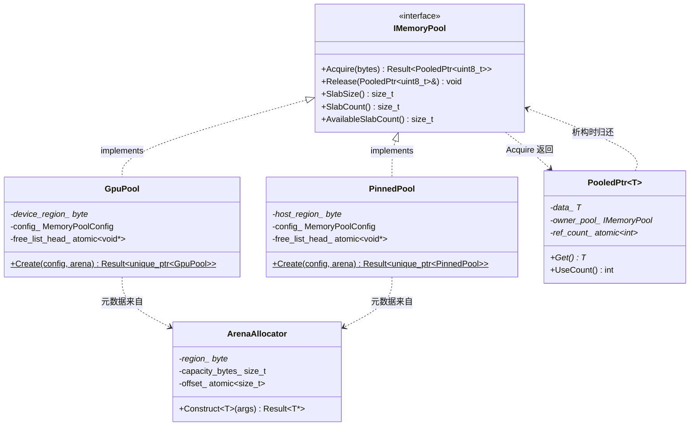
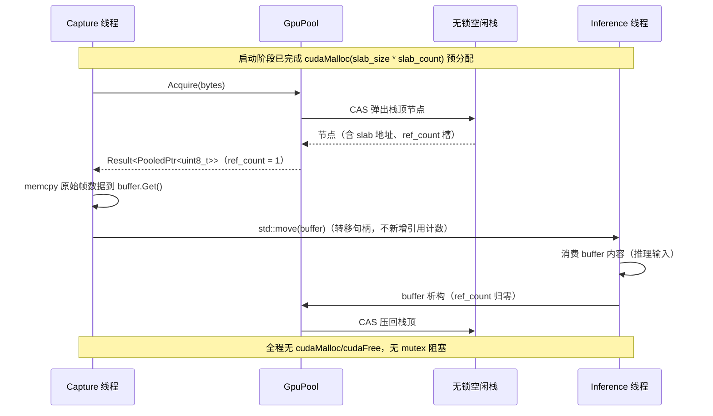

# 1.5 Memory（MemoryPool / ImagePool / TensorPool / GpuPool / PinnedPool）

> 里程碑：里程碑 1 —— 基座设施
> 批次依赖：1.1（`Object`、`Result<T>`，均按 1.1 定稿签名直接引用，不重新定义）
> 本批次提前于 1.4（Runtime）执行：1.4 批次的 CUDA Stream GPU 队列与 Pipeline Executor 需要直接引用本批次定稿的 `GpuPool`/`PinnedPool` 类型名与 `PooledPtr<T>` 句柄语义搬运 GPU 数据，因此本批次的接口签名一旦定稿，1.4 批次只能引用，不可重新定义。
> 本批次不依赖 1.2（生命周期容器）与 1.3（插件体系）：内存池是不需要依赖注入、不需要动态加载的底层子系统，其构造发生在比 `Context` 装配更早的阶段（详见 5. Workflow）。

## 1. Purpose

Memory 批次为 Surface AI Framework 建立处理高分辨率图像与张量数据的核心内存管理基座。在 16 路 12MP 相机 24/7 连续采集与推理的场景下，如果每一帧图像、每一次张量分配都走通用 `malloc`/`new` 或 `cudaMalloc`/`cudaHostAlloc` 的动态分配路径，长时间运行会导致堆（或显存）碎片化，与 spec 的"No Memory Leak"性能目标直接冲突；`cudaMalloc`/`cudaHostAlloc` 本身还是同步的驱动调用，不适合出现在逐帧调用的热路径上。本批次的目标是让 Capture、Preprocess、Inference 等热路径阶段"申请一块内存"这件事，在运行期退化为一次无锁栈的出栈操作，而不是一次真正的系统/驱动分配。

本批次交付：

- **`IMemoryPool`**：统一的池化分配接口契约，规定"获取一块内存"与"归还一块内存"的通用形状，不关心内存实际位于主机内存还是显存。
- **`GpuPool`/`PinnedPool`**：`IMemoryPool` 在两种物理内存类型上的具体落地，分别封装 `cudaMalloc`/`cudaFree` 与 `cudaHostAlloc`/`cudaFreeHost`，对上层调用方屏蔽 CUDA API 差异。
- **`PooledPtr<T>`**：归还语义的引用计数句柄，让调用方以接近裸指针的体验使用池化内存，同时不需要手动记住"用完要还给哪个池"。
- **`ArenaAllocator`**：池自身运行所需元数据（空闲链表节点）的独立分配来源，让"池的管理开销"本身也不产生运行期动态分配。
- **`MemoryPool`/`ImagePool`/`TensorPool`**：贯穿全文档的概念术语，本批次给出三者之间确切的关系定义（见 3. Design），避免后续批次（尤其是 1.4 Runtime）引用时产生歧义。

## 2. Responsibilities

本批次负责：

- 定义 `IMemoryPool` 抽象接口，规定 `Acquire`/`Release` 的签名与语义边界。
- 定义 `GpuPool`、`PinnedPool` 两个具体实现，规定其构造（预分配）流程与内部 slab 组织方式。
- 定义 `PooledPtr<T>`，规定其引用计数模型、拷贝/移动语义、析构时归还行为。
- 定义 `ArenaAllocator`，规定池元数据的独立分配来源与生命周期。
- 明确 `MemoryPool`/`ImagePool`/`TensorPool` 三个概念术语之间的关系，为后续批次引用提供唯一定义。
- 规定内存池的线程安全模型（无锁栈）与对齐策略（统一 64 字节）。

本批次不负责：

- 具体的图像解码、张量运算内容本身，这些属于里程碑 2 及以后；本批次只管理"承载这些数据的内存块从哪里来、用完还到哪里去"。
- CUDA Stream、GPU 队列调度、Pipeline Executor 等运行期调度机制，这些属于 1.4 批次；本批次只提供 `GpuPool`/`PinnedPool` 供 1.4 引用，不定义谁在什么时机调用 `Acquire`。
- NUMA 感知的物理内存放置策略，本版本明确不实现（见 3. Design、12. Future Extension）。
- 运行期可配置的对齐粒度，本版本固定为 64 字节，不提供配置项。

## 3. Design

**`MemoryPool`/`ImagePool`/`TensorPool`/`GpuPool`/`PinnedPool` 五个术语的关系：`GpuPool`/`PinnedPool` 是 `IMemoryPool` 按物理内存类型划分的两个具体 C++ 类型，`MemoryPool` 是二者共同遵循的抽象概念（本身不是一个类型），`ImagePool`/`TensorPool` 是按业务用途划分的命名池实例（同一份 `GpuPool`/`PinnedPool` 类型，用不同的 `slab_size`/`slab_count` 构造参数分别实例化一次），不是独立的 C++ 类型，也不是模板参数化的类型族。** 拒绝"为每种业务数据类型（`Image`、`Tensor`）各自定义一个模板类 `Pool<T>` 或派生类 `ImagePool : public GpuPool`"的方案，理由是 `IMemoryPool::Acquire` 的返回值天然是不带业务语义的裸字节缓冲（`PooledPtr<uint8_t>`）——池本身只负责"一块对齐好的、固定大小的连续内存"这一件事，不关心这块内存将被解释成一张 12MP 图像还是一个检测框张量；把业务类型编码进池的类型系统，会导致 `ImagePool` 与 `TensorPool` 之间产生大量重复代码（二者的分配、归还、对齐逻辑完全一致，唯一差异是 slab 大小），且一旦未来新增第三种业务数据类型（例如点云），又要新增一个 `PointCloudPool` 派生类，池的类型数量随业务数据类型数量线性增长。采用"同一类型、不同构造参数的命名实例"方案后，`ImagePool` 在配置文件与代码里就是一个具体的 `GpuPool` 实例（例如 `GpuPool image_pool{.slab_size = 12 * 1024 * 1024 * 3, .slab_count = max_concurrent_frames}`），`TensorPool` 是另一个用不同 `slab_size` 构造的 `GpuPool`（或 `PinnedPool`，取决于该张量是否需要 CPU 直接可读）实例；新增业务数据类型只需要新增一个构造参数组合，不需要新增类型。这一决策的代价是调用方需要自己保证"从 `image_pool` 拿到的字节缓冲只被当作图像使用"，框架不做运行期类型检查——这一代价是可接受的，因为热路径上增加运行期类型标签检查本身就是需要避免的开销，且调用方（Capture/Preprocess 模块）对自己申请哪个池、拿到的数据是什么这件事本身是确定性已知的，不存在运行期动态决定的场景。

**内存池采用固定大小 slab 分配加空闲链表策略，拒绝通用 `malloc`/`new` 动态分配路径。** 通用动态分配器为任意大小的请求服务，内部需要维护大小不一的空闲块并在分配/释放时做块的合并与拆分；12MP 图像 × 16 路相机在 24/7 场景下的持续分配/释放会让这些大小不一的块反复合并拆分，长期运行后堆地址空间出现大量无法满足大块请求的碎片空洞，这正是"No Memory Leak"性能目标要规避的退化路径（碎片化不是内存泄漏，但表现为同样的"可用内存耗尽"症状）。固定大小 slab 策略把"任意大小分配"这个通用问题收窄成"所有 slab 大小相同、只需要一个空闲链表记录哪些 slab 空闲"的受限问题，分配与释放都退化为链表的出栈/入栈，不存在块合并、拆分、大小匹配这些会产生碎片的操作。代价是同一个池只能服务大小不超过 `slab_size` 的请求，且每次 `Acquire` 无论请求的 `bytes` 是多少都占用一整个 slab；这一代价可接受，因为业务场景本身的数据大小是有限且已知的几种规格（固定分辨率的图像帧、固定维度的张量），不存在"请求大小任意"的真实需求。

**GPU 内存与 Pinned 内存采用双缓冲加启动期预分配策略，运行期不再调用 `cudaMalloc`/`cudaHostAlloc`。** `cudaMalloc`/`cudaHostAlloc` 都是同步的驱动调用，涉及页表登记（Pinned 内存还涉及页锁定），单次调用的延迟在毫秒级，若出现在 Capture 或 Inference 的逐帧热路径上，会直接拖慢帧率；且驱动内部的显存/锁页内存分配器同样存在通用分配器的碎片化风险，24/7 场景下运行期反复 `cudaMalloc`/`cudaFree` 与拒绝通用 `malloc`/`new` 是同一个问题在 GPU 侧的重现。因此 `GpuPool`/`PinnedPool` 在构造时一次性调用 `cudaMalloc`/`cudaHostAlloc` 分配 `slab_count × slab_size` 的连续区域（`slab_count` 由配置文件中的 `max_concurrent_frames` 参数决定——该参数含义是"流水线中同一时刻允许存在的、尚未被完全消费的帧数上限"，直接决定需要多少块 slab 同时在用），运行期全部 `Acquire`/`Release` 调用只在这块预分配区域内部的空闲链表上操作，不产生新的驱动调用。"双缓冲"体现为 `max_concurrent_frames` 的取值语义本身——它至少覆盖"当前正在写入的一帧 + 上一帧仍在被下游消费"两份并存的缓冲，而不是本批次额外引入一套独立的双缓冲切换机制；`slab_count` 本身就是可以配置为任意并发深度的通用参数，双缓冲只是它最小的合理取值（`slab_count = 2`）。

**引用计数用 `PooledPtr<T>` 内部的 `std::atomic<int>`，拒绝 `std::shared_ptr<T>`。** `std::shared_ptr` 的默认析构行为是对底层对象调用 `delete`（或数组版本的 `delete[]`），这与本批次"用完之后归还给池，而不是真正释放内存"的语义直接冲突；`std::shared_ptr` 可以通过自定义删除器绕开默认 `delete` 行为，但这意味着每一次构造 `shared_ptr` 都要正确地把"归还到哪个池"这一信息塞进删除器闭包里，一旦某处构造遗漏自定义删除器（例如误用了 `std::make_shared`），就会在运行期把池化内存错误地 `delete` 掉，且这类错误编译期不可见。`PooledPtr<T>` 把"归还池"这一行为编码进类型本身的析构函数里，构造 `PooledPtr<T>` 的唯一途径是 `IMemoryPool::Acquire`（见 4. Interfaces），不存在"构造出一个不知道归还给谁的 `PooledPtr`"的路径，把运行期才能发现的错误提前变成类型系统层面不可能发生的错误。

**SIMD 对齐统一为 64 字节，通过 `alignas(64)` 与自定义 `AlignedAllocator` 实现，拒绝运行期可配置的对齐粒度。** 64 字节覆盖 AVX-512 的 cache line 宽度需求（也覆盖 AVX2/SSE 更小的对齐需求），图像与张量数据在 Preprocess 阶段的 SIMD 向量化处理是本框架的既定场景，统一按最大公约数的上限对齐一次，比按每种 SIMD 指令集分别对齐更简单且没有下界。拒绝把对齐粒度做成配置项，理由是可预见的对齐需求（AVX-512 及以下）在 64 字节这一个值上已经完全覆盖，运行期配置成其他值不会带来任何已知场景下的收益，反而让 `slab_size` 的计算、`ArenaAllocator` 的对齐逻辑都需要多一个运行期参数分支；在没有实际需求的情况下引入配置项，只是提前为一个不存在的问题付出复杂度成本。

**NUMA 感知分配在本版本明确不实现，列为 Future Extension，不是"暂不支持但已预留接口"的折中方案。** NUMA 感知要求分配时感知当前线程所在的 NUMA 节点，尽量把内存分配在同一节点上以减少跨节点访问延迟，这需要引入 `numa_alloc_onnode` 一类的平台特定 API，并且要求调用方（Capture/Inference 线程）与分配请求之间存在明确的线程—节点绑定关系；当前批次的部署目标硬件规模与线程模型（见 9. Thread Model）尚未证明跨 NUMA 节点访问延迟是实际瓶颈，在没有性能数据支撑的前提下引入 NUMA 绑定逻辑，只会增加 `ArenaAllocator`/`GpuPool`/`PinnedPool` 构造流程的平台依赖与复杂度，且可能与未来的实际部署拓扑不匹配。本批次的 `IMemoryPool`/`GpuPool`/`PinnedPool` 接口签名不为 NUMA 预留任何占位参数（例如不在 `Acquire` 签名里加一个当前忽略的 `numa_node` 参数），因为过早预留签名会在真正设计 NUMA 方案时反而成为约束；需要时按 12. Future Extension 的路径重新设计。

**空闲链表节点使用的元数据内存来自独立的 `ArenaAllocator` 区域，拒绝把元数据节点分配在业务数据 slab 空间内部（例如借用每个 slab 头部的若干字节存放链表指针）。** 借用 slab 头部空间的方案能省下一次独立的元数据区域分配，但会让业务数据的起始地址依赖于头部元数据的大小，且一旦上层调用方（尤其是跨 CUDA/CPU 边界的场景）拿到 `PooledPtr<uint8_t>` 之后直接以为整块 slab 从起始地址开始都是可写的业务数据，头部若被业务代码越界写坏，链表本身就被破坏，且这类错误极难定位（表现为随机的池损坏，而不是清晰的越界访问报错）。`ArenaAllocator` 在启动时从一块独立区域一次性分配所有池需要的空闲链表节点，业务数据 slab 区域从起始地址到末尾整块都是纯粹的业务数据，两块区域在地址空间上完全不重叠，元数据被破坏与业务数据被破坏是两类地址空间上互不干扰的故障，排查时可以立即根据崩溃地址判断是哪一类问题。

## 4. Interfaces

以下为本批次定稿的头文件级声明（命名空间统一为 `sai::memory`），非实现细节；1.4 批次及后续批次引用这些名称时必须逐字一致。

```cpp
// -----------------------------------------------------------------------
// <sai/memory/arena_allocator.h>
// -----------------------------------------------------------------------
namespace sai::memory {

// 池元数据（空闲链表节点等）的独立分配来源，与业务数据 slab 区域在地址空间上不重叠。
// 启动时一次性从操作系统申请 capacity_bytes 大小的区域，运行期只在该区域内部切分，
// 不再向操作系统申请新内存；耗尽时 Allocate 返回错误，不回退到堆分配。
class ArenaAllocator final {
public:
    // capacity_bytes：本 Arena 一次性预留的总字节数，由调用方（GpuPool/PinnedPool 构造流程）
    // 按 slab_count 与每个空闲链表节点的大小预先算好后传入。
    explicit ArenaAllocator(std::size_t capacity_bytes) noexcept;
    ~ArenaAllocator() noexcept;

    ArenaAllocator(const ArenaAllocator&) = delete;
    ArenaAllocator& operator=(const ArenaAllocator&) = delete;
    ArenaAllocator(ArenaAllocator&&) = delete;
    ArenaAllocator& operator=(ArenaAllocator&&) = delete;

    // 按 alignof(T) 对齐分配一个 T 的存储空间并原地构造，返回的裸指针生命周期与 Arena 相同，
    // 不需要（也不允许）单独 delete；Arena 析构时统一回收整块区域。
    // Arena 容量耗尽时返回 Memory_ArenaExhausted 错误。
    template <typename T, typename... Args>
    [[nodiscard]] auto Construct(Args&&... args) noexcept -> Result<T*>;

    [[nodiscard]] auto CapacityBytes() const noexcept -> std::size_t;
    [[nodiscard]] auto UsedBytes() const noexcept -> std::size_t;

private:
    std::byte* region_;
    std::size_t capacity_bytes_;
    std::atomic<std::size_t> offset_;  // 分配游标，多线程下用原子 fetch_add 前进
};

}  // namespace sai::memory
```

```cpp
// -----------------------------------------------------------------------
// <sai/memory/pooled_ptr.h>
// -----------------------------------------------------------------------
namespace sai::memory {

// 引用计数句柄：析构时若引用计数归零，把底层 slab 归还给来源池，而不是 delete 内存。
// 构造 PooledPtr<T> 的唯一合法途径是 IMemoryPool::Acquire，不对外暴露从裸指针直接构造的接口。
template <typename T>
class PooledPtr final {
public:
    PooledPtr() noexcept = default;  // 空句柄，Get() 返回 nullptr，析构无归还行为

    PooledPtr(const PooledPtr& other) noexcept;             // 递增引用计数
    auto operator=(const PooledPtr& other) noexcept -> PooledPtr&;
    PooledPtr(PooledPtr&& other) noexcept;                   // 转移所有权，不改变计数
    auto operator=(PooledPtr&& other) noexcept -> PooledPtr&;
    ~PooledPtr() noexcept;                                    // 计数归零时调用 owner_pool_->ReleaseSlab(...)

    [[nodiscard]] auto Get() const noexcept -> T*;
    [[nodiscard]] auto SizeBytes() const noexcept -> std::size_t;
    [[nodiscard]] auto UseCount() const noexcept -> int;
    [[nodiscard]] auto IsValid() const noexcept -> bool;

    auto operator*() const noexcept -> T&;
    auto operator->() const noexcept -> T*;

private:
    // 仅 IMemoryPool 的实现类可调用的私有构造函数；owner_pool_ 是句柄归还时的回调目标，
    // 不是 PooledPtr 自己管理生命周期的对象（池的生命周期长于其发出的所有句柄，见 11. Memory）。
    friend class IMemoryPool;
    PooledPtr(T* data, std::size_t size_bytes, IMemoryPool* owner_pool,
              std::atomic<int>* ref_count) noexcept;

    T* data_ = nullptr;
    std::size_t size_bytes_ = 0;
    IMemoryPool* owner_pool_ = nullptr;
    std::atomic<int>* ref_count_ = nullptr;  // 指向 slab 元数据中随 slab 一起预分配的计数槽
};

}  // namespace sai::memory
```

```cpp
// -----------------------------------------------------------------------
// <sai/memory/memory_pool.h>
// -----------------------------------------------------------------------
namespace sai::memory {

struct MemoryPoolConfig {
    std::size_t slab_size;    // 单个 slab 的字节数，请求超过该值直接返回错误，不做多 slab 拼接
    std::size_t slab_count;   // 启动时预分配的 slab 数量，通常取自配置文件 max_concurrent_frames
};

// 统一的池化分配契约。GpuPool/PinnedPool 是本接口在两种物理内存类型上的具体实现，
// 均不在 Acquire/Release 之外的路径调用 cudaMalloc/cudaFree/cudaHostAlloc/cudaFreeHost。
class IMemoryPool : public Object {
public:
    ~IMemoryPool() override = default;

    // 从空闲链表弹出一个 slab 并包装为 PooledPtr<uint8_t> 返回。
    // bytes 超过构造时约定的 slab_size 返回 Memory_RequestExceedsSlabSize；
    // 空闲链表已空（所有 slab_count 个 slab 都在使用中）返回 Memory_PoolExhausted，
    // 不阻塞等待、不回退到动态分配——调用方（Capture/Inference 线程）需要自行决定
    // 重试、丢帧或上抛错误，池本身不替调用方做这个决策。
    [[nodiscard]] virtual auto Acquire(std::size_t bytes) noexcept
        -> Result<PooledPtr<uint8_t>> = 0;

    // 显式归还：递减引用计数，计数归零时把 slab 压回空闲链表。
    // 传入的 handle 归还后被置空（data_ = nullptr），防止调用方误用已归还的句柄；
    // 正常情况下不需要手动调用本方法——PooledPtr<T> 的析构函数会自动完成同样的操作，
    // Release 仅用于需要提前于句柄析构时刻主动归还的场景（例如显式生命周期收尾路径）。
    virtual void Release(PooledPtr<uint8_t>& handle) noexcept = 0;

    [[nodiscard]] virtual auto SlabSize() const noexcept -> std::size_t = 0;
    [[nodiscard]] virtual auto SlabCount() const noexcept -> std::size_t = 0;
    [[nodiscard]] virtual auto AvailableSlabCount() const noexcept -> std::size_t = 0;
};

}  // namespace sai::memory
```

```cpp
// -----------------------------------------------------------------------
// <sai/memory/gpu_pool.h>
// -----------------------------------------------------------------------
namespace sai::memory {

// 封装 cudaMalloc/cudaFree 的设备内存池。构造时一次性 cudaMalloc(slab_size * slab_count)，
// 析构时一次性 cudaFree；Acquire/Release 之间不产生任何新的 cudaMalloc/cudaFree 调用。
// 1.4 批次的 CUDA Stream GPU 队列直接持有本类型实例，通过 Acquire 拿到的
// PooledPtr<uint8_t> 底层指针可直接传入 cudaMemcpyAsync 等 CUDA API 作为设备端地址。
class GpuPool final : public IMemoryPool {
public:
    // config：slab_size/slab_count；arena：本池的空闲链表节点从该 ArenaAllocator 分配，
    // 调用方负责保证 arena 的生命周期覆盖本池的整个生命周期（arena 通常与本池同批次
    // 在装配阶段一起构造，见 5. Workflow）。构造失败（cudaMalloc 失败、arena 容量不足）
    // 返回 Result 而非抛异常——本池不是 Object 意义上的"构造失败只能异常"的场景例外，
    // 见 1.1 批次 3. Design 对构造函数异常的判定规则；此处用工厂函数规避在真实构造函数
    // 里表达 Result，构造函数本身仅做成员初始化。
    [[nodiscard]] static auto Create(MemoryPoolConfig config, ArenaAllocator& arena) noexcept
        -> Result<std::unique_ptr<GpuPool>>;

    ~GpuPool() noexcept override;

    GpuPool(const GpuPool&) = delete;
    GpuPool& operator=(const GpuPool&) = delete;
    GpuPool(GpuPool&&) = delete;
    GpuPool& operator=(GpuPool&&) = delete;

    [[nodiscard]] auto Acquire(std::size_t bytes) noexcept
        -> Result<PooledPtr<uint8_t>> override;
    void Release(PooledPtr<uint8_t>& handle) noexcept override;

    [[nodiscard]] auto SlabSize() const noexcept -> std::size_t override;
    [[nodiscard]] auto SlabCount() const noexcept -> std::size_t override;
    [[nodiscard]] auto AvailableSlabCount() const noexcept -> std::size_t override;

private:
    GpuPool() noexcept = default;

    std::byte* device_region_ = nullptr;      // cudaMalloc 返回的设备端基址
    MemoryPoolConfig config_{};
    std::atomic<void*> free_list_head_{nullptr};  // 无锁栈头指针，见 9. Thread Model
};

}  // namespace sai::memory
```

```cpp
// -----------------------------------------------------------------------
// <sai/memory/pinned_pool.h>
// -----------------------------------------------------------------------
namespace sai::memory {

// 封装 cudaHostAlloc/cudaFreeHost 的锁页主机内存池。构造时一次性
// cudaHostAlloc(slab_size * slab_count, cudaHostAllocDefault)，析构时一次性 cudaFreeHost；
// 用于 Host<->Device 之间需要异步 DMA 传输（cudaMemcpyAsync）的中间缓冲，
// 普通堆内存不具备锁页属性，无法用于异步传输。
class PinnedPool final : public IMemoryPool {
public:
    [[nodiscard]] static auto Create(MemoryPoolConfig config, ArenaAllocator& arena) noexcept
        -> Result<std::unique_ptr<PinnedPool>>;

    ~PinnedPool() noexcept override;

    PinnedPool(const PinnedPool&) = delete;
    PinnedPool& operator=(const PinnedPool&) = delete;
    PinnedPool(PinnedPool&&) = delete;
    PinnedPool& operator=(PinnedPool&&) = delete;

    [[nodiscard]] auto Acquire(std::size_t bytes) noexcept
        -> Result<PooledPtr<uint8_t>> override;
    void Release(PooledPtr<uint8_t>& handle) noexcept override;

    [[nodiscard]] auto SlabSize() const noexcept -> std::size_t override;
    [[nodiscard]] auto SlabCount() const noexcept -> std::size_t override;
    [[nodiscard]] auto AvailableSlabCount() const noexcept -> std::size_t override;

private:
    PinnedPool() noexcept = default;

    std::byte* host_region_ = nullptr;        // cudaHostAlloc 返回的锁页主机基址
    MemoryPoolConfig config_{};
    std::atomic<void*> free_list_head_{nullptr};
};

}  // namespace sai::memory
```

```cpp
// -----------------------------------------------------------------------
// <sai/memory/aligned_allocator.h>
// -----------------------------------------------------------------------
namespace sai::memory {

inline constexpr std::size_t kSimdAlignment = 64;  // AVX-512 cache line 宽度，全局固定，不做成配置项

// 用于需要 SIMD 对齐的独立分配场景（例如 ArenaAllocator 自身的初始区域申请）；
// slab 内部按 kSimdAlignment 向上取整，保证每个 slab 起始地址均对齐。
template <typename T>
struct AlignedAllocator {
    using value_type = T;
    [[nodiscard]] auto allocate(std::size_t n) -> T*;
    void deallocate(T* ptr, std::size_t n) noexcept;
};

}  // namespace sai::memory
```

## 5. Workflow

**启动装配流程（单线程，发生在 `Context` 装配之前）：**

1. 框架读取配置文件中的 `max_concurrent_frames` 及各命名池（`image_pool`、`tensor_pool` 等）的 `slab_size` 覆盖值（未覆盖则沿用 `max_concurrent_frames` 派生的默认 `slab_count`）。
2. 按各池所需的空闲链表节点总数估算 `ArenaAllocator` 所需容量，构造一个（或按内存类型分区的多个）`ArenaAllocator`。
3. 依次调用 `GpuPool::Create`/`PinnedPool::Create`，每次调用内部完成一次 `cudaMalloc`/`cudaHostAlloc` 与一次性把 `slab_count` 个 slab 串成初始空闲链表（写入 `free_list_head_`）。
4. 任一 `Create` 失败（显存不足、锁页内存配额不足、`ArenaAllocator` 容量不足）时，整个启动流程通过 `Result<T>` 的 `and_then` 链路短路失败，不进入 `Running` 状态；这一步与 1.2 批次定稿的 `Context::Initialize()` 流程属于同一装配阶段，但池的构造本身不经过 `Context::RegisterModule()`——池不是 `IModule`，没有 `OnInitialize`/`OnStart`/`OnStop` 生命周期钩子需要被驱动，构造完成即可用，销毁只发生在进程退出。

**运行期 `Acquire` 流程（多线程，热路径）：**

```cpp
auto AcquireImageBuffer(IMemoryPool& pool, std::size_t bytes) -> Result<PooledPtr<uint8_t>> {
    return pool.Acquire(bytes);
}
```

调用方（Capture 线程）拿到 `Result<PooledPtr<uint8_t>>` 后用 `and_then` 继续处理，不手动检查 `has_value()` 再嵌套写入逻辑：

```cpp
pool.Acquire(frame_bytes)
    .and_then([&](PooledPtr<uint8_t> buffer) -> Result<void> {
        std::memcpy(buffer.Get(), raw_frame_data, frame_bytes);
        return DispatchToInferenceQueue(std::move(buffer));
    })
    .or_else([](const ErrorInfo& err) {
        LogFrameDropped(err);  // Memory_PoolExhausted 场景：丢帧而非阻塞等待
    });
```

**运行期 `Release`/析构归还流程：** `PooledPtr<uint8_t>` 在 `DispatchToInferenceQueue` 内被移动传递给 Inference 线程，Capture 线程侧的局部变量此时已不持有引用计数；Inference 线程处理完成后 `PooledPtr` 离开作用域触发析构，析构函数递减引用计数，归零时调用 `owner_pool_` 的内部归还路径把 slab 重新压入空闲链表——这一路径与显式调用 `IMemoryPool::Release` 是同一段内部逻辑，`Release` 只是把这段逻辑提前到句柄生命周期结束之前手动触发的入口。

## 6. Data Structure

| 类型 | 归属场景 | 关键字段/成员 | 生命周期 |
|---|---|---|---|
| `MemoryPoolConfig` | 池构造参数 | `slab_size` / `slab_count` | 值语义，仅在 `Create` 调用时使用，不长期持有 |
| `ArenaAllocator` 内部区域 | 池元数据来源 | `region_`（独立分配的字节区域）/ `offset_`（原子分配游标） | 启动时分配，进程退出时随对象销毁一次性释放，运行期只增不减（无归还，因为节点数量在启动后固定） |
| `GpuPool`/`PinnedPool` 内部区域 | 业务数据 slab | `device_region_`/`host_region_`（预分配基址）/ `free_list_head_`（无锁栈头指针） | 启动时一次性分配（`cudaMalloc`/`cudaHostAlloc`），进程退出或池销毁时一次性释放（`cudaFree`/`cudaFreeHost`），运行期区域大小不变 |
| 空闲链表节点 | `ArenaAllocator` 分配的元数据 | `next`（指向下一空闲节点）/ `slab_ptr`（指向对应业务 slab 起始地址）/ `ref_count`（`std::atomic<int>`，随节点一起预分配，供该 slab 对应的 `PooledPtr` 复用） | 启动时随所属池一起构造，进程运行期间地址不变（只在空闲链表与"使用中"之间移动逻辑归属，物理地址不移动） |
| `PooledPtr<T>` | 调用方持有的句柄 | `data_`/`size_bytes_`/`owner_pool_`/`ref_count_`（指向上面节点内的计数槽，不新分配） | 值语义句柄，随业务调用栈构造/拷贝/移动/销毁；不拥有真正的内存生命周期，只拥有"是否归还"的决定权 |

`ref_count_` 不随每个 `PooledPtr<T>` 实例独立分配，而是指向对应空闲链表节点内预先分配好的计数槽——这一设计让引用计数本身也不产生运行期动态分配，与"元数据来自独立 Arena、运行期零动态分配"的整体原则一致。

## 7. Class Diagram



## 8. Sequence Diagram



## 9. Thread Model

**`IMemoryPool::Acquire`/`Release` 必须是多生产者多消费者（MPMC）安全的：** Capture 线程（生产者，高频调用 `Acquire`）与 Inference 线程（消费者，处理完成后触发归还）会在同一个池上并发操作，且实际部署中 Capture 侧本身就是 16 路相机对应的多个线程，`Release` 侧也可能是多个 Inference 工作线程并发触发，因此池内部的空闲链表天然是 MPMC 场景，不是简单的单生产者单消费者队列。

**内部空闲链表用无锁栈（`std::atomic<Node*>` + CAS）实现，拒绝 `std::mutex`。** 12MP 图像 × 16 路相机在高帧率下的 `Acquire`/`Release` 调用频率远高于 1.1 批次 `TypeRegistry::Resolve` 这类低频查询路径，锁竞争在这一频率下会成为热路径瓶颈——每次 `Acquire`/`Release` 都要经历一次可能阻塞的互斥锁获取，多个 Capture 线程同时申请时会互相排队等待，即使持锁时间很短，操作系统调度带来的上下文切换开销在高频场景下会被放大。无锁栈把"弹出/压入一个节点"实现为一个 CAS 重试循环，多个线程可以真正并发尝试，失败只是重试而不是排队等待被唤醒：

```cpp
// 出栈（Acquire 内部）：单个 CAS 重试循环，不嵌套其他条件分支
Node* PopFreeList(std::atomic<Node*>& head) noexcept {
    Node* old_head = head.load(std::memory_order_acquire);
    while (old_head != nullptr &&
           !head.compare_exchange_weak(old_head, old_head->next,
                                        std::memory_order_acq_rel,
                                        std::memory_order_acquire)) {
        // old_head 被 CAS 自动刷新为当前观测到的最新 head，继续下一轮尝试
    }
    return old_head;  // nullptr 表示空闲链表已空，Acquire 据此返回 Memory_PoolExhausted
}

// 入栈（Release/PooledPtr 析构内部）：同样是单个 CAS 重试循环
void PushFreeList(std::atomic<Node*>& head, Node* node) noexcept {
    Node* old_head = head.load(std::memory_order_acquire);
    do {
        node->next = old_head;
    } while (!head.compare_exchange_weak(old_head, node,
                                          std::memory_order_acq_rel,
                                          std::memory_order_acquire));
}
```

这两个函数各自只有一个 `while`/`do-while` 循环，循环体内不包含除 CAS 重试本身之外的条件判断分支，符合"CAS 重试循环写成单层循环，不与其他条件嵌套"的约束；空闲链表为空这一情况通过循环条件（`old_head != nullptr`）本身表达，不需要额外的 `if` 分层。

**引用计数的原子操作与空闲链表的 CAS 操作是两个独立的原子变量，不合并为一次操作。** `PooledPtr<T>` 拷贝/析构时对 `ref_count_` 的 `fetch_add`/`fetch_sub` 与空闲链表的 CAS 分别作用于不同的原子变量，只有 `fetch_sub` 观测到计数归零那一刻才触发一次 `PushFreeList`；两者不需要合并成一次复合原子操作，因为空闲链表的可见性只在"计数真正归零"这一个时间点才有意义，多次递减计数的中间过程不需要对空闲链表可见。

## 10. Performance

- `Acquire`/`Release` 的时间复杂度均为 O(1)（一次 CAS 重试循环，无竞争时一次成功即返回），不随 `slab_count` 增长而变慢；这与拒绝通用分配器（其分配/释放复杂度可能因块合并/拆分而退化）的设计目标一致。
- 无锁栈在高竞争下会出现 CAS 失败重试，但失败后的重试成本是一次原子读加一次比较，远低于 `std::mutex` 竞争失败后线程被操作系统挂起再唤醒的成本；预期即使 16 路相机线程同时申请，单次 `Acquire` 的最坏情况耗时仍在微秒级以内。
- 启动阶段的 `cudaMalloc`/`cudaHostAlloc` 与空闲链表初始化是一次性成本，不计入运行期性能预算；其耗时随 `slab_count × slab_size` 增长，但发生在进程启动阶段，与逐帧处理的帧率指标无关。
- `ArenaAllocator::Construct` 的分配游标前进（`fetch_add`）是 O(1) 且只发生在启动阶段（各池构造时一次性申请所有节点），不在运行期热路径上被调用。

## 11. Memory

本节描述内存池自身的自举内存管理，不是本文档全篇内容的重复摘要。池的运行依赖两类物理上分离的内存区域：

- **业务数据 slab 区域**：`GpuPool` 的 `cudaMalloc` 区域、`PinnedPool` 的 `cudaHostAlloc` 区域，容纳实际的图像/张量字节内容，容量为 `slab_size × slab_count`。这块区域只被业务代码（图像写入、张量读取）访问，池自身的管理逻辑（空闲链表指针、引用计数）不占用这块区域的任何字节。
- **池元数据区域**：由 `ArenaAllocator` 在启动时独立分配，容纳空闲链表节点（`next` 指针、`slab_ptr`、`ref_count` 计数槽）。这块区域的大小只取决于 `slab_count`（每个 slab 对应恰好一个元数据节点），与 `slab_size` 无关——即使业务数据 slab 增大到几十 MB，元数据区域的大小不变，因为元数据节点本身的大小是固定的（一个指针 + 一个指针 + 一个 `int` 量级）。

两块区域在地址空间上不重叠、生命周期一致（随所属池的构造/销毁一起分配/释放，均不在运行期动态增长），这是 3. Design 中"元数据不占用业务数据 slab 空间"决策的具体落地：业务数据越界写坏不会破坏元数据（空闲链表不会因此损坏，池仍能报告正确的 `AvailableSlabCount`），元数据区域本身极小且只在启动阶段写入（运行期只有指针值随节点在链表间移动而改变，区域总大小不变），二者故障域互不干扰。

`ArenaAllocator` 自身不参与池化管理（不存在"归还 ArenaAllocator 分配出去的节点"这一操作路径）——节点在整个进程运行期间要么在空闲链表上，要么被某个 `PooledPtr` 持有，节点对象本身的存储永远不被释放，只在两种逻辑状态之间移动；这与 `GpuPool`/`PinnedPool` 面向业务数据的池化语义（业务数据 slab 会被"借出去再收回来"）是同一类"预分配后不再动态增减"的策略在元数据层的重现，但节点本身没有"借出/收回"的中间态，只有"空闲/使用中"两态。

## 12. Future Extension

- NUMA 感知分配：若未来部署拓扑证明跨 NUMA 节点访问延迟是实际瓶颈，需要重新设计 `GpuPool`/`PinnedPool` 的构造参数与内部区域划分方式（可能需要按 NUMA 节点分别持有独立的区域与独立的空闲链表），本批次不为此预留占位参数，避免过早锁定一个未经验证的方案（详见 3. Design 中 NUMA 排除的完整理由）。
- 动态调整 `slab_count`：当前 `slab_count` 在启动时固定，运行期耗尽则丢帧；若未来需要运行期扩容，需要重新评估"运行期允许 `cudaMalloc`"这一前提是否可接受，这与本批次"运行期零动态分配"的核心设计目标直接冲突，需要独立评估，不在本版本范围内。
- 跨池共享同一块 `ArenaAllocator` 区域：当前设计允许多个池共享同一个 `ArenaAllocator` 实例（只要容量足够），本批次未规定"是否应该所有池统一共享一个全局 Arena"还是"每个池各自持有独立 Arena"，留给 1.4 批次装配阶段依据实际池数量决定，两种用法均符合本批次接口契约。

## 13. Best Practice

- 构造 `GpuPool`/`PinnedPool` 时始终通过 `Create` 静态工厂获取 `Result<std::unique_ptr<...>>`，不要绕过工厂直接构造——私有默认构造函数已经阻止了这一点，但调用方应理解这是有意为之：构造失败（显存不足等）必须通过 `Result<T>` 表达，不是构造函数异常。
- 消费 `Acquire` 返回的 `Result<PooledPtr<uint8_t>>` 时优先使用 `and_then`/`or_else` 链式组合完成"拿到缓冲后立即使用、拿不到立即处理丢帧"两条路径，不要先 `if (result.has_value())` 再在分支内部继续嵌套处理逻辑。
- `PooledPtr<T>` 应通过移动（`std::move`）在线程之间传递所有权，而不是拷贝后各自持有；拷贝会递增引用计数，意味着 slab 要等两份句柄都释放才归还，延长了 slab 的占用时间。
- 各命名池（`image_pool`/`tensor_pool`）的 `slab_size` 应按实际业务数据的最大规格设置并留出合理余量，不要设置成一个覆盖"所有可能场景"的过大值——`slab_size` 直接乘以 `slab_count` 决定该池的总预分配显存/锁页内存占用。

## 14. Anti Pattern

- 不要在 `Acquire` 失败（`Memory_PoolExhausted`）后自旋等待空闲 slab 出现；池本身不提供阻塞等待语义，调用方应把这一情况当作正常的背压信号处理（丢帧、降级、上抛错误），自旋等待会在池持续耗尽的场景下把等待线程变成新的性能瓶颈。
- 不要缓存 `PooledPtr<T>::Get()` 返回的裸指针并在 `PooledPtr` 本身已经析构之后继续使用；裸指针背后的 slab 可能已经被归还并被另一个 `Acquire` 调用重新借出，此时通过缓存的裸指针读写等价于访问一块已经被别人正在写入的内存。
- 不要用 `std::shared_ptr` 包装 `IMemoryPool::Acquire` 返回的底层指针来"实现类似效果"；这正是 3. Design 中明确拒绝的方案，默认删除器会 `delete` 本应归还给池的内存。
- 不要在 `GpuPool`/`PinnedPool` 构造完成后的运行期路径里调用 `cudaMalloc`/`cudaHostAlloc` 做"临时扩容"；一旦出现运行期扩容需求，说明 `slab_count` 的估算或 Future Extension 中的动态扩容方案需要重新评估，不应该在当前接口之外私自新增分配调用绕过池。
- 不要在无锁栈的 CAS 重试循环外再包一层 `std::mutex` 或额外的重试次数上限判断"以防万一"；这既违背了本批次选择无锁结构的初衷（避免锁竞争开销），也会把原本单层的 CAS 循环变成不必要的嵌套结构。

