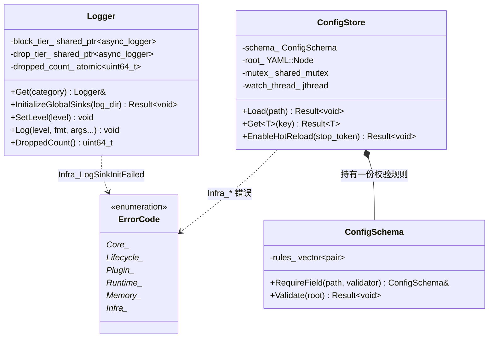
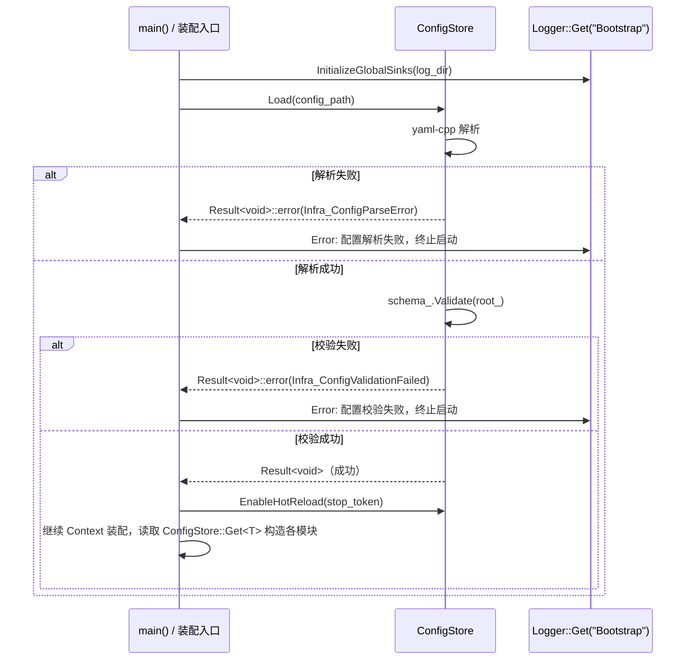

# 1.6 横切关注点（Error Handling 分类表 / Logging / Configuration）

> 里程碑：里程碑 1 —— 基座设施
> 批次依赖：1.1（`Result<T>`、`ErrorInfo`，均按 1.1 定稿签名直接引用，本批次不重新定义这两个类型本身，只补完 `ErrorInfo::code` 所属的 `ErrorCode` 枚举的分类规则）
> 本批次不依赖 1.2/1.3/1.4/1.5 的具体接口签名，但依赖它们已经各自提交的 `ErrorCode` 前缀子集（`Core_*`/`Lifecycle_*`/`Plugin_*`/`Runtime_*`/`Memory_*`）——本批次把这些既成事实汇总进同一张分类表并补完命名规则，不重新命名、不重新解释任何一个已提交成员。
> 本批次定稿的 `Logger`/`ConfigStore`/`ConfigSchema` 是后续所有批次（1.2 - 7.2 中涉及日志与配置读取的一切代码）的唯一基线，一旦定稿不可在其他批次重新定义，只能引用。

## 1. Purpose

横切关注点批次为 Surface AI Framework 补完三类此前批次刻意留白、但每个模块运行都绕不开的基础设施：

- **错误码分类表**：1.1 批次定稿了 `Result<T>`/`ErrorInfo` 这一错误返回通道本身，但 `ErrorInfo::code` 字段的类型 `ErrorCode` 在 1.1-1.5 批次中只各自新增了自己模块前缀下的最小必需子集（`Core_*`/`Lifecycle_*`/`Plugin_*`/`Runtime_*`/`Memory_*`），没有一份文档给出"这些前缀合起来构成一套什么规则、新模块新增错误码时该如何命名、该查哪张表以免和已有码重叠"的权威说明。本批次补完这份规则与汇总表，不重新定义任何已提交成员。
- **`Logger`**：封装 spdlog 异步 logger 的统一日志入口，规定日志从产生到落盘全过程不阻塞 Capture/Inference 等热路径线程，以及队列积压时的确定性丢弃策略。
- **`ConfigStore`/`ConfigSchema`**：封装 yaml-cpp 解析与字段校验的统一配置入口，规定配置如何在启动时一次性加载校验、运行期如何安全地热重载。

需要特别说明本批次与 1.4/1.5 批次之间的一个时序关系：1.4 批次的 `WorkerPool` 线程数、1.5 批次的 `slab_size`/`max_concurrent_frames`，两份文档都写"由配置文件中的参数决定"，但当时都没有引用一个具体的配置读取接口——因为那两个批次只需要断言"这个数字来自配置文件"这一事实，不需要引用配置读取的具体实现。本批次定稿 `ConfigStore` 后，里程碑 6 的实际装配代码在构造 `WorkerPool`/`GpuPool` 之前会先调用 `ConfigStore::Load` 并用 `ConfigStore::Get<T>` 取出这些参数——这是运行时序上的"先后"，不是文档批次之间的引用关系，1.4/1.5 的文档批次依赖声明因此不需要（也不应该）声明对 1.6 的依赖。

## 2. Responsibilities

本批次负责：

- 汇总 1.1-1.5 已提交的 `ErrorCode` 前缀子集，给出模块前缀命名规则与完整分类表，作为里程碑 2-7 新增错误码时的唯一查询依据。
- 定义 `Logger`，规定按类别（category）获取 logger 实例的入口、异步落盘机制、日志轮转策略、队列满时的分级丢弃策略。
- 定义 `ConfigStore`，规定配置文件的加载时机（启动期一次性）、字段校验时机（加载时，通过 `ConfigSchema`）、热重载触发方式（`inotify` 文件系统监听）与热重载校验失败时的回退策略。
- 定义 `ConfigSchema`，规定"一份 YAML 结构应该满足哪些字段约束"这一描述本身的表达方式（手写校验函数，不引入独立 schema 库）。

本批次不负责：

- 重新定义 `Result<T>`/`ErrorInfo` 结构本身，这两者在 1.1 批次已经定稿，本批次只引用。
- 具体业务模块（Capture/Inference 等）应该往日志里写什么内容、配置文件里应该有哪些业务字段，这些属于里程碑 2 及以后；本批次只提供"如何写日志""如何读配置"这两件事的通用机制。
- 指标采集（Metrics）与告警系统，1.4 批次已经明确指出这部分依赖本批次的 Logging/Config 基础设施但留给里程碑 6 设计；本批次只暴露 `Logger` 的丢弃计数这一个可被 Metrics 消费的原始数字，不定义 Metrics 系统本身。
- 配置文件的具体业务字段结构（例如某个相机模块的 YAML 应该有哪些键），这属于该模块自己的设计批次；本批次只定义 `ConfigSchema` 这一通用校验机制的形状。

## 3. Design

**错误码采用单一 `ErrorCode` 枚举 + 模块前缀分区命名（`<ModulePrefix>_<PascalCase 语义>`），拒绝每个模块各自定义独立的 error code 枚举类型。** 若每个模块（Core/Lifecycle/Plugin/Memory/Runtime/……）各自定义一个独立的 `enum class XxxErrorCode`，`ErrorInfo::code` 字段就需要变成某种类型擦除的联合体或者 `std::variant`，1.1 批次"`ErrorInfo` 固定为三个字段"这一简单契约会被打破，且跨模块传播错误（例如 `TaskGraph::RunToCompletion` 内部原样转发 `TypeRegistry::Resolve` 的错误）会需要一层类型转换胶水代码。单一枚举 + 前缀命名把"错误属于哪个模块"这一信息编码进枚举成员名字本身（而不是编码进类型），`ErrorInfo::code` 始终是同一个类型，跨模块传播错误时不需要任何转换，`and_then`/`or_else` 链式组合可以在任意模块边界之间直接传递 `ErrorInfo` 而不丢失来源信息。分类表汇总 1.1-1.5 已提交的前缀，见 6. Data Structure；本批次新增 `Infra_*` 前缀，服务本批次的 `Logger`/`ConfigStore`。

**错误码前缀一旦提交只能新增成员，拒绝对已提交前缀下的成员重新解释含义或删除。** `ErrorCode` 的数值（`std::uint32_t`）一旦分配，可能已经被日志文件、监控系统按数值持久化匹配（例如告警规则"`code == 1042` 时触发工单"），如果后续批次为了"更精确的语义"去修改一个已提交成员的含义或者干脆删掉重新分配，会让历史日志数据与新代码的解释产生错位，且这种错位在编译期完全不可见。因此新增错误码时先查 6. Data Structure 的分类表：若目标模块的前缀下已存在语义相同或高度相近的成员，复用而不新造；若确实是新失败模式，在自己模块的前缀下追加新成员（永远追加在已有成员之后，不重排序），不触碰其他前缀。这条规则本身不需要运行期强制（`enum class` 没有运行期校验成员是否被"篡改"的手段），是对所有批次作者的编码纪律要求，靠代码评审而非编译器保证。

**Logging 采用 `spdlog::async_logger` + 独立后台 IO 线程，拒绝同步 logger（`spdlog::logger` 直写 sink）。** 同步 logger 的每一次 `log()` 调用都在调用者线程上直接执行格式化与磁盘写入，磁盘 I/O 的延迟（尤其是日志文件所在磁盘出现瞬时压力时）会直接体现为调用者线程的阻塞；如果 Capture 或 Inference 这类热路径线程里散布着诊断日志调用（哪怕只是 `Debug` 级别，一旦被启用），一次慢磁盘写入就会直接拖慢一帧的采集或推理节拍，这与本框架对热路径延迟确定性的要求冲突。异步 logger 把"格式化后的日志条目"通过队列转移给一个独立的后台 IO 线程，调用者线程上的 `log()` 退化为一次入队操作（一次原子操作量级），真正的磁盘写入发生在调用者线程完全不感知的后台线程上，热路径线程的执行时间不再包含任何磁盘 I/O 的不确定性。

**日志队列满时采用分级丢弃策略（`Trace`/`Debug` 丢弃并计数，`Warning` 及以上阻塞等待绝不丢弃），拒绝对全部级别统一采用同一种溢出策略。** spdlog 的内置溢出策略只有两种非此即彼的选项：`block`（队列满时调用者阻塞直到有空位）与 `overrun_oldest`（队列满时丢弃队列中最旧的条目，调用者不阻塞）。若统一采用 `block`，热路径线程一旦在 `Trace`/`Debug` 级别被启用的调试场景下高频写日志，日志队列被打满就会让调用者线程阻塞在日志调用上，等价于把"关掉的同步 logger 的阻塞问题"重新引入；若统一采用 `overrun_oldest`，队列积压时可能连 `Error`/`Critical` 级别的日志（往往对应真正的故障现场，产线环境下这类日志是排查事故的唯一线索）都被当作"最旧的条目"一起丢弃，丢失关键诊断信息的代价远高于让调用者短暂阻塞。分级处理把两种策略按级别分别应用：`Trace`/`Debug` 这类高频、允许有损的诊断信息走 `overrun_oldest`（见 4. Interfaces 的双队列实现），`Warning` 及以上这类低频、不允许丢失的信息走 `block`——低频意味着即便偶尔阻塞，阻塞发生的概率与影响范围都远小于高频路径。

**日志轮转策略采用"按天轮转 + 单文件最大 100MB 触发轮转（两个条件任一触发即轮转）"，拒绝单一按天轮转策略。** 单一按天轮转在正常负载下工作良好，但产线现场一旦出现异常报警风暴（例如某路相机持续掉线导致同一个 `Warning` 日志被反复触发），当天的日志文件会在按天轮转生效之前无限增长，单个日志文件膨胀到数 GB 级别不仅占满磁盘，也让运维人员用文本工具打开这个文件排查问题时体验极差（甚至打不开）。叠加单文件大小上限后，无论是否到达按天轮转的时间点，只要当前文件写满 100MB 就立即轮转，把"单个日志文件的最大代价"钳制在一个可预测的上界，按天轮转仍然保留（用于正常负载下按自然日归档，便于按日期检索历史日志），两个条件互不替代、任一触发都执行轮转动作。

**`Logger::Get(category)` 按类别返回专属 logger 实例，拒绝全局单一 logger（所有模块共用同一个 logger 实例、同一个日志级别）。** 全局单一 logger 意味着调试某一个模块（例如某次怀疑是 `GpuStreamQueue` 的 GPU 回调转发出了问题）时只能整体调高日志级别，代价是其他所有模块（Capture、Retrieval 等与本次排障无关的模块）的 `Debug`/`Trace` 日志也会一起被打开，产生大量与当前排障目标无关的噪音，且这些额外噪音本身会占用共享的 8192 容量丢弃队列，挤占真正需要排查的模块的日志空间。按类别取 logger 让每个模块的日志级别可以独立配置（生产环境整体 `Info`，排障时只把某一个类别调到 `Debug`），`Logger::Get` 内部按类别名维护一个查找表，重复调用同一类别名返回同一实例（不重复创建后台线程/队列），多个类别共享同一组底层异步 IO 线程池（见 9. Thread Model），不是每个类别各自开一组线程。

**Configuration 采用 yaml-cpp 加载 + 手写字段校验函数（`ConfigSchema`）实现 JSON-Schema 等价校验，拒绝引入独立的 schema 校验库。** 独立 schema 库（例如把 YAML 转成 JSON 后交给某个 JSON Schema 校验器）能提供更通用的声明式校验能力（正则约束、跨字段依赖表达式等），但代价是引入一个新的第三方依赖、一份需要额外维护的 schema 描述文件格式，以及运行期解析这份 schema 描述本身的开销；框架当前的配置校验需求收窄在"必需字段是否存在""数值是否落在合理区间""字符串是否匹配枚举值"这几类有限模式，用 C++ 函数直接表达这些规则（`ConfigSchema::RequireField` 注册字段路径与校验闭包）比维护一份独立 schema 语言的解析器更直接，校验逻辑本身也能获得编译期类型检查（校验函数签名固定，写错参数类型编译不通过），比脚本化 schema 语言的错误只能在运行期发现更早暴露问题。

**配置在启动时一次性加载并校验，拒绝按需懒解析（首次访问某个键时才解析对应部分）。** 懒解析能省下"从未被访问的配置项也要解析一次"的开销，但代价是配置文件本身如果存在结构性错误（缺少必需字段、字段类型不匹配），这个错误只会在运行期第一次访问该字段的调用点才暴露，而这个调用点可能发生在进程已经运行了很长时间、已经开始处理真实产线数据之后——一个本该在启动阶段就 fail fast 拒绝启动的配置错误，被推迟到运行期某个不确定的时刻才炸出来，故障定位与影响范围都远比启动失败更糟。一次性加载校验把整份配置的正确性检查收敛到 `ConfigStore::Load` 这一个调用点，失败则装配阶段直接失败、不进入 `Running` 状态（与 1.2 批次"装配失败不做自动回滚"结论一致），运行期后续所有 `ConfigStore::Get<T>` 调用面对的都是已经确认过整体结构合法的配置树。

**热重载通过文件系统监听（`inotify`）触发，拒绝定时轮询检查文件修改时间（mtime）。** 定时轮询需要选择一个轮询间隔，间隔选小了增加不必要的文件系统调用频率、消耗一个线程的持续调度周期；选大了则配置变更后到实际生效之间存在一段不确定的滞后，且轮询线程即便配置文件从未变化也要持续被操作系统调度唤醒去做一次无意义的 `stat` 调用。`inotify` 是事件驱动的内核机制，配置文件被写入的那一刻内核直接唤醒监听者，没有轮询间隔这个需要权衡的参数，监听线程在文件未变化期间完全不被调度（阻塞在 `read` 系统调用上），不产生任何空转开销。

**热重载校验失败时保留旧配置继续生效并记录一条 `Error` 级别日志，拒绝回退到默认值。** 回退默认值这一方案表面上"更安全"（总有一份配置可用），但在工业产线场景下默认值往往对应"最保守但不针对当前现场校准过"的参数（例如默认的相机曝光时间、默认的检测阈值），若运维人员编辑配置文件时手误引入一个校验失败的错误（例如少写一个引号），系统在运维人员毫不知情的情况下悄悄切回一套没有针对当前产线校准的默认参数继续运行产线，这比"保持原有的、已知在当前产线上正确运行的旧配置继续生效、同时把这次编辑错误大声报出来"风险更高——旧配置至少是曾经通过校验、被证明在当前现场可用的一份配置，默认值不是。因此 `ConfigStore` 的热重载路径在校验失败时不修改内部持有的配置树，只记录错误日志，调用方（运维人员）看到日志后修正配置文件、触发下一次 `inotify` 事件重试。

## 4. Interfaces

以下为本批次定稿的头文件级声明（命名空间统一为 `sai::infra`），非实现细节；后续批次引用这些名称时必须逐字一致。

```cpp
// -----------------------------------------------------------------------
// <sai/core/error.h>（对 1.1 批次已定稿声明的增量补充，不重复列出
// Core_*/Lifecycle_*/Plugin_*/Runtime_*/Memory_* 已提交成员，完整分类表
// 见 6. Data Structure）
// -----------------------------------------------------------------------
namespace sai {

enum class ErrorCode : std::uint32_t {
    // ... 1.1/1.2/1.3/1.4/1.5 已提交的 Core_*/Lifecycle_*/Plugin_*/Runtime_*/Memory_*
    // 成员原样保留在此处（本批次不重新列出、不重新编号），本批次只在枚举末尾追加
    // 新的 Infra_* 前缀成员：
    Infra_ConfigFileNotFound,       // ConfigStore::Load 指定路径不存在
    Infra_ConfigParseError,         // yaml-cpp 解析阶段失败（YAML 语法错误）
    Infra_ConfigValidationFailed,   // ConfigSchema::Validate 未通过
    Infra_ConfigKeyNotFound,        // ConfigStore::Get<T> 查询的键不存在
    Infra_ConfigKeyTypeMismatch,    // 键存在但无法转换为请求的 T
    Infra_LogSinkInitFailed,        // Logger 初始化底层 spdlog sink（文件句柄/目录）失败
};

}  // namespace sai
```

```cpp
// -----------------------------------------------------------------------
// <sai/infra/logger.h>
// -----------------------------------------------------------------------
namespace sai::infra {

enum class LogLevel : std::uint8_t {
    Trace,
    Debug,
    Info,
    Warning,
    Error,
    Critical,
};

// 按类别（category）持有的日志入口；同一类别名重复调用 Logger::Get 返回同一实例，
// 不重复创建底层 spdlog logger 或后台线程。类别名通常对应模块名（"Capture"/
// "Inference"/"MemoryPool" 等），用于运维排障时按类别单独调整日志级别。
class Logger final {
public:
    // 按类别取得（或首次调用时创建）对应的 Logger 实例；内部维护一个进程级
    // 类别名 -> Logger 的查找表，查找表本身的并发访问见 9. Thread Model。
    [[nodiscard]] static auto Get(std::string_view category) -> Logger&;

    // 全局初始化：构造共享的 spdlog thread_pool（队列容量 8192，见 10. Performance）
    // 与两个 overflow_policy 不同的内部 async_logger 层级（block 层服务 Warning 及
    // 以上，overrun_oldest 层服务 Trace/Debug），必须在任何 Logger::Get 调用之前
    // 执行一次；重复调用返回 Infra_LogSinkInitFailed 之外的成功结果（幂等，不重建
    // 已存在的 sink）。sink 初始化失败（例如日志目录不可写）返回 Infra_LogSinkInitFailed。
    [[nodiscard]] static auto InitializeGlobalSinks(std::filesystem::path log_dir) -> Result<void>;

    // 设置本类别的最低生效级别；低于该级别的调用直接返回，不进入格式化与入队路径。
    void SetLevel(LogLevel level) noexcept;

    template <typename... Args>
    void Log(LogLevel level, fmt::format_string<Args...> fmt_str, Args&&... args) noexcept;

    // Trace/Debug 层队列满时被丢弃的日志条目累计计数，供未来 Metrics 系统采集
    // （本批次不定义 Metrics 系统本身，见 12. Future Extension）。
    [[nodiscard]] auto DroppedCount() const noexcept -> std::uint64_t;

private:
    Logger(std::string category,
           std::shared_ptr<spdlog::async_logger> block_tier,
           std::shared_ptr<spdlog::async_logger> drop_tier) noexcept;

    std::string category_;
    LogLevel min_level_ = LogLevel::Info;
    std::shared_ptr<spdlog::async_logger> block_tier_;  // Warning 及以上，overflow_policy::block
    std::shared_ptr<spdlog::async_logger> drop_tier_;   // Trace/Debug，overflow_policy::overrun_oldest
    std::atomic<std::uint64_t> dropped_count_{0};
};

}  // namespace sai::infra
```

```cpp
// -----------------------------------------------------------------------
// <sai/infra/config_schema.h>
// -----------------------------------------------------------------------
namespace sai::infra {

// 单个字段的校验闭包：接收该字段对应的 YAML 节点，返回校验结果；字段不存在这一
// 情况由 ConfigSchema::Validate 自身处理（区分"必需字段缺失"与"字段值不合法"两类
// 失败，均映射到 Infra_ConfigValidationFailed，具体原因写入 ErrorInfo::message）。
using FieldValidator = std::function<Result<void>(const YAML::Node&)>;

// JSON-Schema 等价的手写字段校验规则集合；本身不解析 YAML 文本（由 ConfigStore
// 使用 yaml-cpp 完成），只对已解析出的节点树按注册的规则逐条校验。
class ConfigSchema final {
public:
    // field_path 采用点分路径（例如 "capture.camera_count"），校验时按路径逐级
    // 下钻到对应节点；路径任一层不存在视为该必需字段缺失。
    auto RequireField(std::string field_path, FieldValidator validator) -> ConfigSchema&;

    // 按注册顺序逐条校验，遇到第一个失败立即返回（不收集全部错误一次性展示），
    // 理由见 3. Design——工业产线场景下配置错误应被当作发布前必须清零的问题处理，
    // 而不是"这次先忽略其中几条"。
    [[nodiscard]] auto Validate(const YAML::Node& root) const -> Result<void>;

private:
    std::vector<std::pair<std::string, FieldValidator>> rules_;
};

}  // namespace sai::infra
```

```cpp
// -----------------------------------------------------------------------
// <sai/infra/config_store.h>
// -----------------------------------------------------------------------
namespace sai::infra {

class ConfigStore final {
public:
    explicit ConfigStore(ConfigSchema schema) noexcept;
    ~ConfigStore() noexcept;

    ConfigStore(const ConfigStore&) = delete;
    ConfigStore& operator=(const ConfigStore&) = delete;
    ConfigStore(ConfigStore&&) = delete;
    ConfigStore& operator=(ConfigStore&&) = delete;

    // 启动期一次性调用：读取 path 指向的 YAML 文件，解析失败返回
    // Infra_ConfigFileNotFound / Infra_ConfigParseError；解析成功后立即用构造时
    // 传入的 ConfigSchema 校验，校验失败返回 Infra_ConfigValidationFailed，且
    // 本次失败不修改内部已持有的配置树（首次调用时内部配置树为空，因此首次
    // 加载失败等价于"没有可用配置"，装配流程据此判断是否继续，见 5. Workflow）。
    [[nodiscard]] auto Load(std::filesystem::path path) -> Result<void>;

    // 按点分路径取出配置值并转换为 T；键不存在返回 Infra_ConfigKeyNotFound，
    // 存在但无法转换为 T 返回 Infra_ConfigKeyTypeMismatch。内部对配置树的访问
    // 加 shared_lock，与热重载线程的写锁互斥（见 9. Thread Model）。
    template <typename T>
    [[nodiscard]] auto Get(std::string_view key) const -> Result<T>;

    // 启动 inotify 监听线程，监听 Load 时记录的文件路径；stop_token 用于随进程
    // 关停一并停止监听线程。校验失败时的行为见 3. Design/5. Workflow，本方法
    // 自身只负责启动监听，不在调用点同步阻塞等待第一次变更。
    [[nodiscard]] auto EnableHotReload(std::stop_token stop_token) -> Result<void>;

private:
    ConfigSchema schema_;
    std::filesystem::path path_;
    mutable std::shared_mutex mutex_;
    YAML::Node root_;              // 当前生效的、已通过校验的配置树
    std::jthread watch_thread_;    // 见 9. Thread Model
};

}  // namespace sai::infra
```

## 5. Workflow

**日志初始化与写入流程：**

1. 进程启动最早期（早于 `Context` 装配，因为装配阶段本身的日志也需要落盘）调用 `Logger::InitializeGlobalSinks(log_dir)`，构造共享的 8192 容量 `spdlog thread_pool` 与按天/100MB 双条件轮转的文件 sink。
2. 各模块在需要写日志的位置调用 `Logger::Get("ModuleName")` 取得类别专属实例（首次调用创建并缓存，后续调用直接返回缓存实例）。
3. 调用 `Log(level, ...)`：若 `level` 低于该类别当前设置的 `min_level_`，直接返回，不发生任何格式化或入队开销。
4. 否则格式化日志文本，按 `level` 是否达到 `Warning` 路由到 `block_tier_` 或 `drop_tier_` 对应的 `spdlog::async_logger`；两个 tier 共享同一个后台 IO 线程池，实际磁盘写入发生在该线程池上，调用者线程在入队完成后立即返回。
5. 若路由到 `drop_tier_` 且队列已满，`spdlog` 的 `overrun_oldest` 策略丢弃队列中最旧的一条，本次调用对 `dropped_count_` 原子自增后返回；若路由到 `block_tier_` 且队列已满，调用者线程阻塞直到后台线程消费出空位。

**配置加载流程（启动期，单线程，先于依赖该配置的模块构造）：**

```cpp
auto BootstrapConfig(std::filesystem::path config_path) -> Result<ConfigStore> {
    ConfigSchema schema;
    schema.RequireField("capture.camera_count", ValidatePositiveInt)
          .RequireField("runtime.stages", ValidateStageList)
          .RequireField("memory.max_concurrent_frames", ValidatePositiveInt);

    ConfigStore store(std::move(schema));
    return store.Load(config_path).map([&store] { return std::move(store); });
}
```

`Load` 失败时 `map` 短路，`BootstrapConfig` 直接把底层 `ErrorInfo` 向上传播；调用方（`main()` 或 `Context` 装配入口）拿到失败结果后不进入 `Running` 状态，与 1.1 批次"查询失败用 `and_then`/`map` 链式短路而非嵌套判断"的标准写法一致。

**配置热重载流程（运行期，独立监听线程触发）：**

```mermaid
sequenceDiagram
    participant Watch as inotify 监听线程
    participant Kernel as 内核 inotify 事件
    participant Store as ConfigStore
    participant Log as Logger("ConfigStore")

    Kernel->>Watch: 文件写入完成事件
    Watch->>Store: 重新读取并解析文件
    alt 解析成功
        Watch->>Store: schema_.Validate(新节点树)
        alt 校验成功
            Store->>Store: unique_lock(mutex_); root_ = 新节点树
            Watch->>Log: Info: 配置重载成功
        else 校验失败
            Watch->>Log: Error: 配置重载失败，保留旧配置
            Note over Store: root_ 不变
        end
    else 解析失败
        Watch->>Log: Error: YAML 解析失败，保留旧配置
        Note over Store: root_ 不变
    end
```

监听线程内部只有两个提前返回分支（解析失败、校验失败），均在早返回处记录错误日志后直接进入下一次 `inotify` 等待，不产生多层嵌套 if；`root_` 只在"解析成功且校验成功"这一条路径的末尾被替换，其余路径原样保留。

## 6. Data Structure

**`ErrorCode` 分类表（本批次汇总，前缀所有权只能新增不能修改）：**

| 前缀 | 归属批次 | 语义范围 | 已提交成员（截至本批次） |
|---|---|---|---|
| `Core_` | 1.1 | `Object`/`TypeRegistry`/`Result<T>` 相关的地基构件错误 | `Core_Unknown`、`Core_ConstructionFailed`、`Core_TypeAlreadyRegistered`、`Core_TypeNotFound` |
| `Lifecycle_` | 1.2 | `Context` 装配流程与生命周期状态机错误 | `Lifecycle_RegisterAfterAssembly` |
| `Plugin_` | 1.3 | 插件加载前置校验（版本/能力/许可）与依赖图结构错误 | `Plugin_VersionIncompatible`、`Plugin_CapabilityUnsupported`、`Plugin_LicenseInvalid`、`Plugin_CircularDependency` |
| `Runtime_` | 1.4 | 任务调度背压、取消、任务图结构错误 | `Runtime_QueueFull`、`Runtime_Cancelled`、`Runtime_NodeNotFound` |
| `Memory_` | 1.5 | 内存池分配失败相关错误 | `Memory_ArenaExhausted`、`Memory_RequestExceedsSlabSize`、`Memory_PoolExhausted` |
| `Infra_` | 1.6（本批次） | `Logger`/`ConfigStore` 基础设施初始化与配置读取错误 | `Infra_ConfigFileNotFound`、`Infra_ConfigParseError`、`Infra_ConfigValidationFailed`、`Infra_ConfigKeyNotFound`、`Infra_ConfigKeyTypeMismatch`、`Infra_LogSinkInitFailed` |

命名规则：`<ModulePrefix>_<PascalCase 语义>`，`ModulePrefix` 必须对应表中已登记的某个设计批次所归属的模块（不允许缩写成表外的新前缀而不登记）；里程碑 2-7 的新模块引入新前缀时（例如 `Vision_`/`Detector_`），在自己的设计批次文档里新增一行到本表（追加，不修改本表已有行），前缀内部成员只能在自己模块的批次文档中追加，不能由其他批次代为新增。

| 类型 | 归属场景 | 关键字段/成员 | 生命周期 |
|---|---|---|---|
| `Logger` | 按类别持有的日志入口 | `category_`/`min_level_`/`block_tier_`/`drop_tier_`/`dropped_count_` | 进程级单例（按类别名缓存），首次 `Get` 时创建，随进程退出销毁 |
| `LogLevel` | `Logger::Log` 的级别参数 | `Trace`/`Debug`/`Info`/`Warning`/`Error`/`Critical` 六档 | 值语义，无持久状态 |
| `ConfigSchema` | `ConfigStore` 构造时传入的校验规则集合 | `rules_`（字段路径 + 校验闭包的有序列表） | 随所属 `ConfigStore` 一起构造/销毁，加载/热重载阶段均复用同一份规则 |
| `ConfigStore` | 配置的加载、查询、热重载入口 | `path_`/`root_`/`mutex_`/`watch_thread_` | 通常由 `main()` 在装配阶段最早期构造，随进程退出销毁；`root_` 在整个生命周期内只在成功加载/成功热重载时被整体替换 |

`ConfigStore::root_` 使用 `YAML::Node`（yaml-cpp 原生节点树）而不是把配置提前展开成框架自定义的结构体，因为不同模块需要的配置字段集合在编译期无法穷举（新模块随里程碑 2-7 逐步加入，每个模块的字段互不相同），保留原生节点树让 `Get<T>` 按路径动态取值，不需要框架维护一个随所有模块增长的巨型配置结构体。

## 7. Class Diagram



## 8. Sequence Diagram



## 9. Thread Model

**Logging 的线程模型分两组独立线程：** 一组是 `spdlog thread_pool` 内部持有的后台 IO 线程（数量由 `InitializeGlobalSinks` 构造时指定，通常 1-2 个即可，因为写盘本身是顺序 I/O，多加线程并不能提升单个日志文件的写入吞吐），所有类别的 `block_tier_`/`drop_tier_` logger 共享同一个 `thread_pool` 实例，这些线程只做"从队列取出格式化好的日志条目、调用底层 sink 写盘"这一件事，不执行任何业务逻辑，也不持有除 sink 文件句柄外的额外状态。另一组是调用 `Logger::Log` 的任意业务线程（Capture/Inference/Retrieval/……工作线程，以及主线程本身），这些线程与后台 IO 线程之间只通过 `spdlog` 内部的无锁/有锁队列（`block_tier_` 用阻塞队列，`drop_tier_` 用允许覆写的环形队列）交互，不共享除队列本身之外的可变状态，因此不需要本框架自己引入额外同步原语。`Logger::Get` 内部的类别名查找表在多线程下并发访问（任意模块首次调用时都可能触发插入），采用与 1.1 批次 `TypeRegistry` 相同的 `std::shared_mutex` 读写分离策略：查找走 `shared_lock`，插入新类别走 `unique_lock`；这一模式已经在 1.1 批次证明适合"写少读多、非热路径"的场景，本批次直接复用同一模式而不重新设计。

**Configuration 的线程模型分两个阶段：** 启动阶段 `ConfigStore::Load` 发生在单线程（`Context` 装配之前的 `main()` 顺序执行路径），不存在并发访问，`root_` 的首次赋值不需要加锁（此时尚未有其他线程持有 `ConfigStore` 的引用）。进入热重载阶段后，`ConfigStore` 的并发访问方分两类：任意数量业务线程调用 `Get<T>` 读取配置（`shared_lock`，并发读之间零阻塞），与唯一一个 `watch_thread_` 在收到 `inotify` 事件、校验通过后写入 `root_`（`unique_lock`，与所有读者互斥）。选用 `std::shared_mutex` 而非 `std::mutex` 的理由与 1.1 批次 `TypeRegistry::Resolve` 完全一致：`Get<T>` 是读多写极少的路径（配置变更是运维触发的低频事件，不是逐帧调用），`shared_mutex` 让并发读之间不互相阻塞。`watch_thread_` 本身阻塞在 `inotify` 的 `read` 系统调用上等待文件系统事件，事件到达前不消耗 CPU、不参与任何锁竞争。

## 10. Performance

- 日志异步队列容量固定为 **8192** 条（`spdlog thread_pool` 的队列容量），`block_tier_` 与 `drop_tier_` 共享同一个 `thread_pool` 实例。
- 队列写满时：路由到 `drop_tier_`（即 `Trace`/`Debug` 级别）的日志条目被丢弃（`overrun_oldest` 语义，丢弃队列中最旧的一条为新条目让出空间），并对该类别的 `dropped_count_` 原子计数；路由到 `block_tier_`（即 `Warning`/`Error`/`Critical` 级别）的日志条目绝不丢弃，调用者线程阻塞直到后台 IO 线程消费出空位。
- `Logger::Log` 在级别过滤未通过时（低于 `SetLevel` 设定的 `min_level_`）的开销是一次整数比较 + 提前返回，不发生任何格式化或原子操作，运行期开销可忽略。
- `Logger::Get` 首次调用某类别名时的开销包含一次 `unique_lock` 获取与 `spdlog::async_logger` 构造（不在热路径发生，通常在模块初始化阶段一次性调用）；后续重复调用是一次 `shared_lock` + 哈希表查找，预期耗时与 1.1 批次 `TypeRegistry::Resolve` 同量级（低于 100 纳秒，无写入者竞争时）。
- `ConfigStore::Get<T>` 的时间复杂度取决于点分路径的层数（每层一次 `YAML::Node` 的 map 查找），配置字段路径层数在实践中不超过 4-5 层，单次查询预期耗时在微秒级以内；该接口设计为装配阶段调用（读取各模块构造参数），不预期出现在逐帧热路径上，因此不为其设定纳秒级指标。
- `ConfigStore::Load` 的解析与校验耗时随配置文件体量线性增长，只发生在启动阶段与热重载触发时（均为低频事件），不设硬性性能指标。

## 11. Memory

- 日志条目在入队前完成格式化（`fmt::format_string` 展开为 `std::string`），这一步会有一次堆分配（短消息可能被 spdlog 内部的小字符串优化规避）；框架接受这一开销，因为格式化本身发生在调用者线程，只有分配这一步的成本需要评估，且日志消息不是逐帧必然触发的路径（前提是 `Trace`/`Debug` 没有在生产环境被启用）。
- `drop_tier_` 的环形队列容量固定为 8192，构造时一次性分配，运行期不再随日志量增长而扩张（这正是"满了就丢弃"策略存在的前提——如果队列可以无限扩张，就不需要丢弃策略了，但也意味着队列本身在日志风暴场景下的内存占用无上界，与 1.4 批次拒绝无界队列的理由一致）。
- `ConfigStore::root_`（`YAML::Node`）在 `Load` 成功时整体替换旧节点树，旧节点树的内存在替换后没有其他引用持有时由 `YAML::Node` 内部的引用计数机制自动释放，不需要框架手动管理；由于加载与热重载都是低频事件，这一次性的堆分配/释放不构成性能或内存压力问题。
- `ConfigSchema::rules_` 在装配阶段构造完成后运行期只读（校验时遍历，不修改），不产生运行期动态增长的内存占用。

## 12. Future Extension

- `Logger::DroppedCount()` 目前只是一个可被外部轮询读取的原始计数器；若未来里程碑 6 定稿 Metrics 系统，应该由该系统主动订阅这一计数并纳入告警规则（例如"某类别丢弃计数在 1 分钟内超过阈值触发告警"），本批次不预先设计订阅机制的具体形态，避免与尚未定稿的 Metrics 系统的设计冲突。
- `ConfigSchema` 当前的校验规则局限于单字段独立校验（`RequireField` 逐条注册），若未来出现跨字段依赖的校验需求（例如"当 `capture.mode` 为 `stereo` 时 `capture.camera_count` 必须为偶数"），需要扩展 `ConfigSchema` 支持跨字段规则；本批次不预留这类接口占位，因为当前里程碑 1-2 的已知配置字段尚未出现这类依赖，过早设计容易与实际出现的需求形态不匹配。
- 配置热重载当前只支持本地文件系统监听（`inotify`，Linux 专属）；若未来需要支持从远程配置中心（etcd/Consul 一类）拉取配置变更，需要在 `ConfigStore` 之上新增一层适配不同变更通知来源的抽象，本批次的 `EnableHotReload(stop_token)` 签名不预先为此设计参数，留待相关里程碑评估实际需求后再设计。
- `ErrorCode` 分类表本身会随里程碑 2-7 持续增长新的模块前缀；本批次交付的是命名规则与截至 1.1-1.6 的汇总表，不是最终版本，后续每个批次按 3. Design 的追加规则自行登记，本表不需要再由某一个批次统一重写。

## 13. Best Practice

- 新增错误码前先查 6. Data Structure 的分类表，确认目标语义在自己模块的前缀下没有已存在的相近成员；确实需要新成员时追加在自己模块前缀的末尾，不修改其他前缀下的既有成员。
- 生产环境部署时把各类别 `Logger` 的级别设置在 `Info` 及以上，只在现场排障时针对具体怀疑的模块类别临时调到 `Debug`/`Trace`，缩小噪音范围并减少 `drop_tier_` 队列的丢弃概率。
- 读取配置时优先使用 `ConfigStore::Get<T>` 而不是直接持有 `YAML::Node` 到处传递；`Get<T>` 统一了错误处理路径（`Infra_ConfigKeyNotFound`/`Infra_ConfigKeyTypeMismatch`），直接操作 `YAML::Node` 会绕过这一统一契约，且让调用方代码耦合 yaml-cpp 的具体 API。
- 编写 `ConfigSchema` 规则时让校验函数本身保持无副作用（只读取传入的 `YAML::Node` 并返回 `Result<void>`），不要在校验闭包里触发日志写入或修改其他状态；校验失败的日志记录统一由 `ConfigStore::Load`/热重载流程的调用点负责，保持校验规则本身可独立测试。
- 依赖 `ConfigStore` 中某个配置项的模块，在自己的 `OnInitialize` 钩子里调用 `Get<T>` 并用 `and_then` 链式处理，不要假设配置一定存在而直接调用 `.value()`——热重载场景下同一个键在未来某次重载后可能变得不合法，调用方应该始终走 `Result<T>` 的错误分支处理路径而不是假设成功。

## 14. Anti Pattern

- 不要为新模块新增一个独立的 `enum class XxxErrorCode` 类型再想办法塞进 `ErrorInfo::code`；`ErrorCode` 是单一枚举，新模块通过追加自己的前缀成员来扩展，不是引入并行的枚举类型体系。
- 不要修改或删除其他批次已提交的 `ErrorCode` 成员（即便觉得命名不够精确）；已分配的枚举值可能已被日志/监控系统按数值持久化匹配，重新解释含义会让历史数据与新代码产生错位。
- 不要在 Capture/Inference 等热路径线程上直接使用同步 `spdlog::logger`（绕开 `Logger::Get` 提供的异步封装）来"图方便少一层调用"；这会重新引入本批次明确拒绝的磁盘 I/O 阻塞热路径问题。
- 不要把 `Warning` 及以上级别的日志误路由到 `drop_tier_`（例如为了"减少阻塞风险"而把某个高频触发的 `Error` 日志改成 `Debug` 级别绕过 `block_tier_`）；级别本身应该反映事件的严重程度，不应该为了规避丢弃/阻塞策略而扭曲级别语义。
- 不要在配置热重载校验失败的分支里让系统回退到默认值或半初始化状态；本批次的确定结论是保留旧配置继续生效，任何"顺手加一个默认值兜底"的改动都违反 3. Design 已经论证过的风险权衡。
- 不要用定时轮询文件 mtime 的方式模拟热重载（即便觉得"实现更简单，不需要理解 inotify API"）；这会重新引入本批次已经论证过的轮询间隔权衡问题与不必要的持续调度开销。
