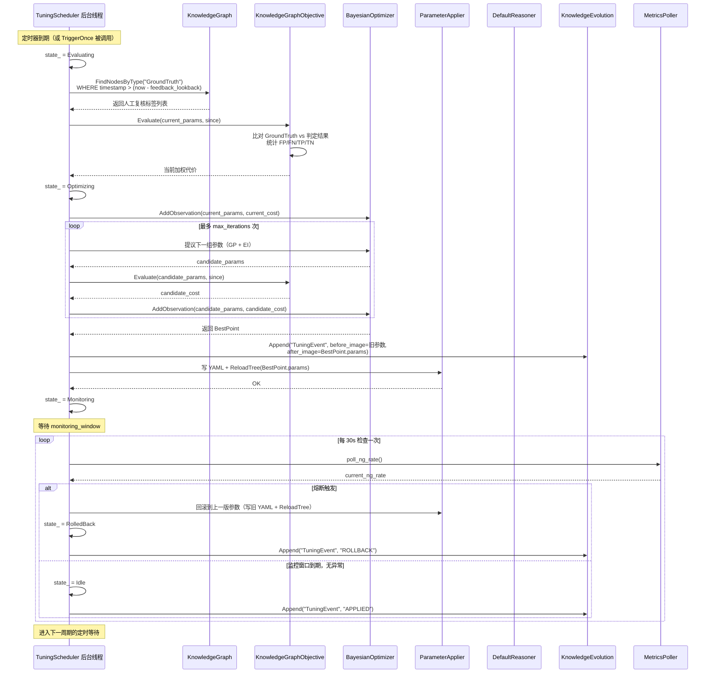
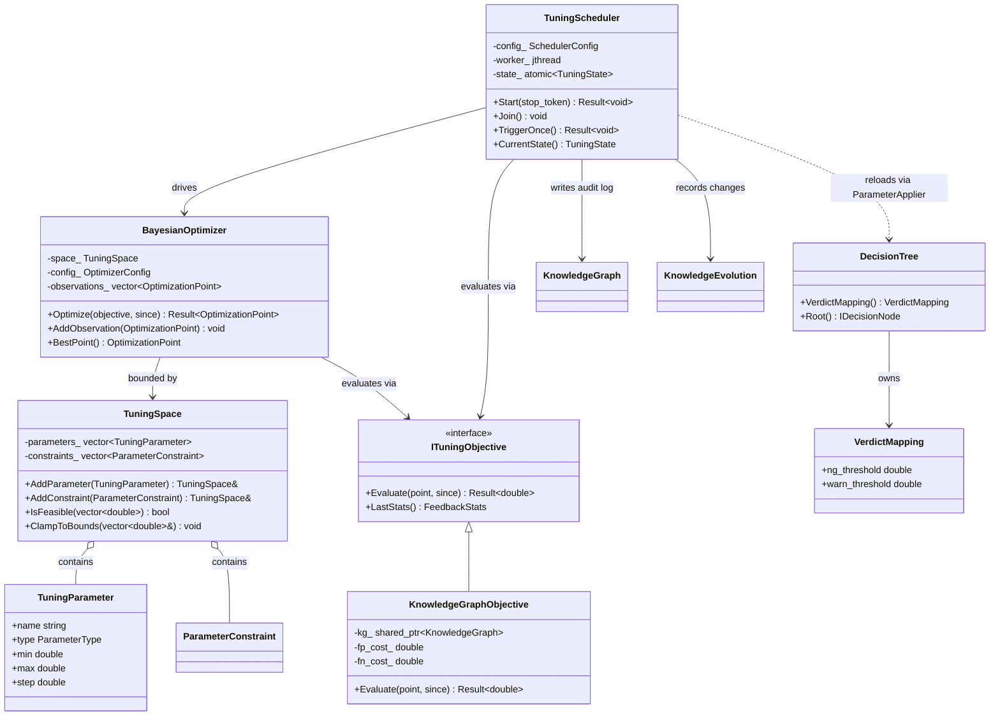

# 决策参数自动寻优（Bayesian Auto-Tuning）

> 里程碑：里程碑 7 之后 —— 决策层补强
> 批次依赖：5.1（`RuleEngine`/`FactBase`/`FactSource`，只读引用）、5.2（`IReasoner`/`DefaultReasoner`/`DecisionTree`/`ScoreFormula`，直接修改其 YAML 配置并触发 `ReloadTree`）、4.1（`KnowledgeGraph`/`KnowledgeEvolution`，读取反馈数据、写入调优审计日志）、6.1（`Pipeline`/`IStageNode::ReloadConfig`，触发运行期热重载）
> 本批次不修改任何已冻结接口的签名，只通过 YAML 文件 + 热重载机制间接调整决策参数；引入的新类型全部位于新命名空间 `sai::tuning`，不与既有模块产生类型级耦合。

## 1. Purpose

当前决策层的所有阈值、权重、判定边界均以人工常量形式存在于两处：（1）`DecisionTree` YAML 文件中每个 `LeafNode` 的 `ScoreFormula`（`weights`、`threshold`）以及 `BranchNode` 的数值分支键（`">0.8"`、`">0.6"` 等）；（2）`DefaultReasoner::Reason()` 中硬编码的 verdict 映射边界（`score > 0.7 → NG`、`score > 0.3 → WARN`）。这些参数在部署时由工程师根据离线验证集经验拍定，部署后不再变化，无法随产线运行数据自动修正以下两类系统性偏差：

- **误报率漂移**：随着原材料批次、环境光照、相机老化的缓慢变化，原本合理的阈值可能不再匹配当前的正常样本分布，导致误报率上升。
- **漏检代价不对称**：不同缺陷类型（裂纹 vs 轻微划痕）的漏检代价不同，且产线在不同生产周期的质量容忍度可能变化（例如新车型导入期容忍度更低），人工参数无法感知这种时变代价。

本批次引入一个独立的离线调优进程 `TuningScheduler`，周期性读取知识库中积累的人工复核标签（Ground Truth），以最小化"漏检代价 × 漏检率 + 误报代价 × 误报率"为目标函数，在预先声明的安全搜索空间内用贝叶斯优化（Bayesian Optimization）自动寻优决策参数，并将结果写入 YAML 文件后触发 `ReloadTree`/`ReloadConfig` 热重载，使下一次推理周期使用新参数。

## 2. Responsibilities

本批次负责：

- 定义 `TuningParameter`（单个可调参数的名称、类型、合法范围）与 `TuningSpace`（一组参数 + 跨参数简单约束）的数据结构，作为人工声明"哪些参数允许自动调整、调整边界在哪"的唯一入口。
- 定义 `ITuningObjective` 接口：从 `KnowledgeGraph` 中查询指定时间窗口内的人工复核标签，计算当前参数下的漏检数、误报数，返回加权代价作为贝叶斯优化的目标函数值。
- 实现 `BayesianOptimizer`：以高斯过程（Gaussian Process）为代理模型、Expected Improvement（EI）为采集函数的贝叶斯优化器。在 `TuningSpace` 声明的边界内搜索，每次迭代提议一组新参数。
- 实现 `TuningScheduler`：后台线程，按可配置周期执行"查询反馈 → 计算当前代价 → 贝叶斯优化提议 → 写入 YAML → 触发热重载 → 监控异常 → 记录审计日志"的完整调优循环。
- 定义 `TuningRecord`：每次调优事件的审计记录，写入 `KnowledgeGraph`（节点类型 `TuningEvent`），包含旧参数、新参数、优化前后的目标函数值、时间戳、触发原因，通过 `KnowledgeEvolution` 记录变更前后的参数快照。
- 在 `DefaultReasoner` 中将硬编码的 verdict 映射边界（0.7/0.3）移到 YAML 的 `verdict_mapping` 段，使其成为可热重载的可调参数。

本批次不负责：

- 自动发现"哪些参数应该被调优"——`TuningSpace` 由领域工程师声明，本批次只在声明的空间内搜索。
- 修改 `ScoreCalculator::Sigmoid` 的数学形式本身（若未来需要引入非 Sigmoid 的评分函数族，属于 `DecisionTree` 的扩展，与本批次的参数搜索正交）。
- 处理跨 SKU 的迁移学习或元学习——每个 SKU 的调优状态独立存储，本批次不设计 SKU 之间的知识共享机制。
- 实时逐帧调整参数——本批次是周期性批量优化，不是在线梯度下降；单帧推理仍然使用当前加载的固定参数，调优发生在独立的离线节奏上。
- 替代人工对搜索空间边界的最终判断——`TuningSpace` 的 `min`/`max` 由人工设定，优化器不会超出这些边界。

## 3. Design

**调优进程采用独立后台线程 + 周期性批量评估，拒绝逐帧在线更新。** 逐帧在线梯度下降（例如每处理一帧就用其 Ground Truth 标签做一步 SGD）虽然收敛速度更快，但工业产线的 Ground Truth 标签不是实时可得的——人工复核发生在检验之后数分钟甚至数小时，且标签以批次而非单帧粒度到达。此外，在线更新意味着模型参数在任意时刻都可能变化，使得同一批次内的两帧可能使用不同参数得到不同判定，给质量审计带来不确定性。周期性批量评估把"收集反馈 → 评估当前代价 → 提议新参数 → 一次性热重载"收敛为一个原子操作，保证任意两次热重载之间参数不变，且调优决策可审计。

**代理模型采用高斯过程（Gaussian Process），拒绝网格搜索与随机搜索。** 每次参数评估需要积累足够数量的人工复核标签才能可靠估计误报率/漏检率，这个"足够数量"在产线节拍下通常需要数小时到一天，因此目标函数的评估是昂贵且带噪声的。网格搜索在参数维度超过 3 时组合爆炸，且在高维空间的每一维均匀撒点会浪费大量评估预算在明显不优的区域；随机搜索虽然在高维空间比网格搜索更高效，但同样不做任何"从已评估点推断未评估区域"的推理，评估次数随维度线性增长。高斯过程代理模型在每次评估后更新对目标函数全局形状的后验信念，自带不确定性估计——在已充分探索的区域后验方差低（"这里大概就这个值"），在未探索区域后验方差高（"这里不确定，可能更好也可能更差"）。这个不确定性估计是贝叶斯优化区别于其他黑箱优化方法的核心优势。

**采集函数采用 Expected Improvement (EI)，拒绝 Probability of Improvement (PI) 与 Upper Confidence Bound (UCB)。** PI 只关心"新点比当前最优点更好的概率"，不关心"好多少"——一个以 99% 概率只改进 0.1% 的点会被 PI 排在比"以 60% 概率改进 50%"的点更高的优先级，这在调优场景下是劣化的探索策略。UCB 需要手动调节探索-利用的权衡系数 κ，该系数的合适取值高度依赖目标函数的尺度与噪声水平，在工业部署中不引入额外的人工调参负担。EI 天然平衡"改进的概率"与"改进的幅度"：`EI(x) = E[max(0, f(x*) - f(x))]`，其中期望在 GP 后验下是解析可算的（不需要数值积分），不引入额外超参数，对噪声评估也有自然的扩展（Noisy EI，在观测噪声假设下调整改进量的计算）。

**搜索空间受 `TuningSpace` 的硬边界约束 + 异常率熔断自动回滚，拒绝无约束自由探索。** 贝叶斯优化器在提议新参数时严格在 `TuningSpace` 声明的边界内采样（通过 GP 的输入变换或 EI 优化时的边界约束），但仅此不足以防止"合法但危险"的参数组合——例如一组在边界内但让所有样本都被判为 OK 的参数会导致漏检率飙升。因此在热重载新参数后，`TuningScheduler` 进入一个短暂的监控窗口：如果熔断条件触发（例如 NG 率突然降为零，或 NG 率突然超过 50%），自动回滚到上一个安全版本的参数，记录一条 `Error` 日志，并将该参数组合标记为已探索的失败点（在 GP 中注入一个人工评估为 +∞ 代价的虚拟观测点，防止优化器在未来迭代中重新探索该区域）。

**参数存储沿用 YAML 文件 + 热重载机制，拒绝引入新的参数存储格式或直接内存写入。** `ReloadTree` 和 `ReloadConfig` 已经提供了文件→内存的热重载通道，`TuningScheduler` 只负责把优化器输出的参数序列化回 YAML 文件（覆盖原文件或写入新文件路径），然后通过已有的热重载 API 触发生效，不直接修改 `DefaultReasoner` 内存中的参数结构体。这样做的好处：（1）参数变更有文件落盘，运维人员可以直接查看当前生效的参数文件；（2）热重载失败时旧参数自动保留生效（`ConfigStore` 的已有语义），`TuningScheduler` 不需要自己实现参数回退逻辑；（3）`KnowledgeEvolution` 的 `before_image` 可以直接用文件 diff 或完整文件快照表示，审计粒度清晰。

**硬编码 verdict 映射（0.7/0.3）从 C++ 移到 YAML 的 `verdict_mapping` 段，拒绝继续在编译期固定。** 当前 `DefaultReasoner::Reason()` 中的 `if (score > 0.7) → NG` 分支无法在不重新编译的情况下调整，运维人员修改 YAML 中的 `ScoreFormula` 权重/阈值后，最终的 NG/WARN/OK 分类边界仍然是硬编码的——这意味着即便贝叶斯优化找到了更好的权重组合，最终的分类粒度仍然被 0.7/0.3 这两道"铁门"卡住。将 `verdict_mapping` 移到 YAML（作为 `DecisionTree` 的顶层配置段），`DefaultReasoner` 在 `Reason()` 中从 `DecisionTree` 读取当前的映射边界，使 verdict 边界和 `ScoreFormula` 参数可以被同一次热重载一起更新。

## 4. Interfaces

以下为本批次定稿的头文件级声明（命名空间统一为 `sai::tuning`），非实现细节。

```cpp
// -----------------------------------------------------------------------
// <sai/tuning/tuning_space.h>
// -----------------------------------------------------------------------
namespace sai::tuning {

enum class ParameterType : std::uint8_t {
    Continuous,   // double, 在 [min, max] 内连续取值
    Discrete,     // double, 在 [min, max] 内以 step 为步进取值
};

struct TuningParameter {
    std::string name;              // 对应 YAML 中的点分路径，如 "leaf_0.formula_0.weight_0"
    ParameterType type;
    double min;
    double max;
    double step{0.0};             // 仅 Discrete 时有效，Continuous 忽略
};

struct ParameterConstraint {
    // 跨参数简单约束：lhs_name * coeff_lhs + rhs_name * coeff_rhs <= bound
    // 例如 "weight_0 + weight_1 == 1.0" 表达为两条不等约束：
    //   weight_0 + weight_1 <= 1.0 且 -weight_0 - weight_1 <= -1.0
    std::string lhs_name;
    double coeff_lhs{1.0};
    std::string rhs_name;
    double coeff_rhs{1.0};
    double bound{0.0};
};

class TuningSpace final {
public:
    auto AddParameter(TuningParameter param) -> TuningSpace&;
    auto AddConstraint(ParameterConstraint constraint) -> TuningSpace&;

    auto Parameters() const -> const std::vector<TuningParameter>&;
    auto Constraints() const -> const std::vector<ParameterConstraint>&;
    auto Dimension() const -> std::size_t;

    // 检查一个参数向量是否在合法空间内（边界 + 约束均满足）
    auto IsFeasible(const std::vector<double>& point) const -> bool;

    // 将点裁剪到边界内（不保证跨参数约束，仅裁剪每维边界）
    auto ClampToBounds(std::vector<double>& point) const -> void;

private:
    std::vector<TuningParameter> parameters_;
    std::vector<ParameterConstraint> constraints_;
};

}  // namespace sai::tuning
```

```cpp
// -----------------------------------------------------------------------
// <sai/tuning/tuning_objective.h>
// -----------------------------------------------------------------------
namespace sai::tuning {

struct FeedbackStats {
    std::int64_t total_inspections{0};
    std::int64_t false_positives{0};   // OK 被判为 NG/WARN
    std::int64_t false_negatives{0};   // NG 被判为 OK
    std::int64_t true_positives{0};
    std::int64_t true_negatives{0};
    double fp_cost_weight{1.0};        // 单次误报的经济代价权重
    double fn_cost_weight{5.0};        // 单次漏检的经济代价权重（通常远高于误报）
};

// ITuningObjective：从 KnowledgeGraph 查询反馈并评估当前参数的代价
class ITuningObjective {
public:
    virtual ~ITuningObjective() = default;

    // 查询 since 时刻之后入库的 GroundTruth 标签，按当前参数（由 point
    // 序列化为 YAML 并触发热重载后采集的标签）计算 FeedbackStats。
    // 返回加权代价：fp_cost_weight * FP_rate + fn_cost_weight * FN_rate，
    // 其中 rate = count / total_inspections。
    virtual auto Evaluate(
        const std::vector<double>& point,
        std::chrono::system_clock::time_point since
    ) -> Result<double> = 0;

    // 返回最近一次 Evaluate 的详细统计，供审计日志使用。
    virtual auto LastStats() const -> const FeedbackStats& = 0;
};

// KnowledgeGraphObjective：基于 KnowledgeGraph 中 GroundTruth 节点的实现
class KnowledgeGraphObjective final : public ITuningObjective {
public:
    KnowledgeGraphObjective(
        std::shared_ptr<knowledge::KnowledgeGraph> kg,
        double fp_cost, double fn_cost
    );

    auto Evaluate(const std::vector<double>& point,
                  std::chrono::system_clock::time_point since)
        -> Result<double> override;

    auto LastStats() const -> const FeedbackStats& override;

private:
    std::shared_ptr<knowledge::KnowledgeGraph> kg_;
    FeedbackStats last_stats_;
    double fp_cost_;
    double fn_cost_;
};

}  // namespace sai::tuning
```

```cpp
// -----------------------------------------------------------------------
// <sai/tuning/bayesian_optimizer.h>
// -----------------------------------------------------------------------
namespace sai::tuning {

struct OptimizerConfig {
    std::size_t max_iterations{50};         // 单次调优周期的最大 GP 迭代次数
    std::size_t initial_random_points{5};   // 初始随机探索点数
    double noise_level{0.01};               // 观测噪声标准差（GP likelihood）
    double length_scale_prior{0.5};         // RBF 核长度尺度的先验均值
};

struct OptimizationPoint {
    std::vector<double> params;
    double cost{0.0};
    std::chrono::system_clock::time_point evaluated_at;
};

class BayesianOptimizer final {
public:
    explicit BayesianOptimizer(TuningSpace space, OptimizerConfig config);

    // 添加已知评估点（从 KnowledgeEvolution 恢复的历史调优记录）
    auto AddObservation(OptimizationPoint point) -> void;

    // 运行贝叶斯优化主循环：
    //   1. 用已有观测拟合 GP 超参数（RBF 核 + 常数均值函数）
    //   2. 最大化 EI 采集函数以提议下一组参数
    //   3. 调用 objective.Evaluate(proposal, since) 评估
    //   4. 将新观测加入 GP
    //   5. 重复直到 max_iterations 或 EI 最大值低于阈值
    // 返回找到的最优参数组合及其代价。
    auto Optimize(
        ITuningObjective& objective,
        std::chrono::system_clock::time_point feedback_since
    ) -> Result<OptimizationPoint>;

    auto BestPoint() const -> const OptimizationPoint&;
    auto AllObservations() const -> const std::vector<OptimizationPoint>&;

private:
    TuningSpace space_;
    OptimizerConfig config_;
    std::vector<OptimizationPoint> observations_;
};

}  // namespace sai::tuning
```

```cpp
// -----------------------------------------------------------------------
// <sai/tuning/tuning_scheduler.h>
// -----------------------------------------------------------------------
namespace sai::tuning {

enum class TuningState : std::uint8_t {
    Idle,
    Evaluating,    // 正在采集反馈数据期间
    Optimizing,    // 正在运行贝叶斯优化
    Monitoring,    // 刚热重载新参数，正在监控异常率
    RolledBack,    // 上一次调优触发熔断已回滚
};

struct SchedulerConfig {
    std::chrono::seconds interval{3600};          // 调优周期间隔（默认 1 小时）
    std::chrono::seconds monitoring_window{300};  // 热重载后熔断监控窗口（默认 5 分钟）
    std::chrono::seconds feedback_lookback{86400};// 反馈查询的时间窗口（默认 24 小时）

    // 熔断条件：若监控窗口内 NG 率低于或高于以下阈值，触发自动回滚
    double min_ng_rate{0.001};    // NG 率低于此值 → 怀疑全部放行
    double max_ng_rate{0.50};     // NG 率高于此值 → 怀疑大量误报
    std::size_t min_samples_for_trigger{50};  // 监控窗口内至少这么多帧才触发熔断检查
};

class TuningScheduler final {
public:
    TuningScheduler(
        SchedulerConfig config,
        std::unique_ptr<BayesianOptimizer> optimizer,
        std::unique_ptr<ITuningObjective> objective,
        std::shared_ptr<knowledge::KnowledgeGraph> kg,         // 写审计日志
        std::shared_ptr<knowledge::KnowledgeEvolution> evolution // 写变更记录
    );

    // 注入外部依赖：调优结果通过这两个回调生效
    auto SetParameterApplier(
        std::function<Result<void>(const std::vector<double>&)> applier
    ) -> void;

    auto SetMetricsPoller(
        std::function<Result<double>()> ng_rate_poller  // 返回当前 NG 率
    ) -> void;

    // 启动后台调优线程；stop_token 用于随进程关停
    auto Start(std::stop_token stop_token) -> Result<void>;

    // 等待后台线程结束（进程关停时调用）
    auto Join() -> void;

    auto CurrentState() const noexcept -> TuningState;

    // 强制触发一次调优周期（运维调试用）
    auto TriggerOnce() -> Result<void>;

private:
    SchedulerConfig config_;
    std::unique_ptr<BayesianOptimizer> optimizer_;
    std::unique_ptr<ITuningObjective> objective_;
    std::shared_ptr<knowledge::KnowledgeGraph> kg_;
    std::shared_ptr<knowledge::KnowledgeEvolution> evolution_;
    std::function<Result<void>(const std::vector<double>&)> apply_params_;
    std::function<Result<double>()> poll_ng_rate_;
    std::jthread worker_;
    std::atomic<TuningState> state_{TuningState::Idle};
};

}  // namespace sai::tuning
```

```cpp
// -----------------------------------------------------------------------
// <sai/reasoner/decision_tree.h>（对 5.2 批次的增量补充）
// -----------------------------------------------------------------------
namespace sai::reasoner {

struct VerdictMapping {
    double ng_threshold{0.7};       // score > this → "NG"
    double warn_threshold{0.3};     // score > this && <= ng_threshold → "WARN"
    // <= warn_threshold → "OK"
};

class DecisionTree {
public:
    // ... 5.2 批次已有签名保持不变 ...

    // 从 YAML 中解析 verdict_mapping 段（可选——若 YAML 未提供则使用默认值）
    auto VerdictMapping() const -> const reasoner::VerdictMapping&;
};

}  // namespace sai::reasoner
```

```cpp
// -----------------------------------------------------------------------
// <sai/tuning/error_codes.h>（对 ErrorCode 枚举的追加）
// -----------------------------------------------------------------------
namespace sai {

enum class ErrorCode : std::uint32_t {
    // ... 已有前缀成员保持不变，在末尾追加 ...
    Tuning_SpaceEmpty,                  // TuningSpace 未声明任何参数
    Tuning_ConstraintViolated,          // 优化器提议的点违反约束
    Tuning_ObjectiveEvalFailed,         // ITuningObjective::Evaluate 查询 KG 失败
    Tuning_RollbackTriggered,           // 熔断触发，已自动回滚
    Tuning_ParameterApplyFailed,        // 写 YAML 或 ReloadTree 失败
};

}  // namespace sai
```

## 5. Workflow

**完整调优周期：**



**反馈数据写入流程（不在本批次范围内，由 Pipeline 的 Export 阶段或外部系统负责，此处仅描述与本批次的接口约定）：**

1. 每个检验帧经 `ReasonStage` 产出 `ReasoningResult`（含 `verdict`、`severity`）。
2. 人工复核站的操作员确认或修正 verdict（例如将 WARN 标记为 NG，或将 NG 标记为 OK），形成 Ground Truth 标签。
3. Ground Truth 以 `KnowledgeNode` 形式写入 `KnowledgeGraph`：
   ```
   type: "GroundTruth"
   properties:
     inspection_id: <string>
     frame_id: <int>
     sku_id: <string>
     machine_verdict: <NG|WARN|OK>
     human_label: <NG|OK>
     severity: <double>
     timestamp: <unix_microseconds>
   ```
4. `KnowledgeGraphObjective::Evaluate` 查询这些节点并与当前参数的判定结果对比，计算 FP/FN 统计。

**参数序列化流程：**

1. `BayesianOptimizer::Optimize` 输出的 `OptimizationPoint::params` 是 `vector<double>`，其顺序与 `TuningSpace::Parameters()` 一致。
2. `ParameterApplier`（由 `seat_aoi` 的装配代码注入）负责：
   - 读取当前的 DecisionTree YAML 文件（或 Pipeline YAML 文件，取决于参数所属位置）。
   - 按 `TuningParameter::name` 中点分路径的约定（例如 `leaf_0.formula_0.weight_0`）将 `params[i]` 写入对应位置。
   - 对 `verdict_mapping` 段中的 `ng_threshold`/`warn_threshold` 同理处理。
   - 调用 `DefaultReasoner::ReloadTree(path)` 或 `IStageNode::ReloadConfig(config)` 使其生效。
3. 如果参数分别属于多个 YAML 文件（例如部分在 decision_tree.yaml，部分在 pipeline.yaml），ParameterApplier 需分别写入各文件后依次触发对应的热重载。

## 6. Data Structure

**`TuningSpace` — 搜索空间定义：**

| 字段 | 类型 | 说明 |
|------|------|------|
| `parameters_` | `vector<TuningParameter>` | 待调优参数列表，顺序固定（`OptimizationPoint::params` 按此顺序索引） |
| `constraints_` | `vector<ParameterConstraint>` | 跨参数线性约束列表（可选，绝大多数场景为空） |

**`TuningParameter` — 单个可调参数：**

| 字段 | 类型 | 说明 |
|------|------|------|
| `name` | `string` | 参数在 YAML 中的点分路径，用于 ParameterApplier 定位写入目标 |
| `type` | `ParameterType` | `Continuous`（连续）或 `Discrete`（离散步进） |
| `min`/`max` | `double` | 硬边界，优化器不会提议边界外的值 |
| `step` | `double` | 离散参数的有效步进（例如 0.05 表示只取 0, 0.05, 0.10, …） |

**`FeedbackStats` — 反馈统计：**

| 字段 | 类型 | 说明 |
|------|------|------|
| `total_inspections` | `int64_t` | 统计窗口内的总检验帧数 |
| `false_positives` | `int64_t` | 人工标签为 OK、机器判为 NG/WARN 的数量 |
| `false_negatives` | `int64_t` | 人工标签为 NG、机器判为 OK 的数量 |
| `true_positives` | `int64_t` | 人工标签为 NG、机器判为 NG/WARN 的数量 |
| `true_negatives` | `int64_t` | 人工标签为 OK、机器判为 OK 的数量 |
| `fp_cost_weight` | `double` | 单次误报的代价权重（默认 1.0） |
| `fn_cost_weight` | `double` | 单次漏检的代价权重（默认 5.0，反映工业场景漏检代价远高于误报） |

**`OptimizationPoint` — GP 观测点：**

| 字段 | 类型 | 说明 |
|------|------|------|
| `params` | `vector<double>` | 参数向量（长度 = `TuningSpace::Dimension()`） |
| `cost` | `double` | 该参数对应目标函数值 = `fp_cost_weight * FP_rate + fn_cost_weight * FN_rate` |
| `evaluated_at` | `time_point` | 评估时间戳 |

**`VerdictMapping` — verdict 判定边界（从 C++ 移到 YAML）：**

| 字段 | 类型 | 默认值 | 说明 |
|------|------|--------|------|
| `ng_threshold` | `double` | 0.7 | `score > ng_threshold → "NG"` |
| `warn_threshold` | `double` | 0.3 | `ng_threshold ≥ score > warn_threshold → "WARN"` |

**KnowledgeGraph 中的 `TuningEvent` 节点类型：**

```
type: "TuningEvent"
properties:
  event_type: "PROPOSED" | "APPLIED" | "ROLLBACK"
  parameters_before: <JSON string of vector<double>>
  parameters_after: <JSON string of vector<double>>
  objective_before: <double>
  objective_after: <double>
  iteration_count: <int>
  trigger: "scheduled" | "manual" | "drift_alert"
  timestamp: <unix_microseconds>
```

**扩展后的 `DecisionTree` YAML 格式：**

```yaml
# 顶层新增 verdict_mapping 段（可选，缺失时使用默认值 0.7/0.3）
verdict_mapping:
  ng_threshold: 0.7
  warn_threshold: 0.3

# 已有的根节点定义保持不变
type: branch
field: detection.anomaly_map.max_score
branches:
  ...
```

**对应 `TuningSpace` 的 YAML 声明（单独文件或嵌入 pipeline.yaml）：**

```yaml
tuning:
  enabled: true
  scheduler:
    interval_sec: 3600
    monitoring_window_sec: 300
    feedback_lookback_sec: 86400
  objective:
    fp_cost: 1.0
    fn_cost: 5.0
  safety:
    min_ng_rate: 0.001
    max_ng_rate: 0.50
    min_samples_for_trigger: 50
  optimizer:
    max_iterations: 50
    initial_random_points: 5
    noise_level: 0.01
  parameters:
    - name: "leaf_0.formula_0.weight_0"
      type: continuous
      min: 0.1
      max: 0.9
    - name: "leaf_0.formula_0.weight_1"
      type: continuous
      min: 0.1
      max: 0.9
    - name: "leaf_0.formula_0.threshold"
      type: continuous
      min: 0.1
      max: 0.7
    - name: "verdict_mapping.ng_threshold"
      type: continuous
      min: 0.5
      max: 0.9
    - name: "verdict_mapping.warn_threshold"
      type: continuous
      min: 0.1
      max: 0.5
```

## 7. Class Diagram



## 8. Sequence Diagram

（见 5. Workflow 中的 mermaid 序列图，此处不重复列出。）

## 9. Thread Model

**调优系统涉及两个独立线程：**

- **TuningScheduler 后台线程**（`worker_`，`std::jthread`）：执行完整的调优周期（查询反馈 → 优化 → 写入 YAML → 触发热重载 → 监控熔断），周期之间阻塞在 `wait_for` 上等待下一轮定时。该线程在 `Evaluating`、`Optimizing`、`Monitoring` 阶段持有 `TuningScheduler` 的内部状态，但不持有 `DecisionTree` 或 `DefaultReasoner` 的锁——参数生效通过 `ReloadTree`（内部使用 `DecisionTree` 自身的 `unique_lock` 替换 `root_`），与正在执行 `Reason()` 的业务线程之间通过 `ReloadTree` 内部的锁竞争解决。调优线程在贝叶斯优化阶段可能执行较重的数值计算（GP 超参数拟合涉及 Cholesky 分解，O(n³) 其中 n 是已观测点数），但调优周期以小时计，观测点数不超过数百，单次 Cholesky 耗时在毫秒量级，不构成性能瓶颈。

- **MetricsPoller 回调**（在 `Monitoring` 阶段由 `TuningScheduler` 周期调用，每次在 `worker_` 线程上同步执行，不另开线程）：`poll_ng_rate()` 预期为轻量级查询（从 Pipeline 的 `StageMetrics` 原子计数器读取两个整数做除法），不涉及 I/O 或锁竞争，在调优线程上直接调用不阻塞其他工作。

**与业务线程的并发关系：**

- `ParameterApplier` 写入 YAML 文件 + 调用 `ReloadTree`：`ReloadTree` 内部持有 `DecisionTree` 的独占锁替换 `root_`，业务线程的 `Reason()` 在读取 `root_` 时持有共享锁，写入者阻塞直到所有读者退出，读者不会被长时间阻塞（`root_` 替换是一次指针赋值）。
- `KnowledgeGraphObjective::Evaluate` 读取 `KnowledgeGraph`（SQLite 查询）：SQLite 自身的读写锁协调调优线程的查询与业务线程的 Ground Truth 写入，调优线程的查询是只读的，SQLite 的 WAL 模式允许读写并发。
- `KnowledgeEvolution::Append` 写入调优日志：与业务线程对 `KnowledgeEvolution` 的写入（记录检测结果的变更）之间通过 SQLite 的写锁串行化。

**线程安全总结：**

| 共享资源 | 访问者 | 同步机制 |
|----------|--------|----------|
| `DecisionTree::root_` | 调优线程（写 YAML + ReloadTree）vs 业务线程（Reason 读） | ReloadTree 内部 exclusive lock |
| `KnowledgeGraph` (SQLite) | 调优线程（Objective 查询 + 审计日志写入）vs 业务线程（Ground Truth 写入） | SQLite WAL 模式读写锁 |
| `TuningScheduler::state_` | 调优线程（写入）vs 任意线程（`CurrentState()` 读取） | `std::atomic<TuningState>` |
| `BayesianOptimizer::observations_` | 仅调优线程访问 | 无需同步（单线程所有者） |

## 10. Performance

- GP 超参数拟合的计算复杂度为 O(n³)（n = 已观测点数，包含初始随机点 + 每次迭代新增点）。`max_iterations` 默认 50，`initial_random_points` 默认 5，单次调优周期最多 55 个观测点，Cholesky 分解耗时在 55³ ≈ 166k 次浮点运算量级，在任意现代 CPU 上低于 10ms。
- EI 采集函数的最大化通过多起点 L-BFGS-B 完成（边界约束拟牛顿法）。L-BFGS-B 在 5-15 维参数空间（典型场景：3-5 个叶子节点，每节点 2-3 个参数 + 2 个 verdict 边界）的收敛步数通常在 20-50 次梯度评估，每次评估 O(n²)（GP 预测方差的计算），总耗时在 100ms 以内。
- 目标函数评估（`KnowledgeGraphObjective::Evaluate`）的核心开销是一条 SQL 聚合查询（统计特定时间窗口内的 GroundTruth 节点并按 human_label 分组计数），反馈窗口内假设有 10 万条检验记录，SQLite 在有索引的 `timestamp` 列上做范围扫描 + GROUP BY 的耗时约 50-200ms（视磁盘性能）。
- 整个调优周期（不含 `feedback_lookback` 的反馈积累等待时间）的计算耗时预期在 5 秒以内，在默认 1 小时间隔的背景下完全不影响产线吞吐。
- `ReloadTree` 触发的 YAML 重新解析与 `root_` 替换耗时在微秒级（解析一个 1-2KB 的 YAML 文件），不造成业务线程的显著阻塞。

## 11. Memory

- `BayesianOptimizer::observations_` 存储所有历史观测点，每个点包含 `vector<double>`（维度 ≤ 15）+ 一个 `double` + 一个 `time_point`，每观测点约 150 字节，55 个观测点约 8KB，属于会话级固定内存，不随产线运行时间增长。
- GP 内部协方差矩阵为 n×n 的密集矩阵（`vector<vector<double>>`），n=55 时约 24KB，在每次调优周期的 `Optimize()` 调用期间临时分配，方法返回后释放，不存在于调优周期的 idle 阶段。
- `TuningScheduler` 本身在 idle 阶段只持有配置数据结构（约 2KB）与共享指针（16 字节 × 4），不持有大型临时计算结构。
- YAML 文件的读写通过 yaml-cpp 的 `YAML::Node` 完成，写入后立即释放，不在内存中长期持有副本——决策树参数的实际生效副本由 `DefaultReasoner::tree_` 持有，与调优系统无内存重叠。

## 12. Future Extension

- **多 SKU 共享先验**：当前每个 SKU（产品型号）独立维护自己的 `TuningSpace` 与 GP 观测历史。若未来多个 SKU 共享同一套检测站（同一相机、同一光源、同一材料类别），可以将一个 SKU 的调优结果作为另一个 SKU 的 GP 先验均值函数，减少冷启动所需的随机探索次数。本批次不在 GP 中预留多任务/迁移学习的核函数扩展点，留待实际出现多 SKU 共享场景时再评估。
- **基于概念漂移告警的自动触发**：`CoresetEvolution` 已具备概念漂移检测能力。若未来将漂移告警信号接入 `TuningScheduler`，可以在检测到显著分布偏移时自动触发一次调优周期（`trigger: "drift_alert"`），而不必等待定时器到期。本批次在 `TuningEvent.trigger` 字段中预留了 `"drift_alert"` 枚举值，但 `Start()` 的当前实现只走定时触发。
- **采集函数的可替换性**：当前 GP + EI 是硬编码组合。若未来有明确证据表明另一组代理模型 + 采集函数在特定产线更优（例如使用随机森林代理模型处理离散参数空间，或使用 UCB 并证明其 κ 值在该场景下的最优性），应抽象 `ISurrogateModel` 和 `IAcquisitionFunction` 接口。本批次不引入这些接口，因为当前只有一个经过论证的组合，过早抽象会导致接口设计脱离实际第二组实现的需求。
- **参数空间自动发现**：当前 `TuningSpace` 完全由人工声明。若未来希望系统自动识别"哪些参数可能对目标函数敏感"，可以在初始随机探索阶段加入 Sobol 敏感性分析（计算每个参数的一阶/总阶 Sobol 指数），自动筛除对目标函数无显著影响的参数，缩减搜索空间。本批次不实现，但 `OptimizationPoint` 中保留了 `evaluated_at` 时间戳，可用于事后敏感性分析。
- **ErrorCode `Tuning_*` 前缀**：本批次新增 5 个 `Tuning_*` 错误码。未来若扩展调优相关功能（例如增加 `Tuning_DriftAlertTriggered`、`Tuning_MultiObjectiveParetoFront`），在 `Tuning_` 前缀下追加，不修改本批次已提交的成员。

## 13. Best Practice

- 声明 `TuningSpace` 时，`min`/`max` 边界应基于领域知识设定合理范围，不要设为 [0, 1] 的无差别全覆盖——越宽的搜索空间需要越多的初始随机探索点才能有效引导 GP 探索，同时增加了触及熔断的风险。
- `fn_cost_weight` 应显著大于 `fp_cost_weight`（建议 ≥ 3:1），反映工业场景漏检代价远高于误报的基本事实。如果产线处于新车型导入期（对质量异常敏感），可临时增大 `fn_cost_weight`（例如 10:1）。
- 初始部署时，先以 `initial_random_points` 较大（例如 10-15）+ `max_iterations` 较小（例如 10-20）的组合进行快速探索，待 GP 获得足够的初始信念后再切换到默认配置（5 + 50）。这减少了冷启动阶段 GP 对未探索区域盲目乐观导致提议危险参数的风险。
- 熔断的 `min_ng_rate`/`max_ng_rate` 应根据历史统计基线设定，不要使用本批次的默认值（0.001/0.50）作为通用值。对于某一特定产线，建议取历史一个月的 NG 率 P5/P95 分位数作为熔断边界。
- 每次调优周期结束后，运维人员应检查 `KnowledgeEvolution` 中的 `TuningEvent` 节点，确认参数变更方向合理（例如不要把 NG 阈值越调越低而漏检率随之上升），不要完全依赖自动化——贝叶斯优化只是工具，最终的质量责任仍在产线工程师。
- 不要在调优周期的 `Monitoring` 窗口内手动修改 YAML 配置文件——这会与 `TuningScheduler` 的监控读数和潜在的自动回滚产生竞争。如果需要手动介入，先调用 `Join()` 停止调优线程。

## 14. Anti Pattern

- 不要跳过初始随机探索阶段直接使用 GP + EI——没有初始观测点的 GP 后验均值恒为零（常数均值先验），EI 会退化为随机采样，失去贝叶斯优化的全部优势。
- 不要在目标函数中使用除 `FeedbackStats` 加权代价之外的指标（例如纯准确率）——准确率在类别不平衡的产线场景下（OK 帧占 95%+，NG 帧不足 5%）会产生"永远判 OK 就能拿 95% 准确率"的退化最优解，与漏检最小化的实际业务目标背道而驰。加权代价显式编码了代价不对称性。
- 不要为每个 `ScoreFormula` 的每个参数都声明为可调——搜索空间维度每增加一维，GP 所需的探索样本数以指数增长。只选择对判定结果影响最大的 3-7 个参数加入 `TuningSpace`（建议优先选择 `verdict_mapping` 的边界、最高优先级叶子节点的权重/阈值）。
- 不要把 `monitoring_window` 设得太短（例如 30 秒）——产线节拍下 30 秒可能只有不到 10 帧，样本量不足以可靠判断 NG 率是否异常；`min_samples_for_trigger` 保证了至少积累足够帧数后才检查熔断条件。
- 不要在贝叶斯优化迭代期间修改 `TuningSpace` 的边界——这会使已观测点的坐标与新的边界定义不一致，导致 GP 在已观测点的合法性判断上产生歧义。如需修改边界，先调用 `Join()` 停止调优线程，清空观测历史，修改 `TuningSpace` YAML，再重启。
- 不要用 `TuningScheduler` 替代对推理管线的日常监控——调优系统的熔断只在参数变更后的 `monitoring_window` 内生效，它不能替代对 NG 率、检测延迟、资源利用率的持续监控与告警系统（后者属于 Metrics 与运维基础设施的职责）。
